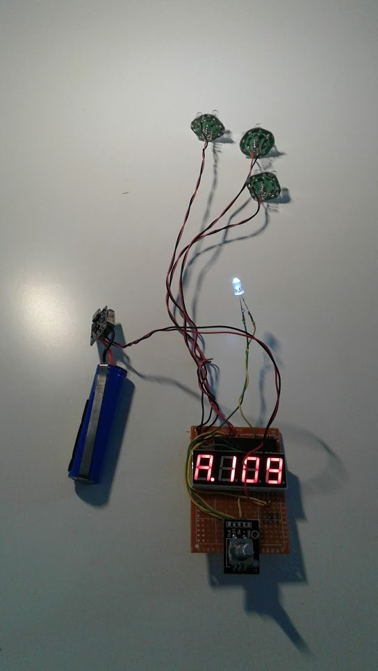
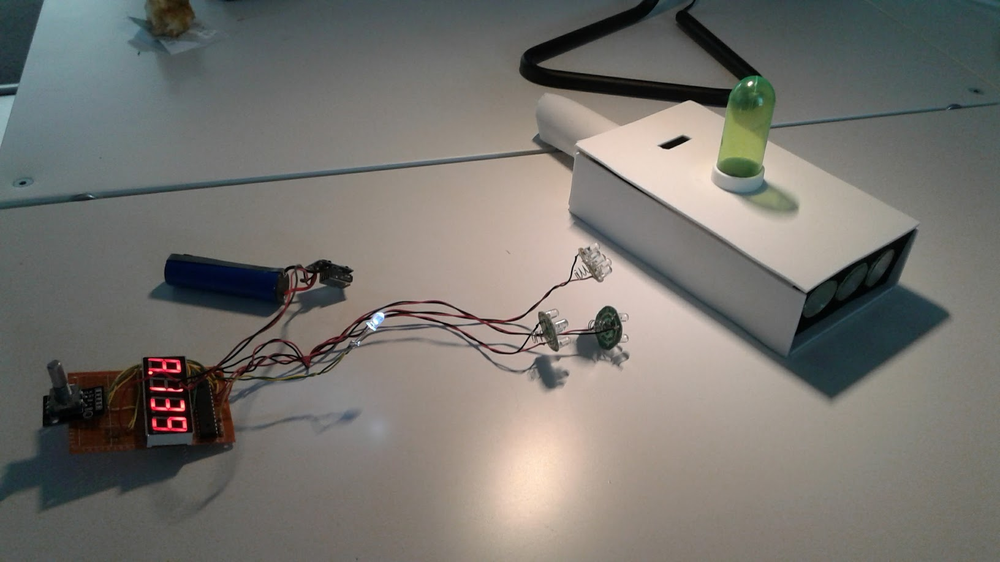

## The idea

Just some data regarding an Arduino project done for a friend... The goal was to
make a portal gun used in the Rick & Morty show. My friend was ok to build up the box,
and I want to make the electronics based onspare part I already have.

Some ideas on internet show some info on how to make that but not enough for me :).
[This video](https://www.youtube.com/watch?v=uPB6Z9btUO4) show how to make the box,
but the gun is not functional (no screen no button...). [This one](https://www.youtube.com/watch?v=uBO3GrtVYcY)
from Indy Mogul is using a arduino based electronics but no details on the code used.

## The goal

The idea is to make the gun quikly so to be usable for the Halloween '17, so no way
to wait for parts from ebay/china. So we use :

 - atmega328p as the core (around 2$ not bootloaded)
 - cheap 7 segments 4 digits (around $1 with 12 pins)
 - a rotary encoder with a switch for the command (only part that we buy for the
   project !)
 - some leds from cheap lamps from dollarama
 - some resitors
 - a battery from a rechargeable usb stick

## The result

The internal electronics:

With the box:

The happy user:

The encoder move the 'dimension' on the screen, I use a trick to print a letter
first then a 3 digits number (from 100 to 199 only !). The switch on the encoder
trigger the fire (3 leds at the front that blink quickly and printing 'FirE') on
the screen.

The first issue was the battery: we make it die after couples of minutes. I don't
know why because I was linked to the USB output and not taking much power... This
have been changed to just a 3-cells holder.  

For reference the ardunio ino file:
[portal gun arduino file](/files/portalgun.ino)
