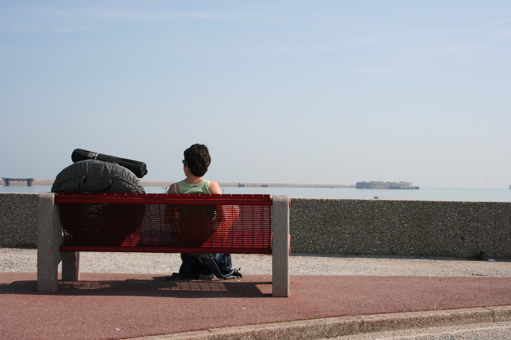
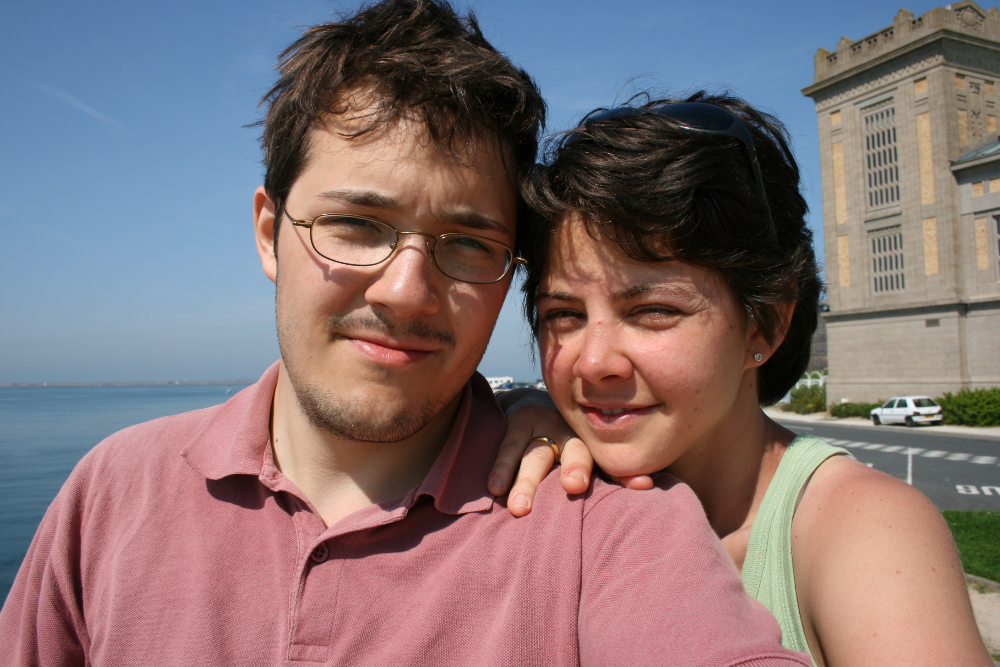

### Contexte
5 jours de vacances : une bonne occasion pour s’entrainer sur les
sentiers de la côte normande, avec le topo-guide fraichement acheté.  
Matos :
-   un sac de 40 litres chacun
-   une tente 2 seconds II de chez Decath’
Bilan mitigé au niveau transport (pas beaucoup de lignes de train en
Normandie, et pas beaucoup de bus…) et hébergement (la 2 seconds II est
un peu large pour les passage étroits du sentier des douaniers). Mais au
final, un bon début pour faire de la rando, des super paysages et un bon
grand WE :).

### 8 mai : arrivée sur Cherbourg en train
-   Train Paris-Caen-Cherbourg, départ 10h30, arrivée autour de 13h.
-   Midi au resto a Caen
-   Diner au resto à Cherbourg
-   Dodo au camping de Cherbourg

### 9 mai : Auderville – Omonville-la-Rogue (15km)
-   Bus entre Cherbourg et Auderville, de 12h30 à 13h15 (_MANEO_, ligne 100)
-   Midi pique-nique à Auderville
-   Diner au resto à Omonville-la-Rogue
-   Dodo au camping de Omonville-la-Rogue

### 10 mai : Omonville-la-Rogue – Urville-Nacqueville (11km)
-   Midi pique-nique au Hameau Gruchy
-   Diner au resto du camping d’Urville-Nacqueville
-   Dodo au camping d’Urville-Nacqueville

### 11 mai : Urville-Nacqueville – Cherbourg (10km)
-   Midi pique-nique en banlieue de Cherbourg
-   Diner au resto à Cherbourg
-   Dodo à l’hotel dans Cherbourg

### 12 mai : départ de Cherbourg en train
Train Cherbourg-Caen-Paris vers 8h30

### Petit bilan
Pour une première expérience de la rando à pied sur plusieurs jours, ben
c‘était bien mais plusieurs points à noter :
-   **Transport** : les possiblités de transport sont primodiales dans
    le cadre d’une rando à pied sans voiture… La Normandie, c’est pas
    génial pour ça : pour aller vers Auderville, il n’y a pas de train.
    En plus, les bus sont pas hyper pratique : geré par
    [Manéo](http://mobi50.com), les horaires sont pas réguliers (par
    exemple deux départs dans la journée ; un à 12h30 et un à 16h :) ),
    et encore pire les samedis, dimanches et fêtes…
-   **Hébergement** : on avait prévu de partir au début en chambres
    d’hôtes, mais comme on s’y est pris trop tard on s’est rabattus sur
    le camping la veille de partir (ce qui nous a valu de louper un
    train d’ailleurs…). Dans l’affolement, j’ai choisi une tente
    Decathlon 2 Seconds II (assez grande pour 2 personnes, disque
    d’environ 60 cm de diamètres, 3kg). Elle est bien mais passe assez
    mal dans les passage étroits du sentier des douaniers… De plus, on
    s’est rendu compte la première nuit qu’une tige en fibre de carbone
    de l’armature était fendue à un endroit, et que vu les pressions
    exercées dessus pour ranger la tente ; elle allait pas tenir
    longtemps… J’aurais du l’ouvrir avant de partir avec ! En plus, le
    placement sur le sac à dos n’est pas évident, j‘étais obligé de
    faire passer les sangles de la tente dans le dos du sac à dos ; ce
    qui écartait les sangles abdominales (pas pratique du tout !)

