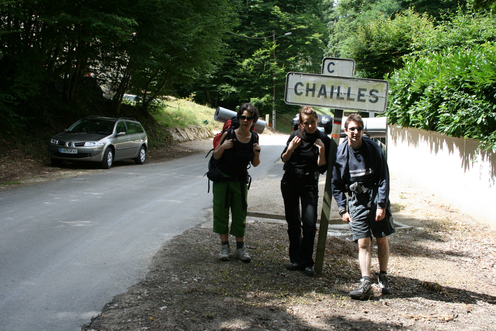
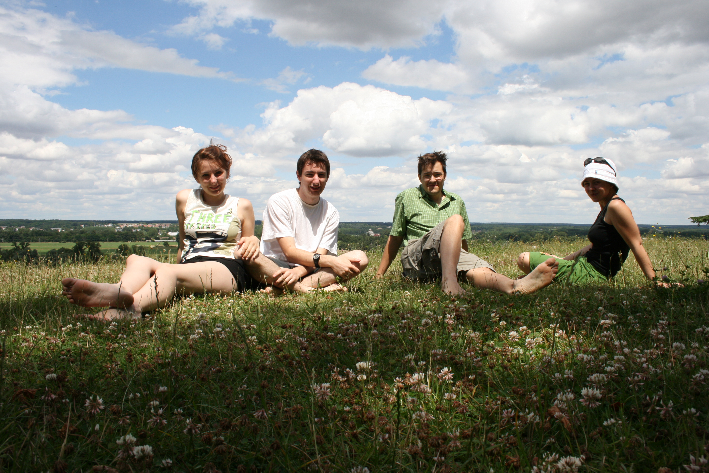
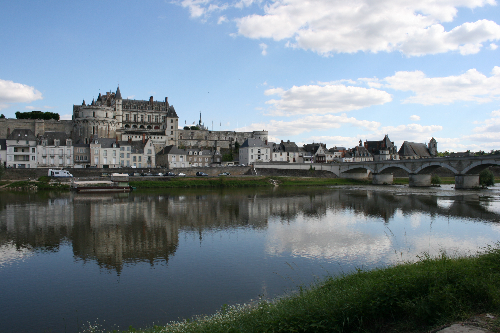

### Jour 1 : 12 juillet – Blois > Candé s/ Beuvron (17km)
Train Paris-Blois de 7h22, on arrive à Blois vers 9h. Premiers pas avec
le sac. C’est lourd ! Pour moi ça doit tourner autour de 12 kg ;). On
cherche le château de Blois. Déjà obligé de sortir carte et boussole…

On passe au marché pour se ravitailler. On décolle vraiment vers 10h30.
Direction la voie longue (cf le TopoGuide du GR3) via le carrefour de
l‘étoile. On se pose à 12h30 dans le petit village de Chailles (sans
jeux de mot…). On trouve un coin d’herbe derrière l‘église, nickel pour
le premier pique-nique de la rando. Quelques gouttes de pluie. On en
profite alors pour investir un petit garage à proximité, protégé par une
simple pierre. La pluie s’arrête et on peut repartir au sec. La route
est pas trop dur, on arrive facilement à Candé sur Beuvron vers 16h. Le
camping de la Grande Tortue est au fond du village (1 km en plus à
faire!) mais sur la route du GR (ça de moins à faire demain).

On pose sacs et tente, et on file sous la douche. Première bière au bar
du camping et plouf dans l’eau de la piscine pour ceux qui ont des
maillots. Pour ce soir, ce sera pâtes au camping-gaz avec de la sauce
tomate, avec une petite salade du restaurant pour agrémenter. Galère de
bouffer à cause de la pluie, les deux premières session pâtes ont
échouées : la première fois j’ai renversé l’eau bouillante par terre, et
la deuxième fois j’ai renversé l’eau bouillante avec les pâtes par terre
:(. La troisième était la bonne ! Première nuit sous la **T3 ultralight
pro** : ben ça va, elle est bien sombre (toute noire) !

### Jour 2 : 13 juillet – Candé s/ Beuvron > Mosnes (16km)

Il fait beau aujourd’hui. Petit café pour démarrer la journée. On
décolle vers 10h15. La route goudronnée sous les arbres est chouette et
encore fraiche (ça va pas durer…). Passage dans les bois sur des grands
chemins un peu sombre…On arrive assez tranquillement à Chaumont.
Ravitaillement en fruits. On veut se poser dans les jardins du château,
donc on se prend des billets pour visiter le château (ùù&\$ de vente
liée…). On se pose dans l’herbe, on est bien :). Saucisson, pâté,
fromage et pain comme hier midi. Je me rend compte que j’ai une nouvelle
amie : une tique sur le tibia droit, depuis ce matin je pense…

Petite visite rapide du château ensuite. On repart vers 15h (un peu
tard…). On se dirige tranquillement ensuite vers le camping du soir. A
l’origine, on avait prévu le camping à la ferme de Rilly s/ Loire mais
pas de réponse au téléphone quand on a essayé d’appeler, donc on s’est
rabattus sur le camping du Fantasy Forest de Mosnes (pas sur le GR). La
fin de la journée est plus difficile (moustiques…) et fatigue des deux
jours. De plus, les 2/3 kilomètres qui séparent Mosnes de Rilly sont
encore plus dur (ça doit être physiologique…).

On arrive vers 18h30 au camping, en bord de Loire, nazes. Un employé
nous apprend que l’accueil du camping est à 900m de là, dans le village
de Mosnes :(.Et oui le camping du Fantasy Forest n’est pas au même
endroit que le parc ! Aller-Retour avec cet employé super sympa dans sa
voiture juste à temps (l’accueil ferme à 19h). Posage de sacs/tentes
puis douche bien méritée !

Pas trop de bouffe dans les sacs pour ce soir, et vu l’expérience de la
veille, on décide de manger ce soir au restaurant, sur Mosnes. Le seul
restaurant ouvert en ce dimanche 13 juillet au soir est en fait celui du
Fantasy Forest – Domaine des Tomeaux, assez classe. Et on est
franchement pas adapté (chaussures de rando, short…). Après avoir galeré
pour avoir une table, on s’est régalé de bons plats et de bon vin.
Retour joyeux au camping, en croisant la descente au flambeaux de
Mosnes, et aussi peut-être un peu trop arrosé ! Bon dodo, mais sur un
karimat en mousse :(

### Jour 3 : 14 juillet – Mosnes > Amboise (18km)

Dernier jour. Réveil (dur) à 8h15. KF. Départ à 10h30 après avoir bien
secoué les tentes. Bonne nouvelle : ma copine la tique est partie !
Début de journée un peu chaud. Dans une discussion, on s’est planté de
route sur un embranchement, et on se retrouve sur le champ d’un
agriculteur pas super aimable, mais qui nous redirige quand même… Les
chemins de la carte IGN sont pas hyper
actualisés, y’en a un qui a disparu ! Faut croire que les champs se
déplacent ;).

On se pose vers 13h15 pour manger à côté du village de
Souvigny-de-Touraine, déjà bien fatigué : la journée va être longue !  
On mange nos derniers sandwiches, prévu pile-poil pour pas faire de
restes, c’est cool… Par contre j’avais prévu pas assez large pour les
cafés, il en aurait fallu plus pour assurer un petit café le midi.

L’après-midi est longue, on avait prévu de faire 8 ou 9 km dans l’aprem.
A certains moments des grandes étendues de champs, et une route en terre
ou goudron : il fait très chaud… On avait pris chacun 1 litre d’eau ; et
bien c‘était pas assez. La prochaine fois je prend 2 litres… Les 4
derniers kilomètres sont éreintants : on arrive sur Amboise, donc zone
industrielle pendant plusieurs km… Arrivé devant le château vers 17h, on
se pose à une terrasse pour boire, et manger une glace : le bonheur
d‘être enfin arrivé ! Le train est à 19h, on a le temps de se poser en
bord de Loire pour dormir un peu. La dernière après-midi a été vraiment
difficile pour tout le monde…

Dernière épreuve, le train : on décide de prendre un train un peu en
avance pour arriver plus tôt sur Paris, mais c‘était mal joué sur la
place : il était bondé ! Bon c‘était l’occaz de tomber sur Baptiste
(Aubin) et Amélie, que j’avais connu au Burkina Faso
quelques années auparavant…

### Epilogue : contenu du sac

| Item                                    | Poids(g) | Commentaire                                                                                            |
|:--------------------------------------- |:-------- | ------------------------------------------------------------------------------------------------------ |
| Sac à dos Quecha Forclaz 60 Symbium 3 H | 2700     | Fonctionnel et pratique. Un peu lourd peut-être ?                                                      |
| Tente Quechua T3 ultralight pro         | 2 887    | cf ci-dessous                                                                                          |
| Sac de couchage Quechua S15 ultralight  | 640      | Léger, peu encombrant, pratique… et assez chaud pour dormir en bord de Loire en été ! (confort : 15°C) |
| Réchaud Campingaz Twister 270           | 220      |                                                                                                        |
| Gaz CV270 ou CV300                      | 300      |                                                                                                        |

La tente est grande pour 2 personnes, on tient aussi à 4 pour manger dedans quand il pleut. Facile à monter (les deux toits sont déjà fixé l’un à l’autre, mais pas autoportante. J’aime bien les sardines orange très légères… L’ensemble est il est vrai un peu lourd. On rêve de tarp…
