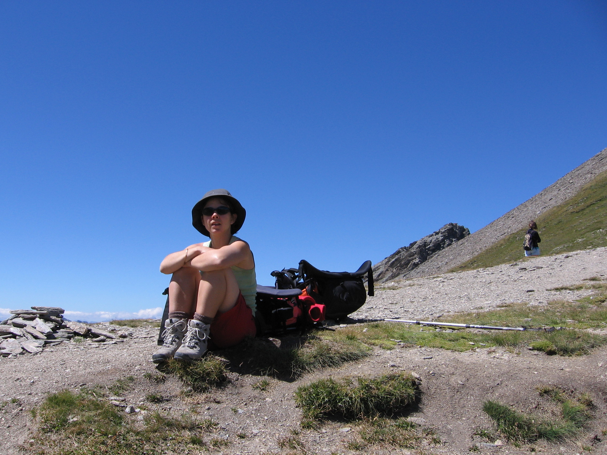
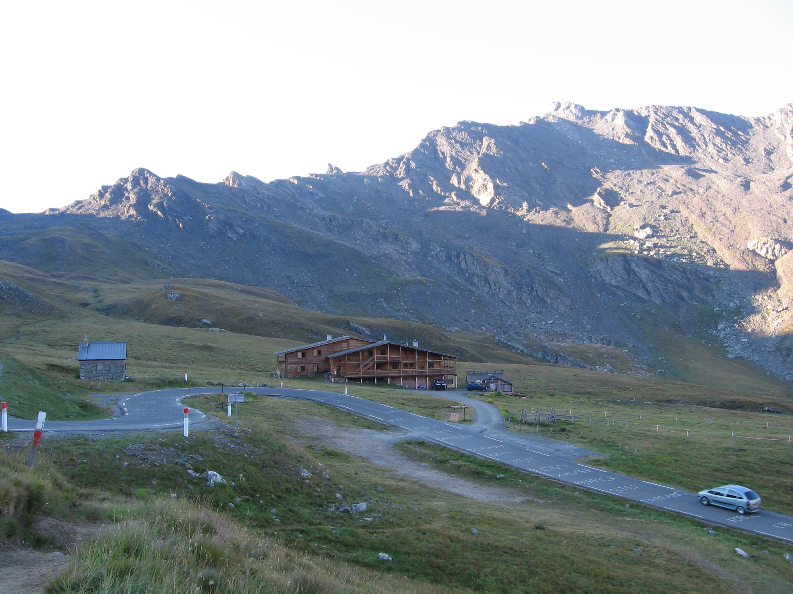
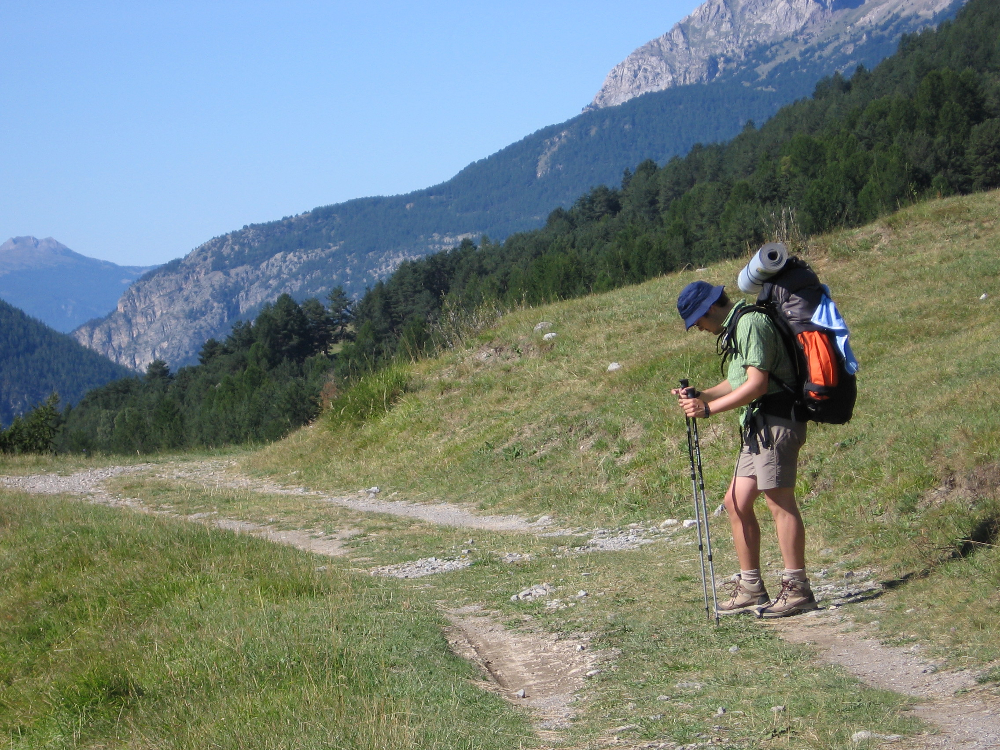
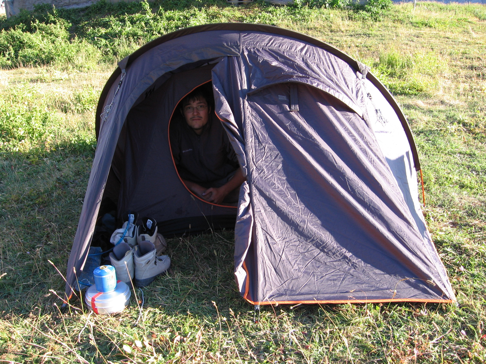
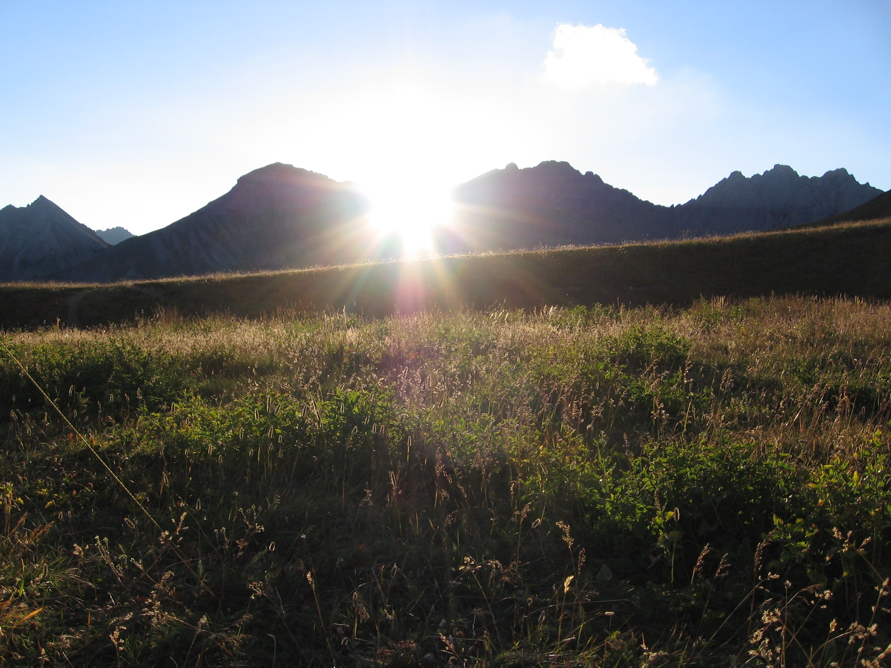
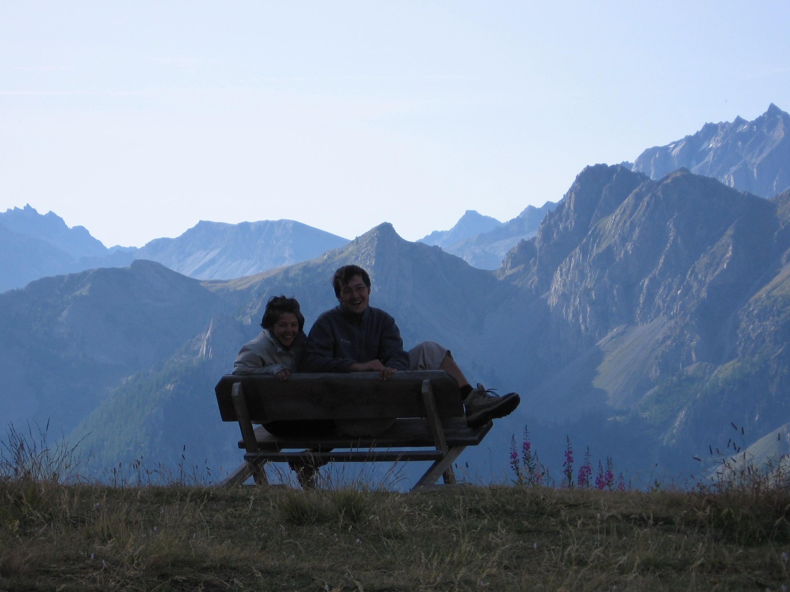
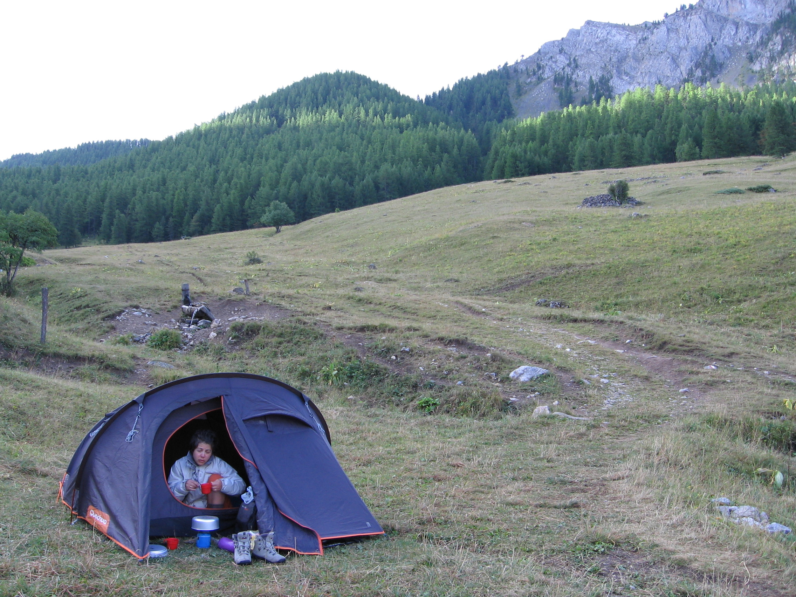
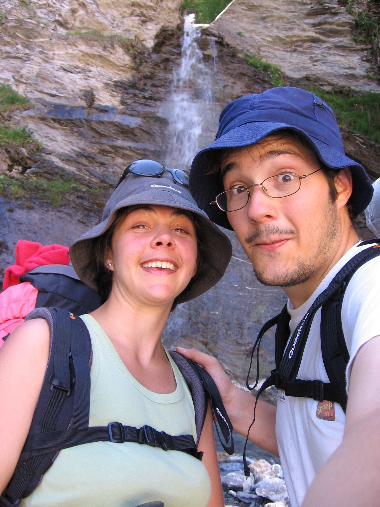

### Dimanche 17 aout (J0)
On part en voiture d'Oullins direction St Véran vers 16h. Poids des sacs
: Marion : 9 kg, Julien : 17 kg... Arrivé au Champ de l'Alpe vers 20h30.
Sympa le refuge autogeré... Par cher (27€ pour nous deux). On fait sa
popotte : riz et soupe pour ce soir. Et au lit à 22h, on prend les
bonnes habitudes...

### Lundi 18 aout (J1) – St Véran > Col Agnel

Levé à 7h, douche et petit dejeuner à la cuisine du gite. Départ à 8h.
On laisse la voiture devant le gite pour notre toute la durée de notre
randonnée. Pause 'pain' à la seule boulangerie de St Véran ouverte... Et
direction le col Agnel... Passage à la chapelle de Clausis. Pause à 12h
dans la montée du col de Chamoussière. On a reservé par téléphone 2
places au refuge Agnel. On arrive vers 15h au refuge Agnel. Crevé mais
finalement on arrive tôt ! Diner + Nuit + Petit Dej : 37€ par personne,
cher mais bon on est en vacances. Et pas envie de bivouaquer à 2500m le
premier jour... Première bière du séjour, j'ai as trouvé la Tourmente,
je me rabat sur une obscure bière allemande, pas super bonne... Et la
douche fait un bien immense... Elle est ouverte de 15h à 19h et pas plus
tard, le refuge Agnel est alimenté par panneau solaire. L'attente
jusqu'au repas de 19h est longue et on est limite frigorifié avant
d'aller manger ! Sous la couette, il fait un peu plus chaud.... On fait
la connaissance de deux femmes qui veulent faire le Pain de Sucre le
lendemain. C'est l'esprit refuge... Le repas : soupe de légume,
blanquette de veau et riz, fromage puis dessert. Tout est limite à
volonté (sauf le fromage!) mais c'est comme à la maison : on met le
couvert, on se sert dans la soupière, on range et on nettoie la table à
la fin du repas. Quelques groupes accompagnés font le tour comme nous,
mais avec le service Sherpa (service de transport de bagages de refuge à
refuge), et donc exclusivement en refuge. Nous on fait figure
d'extra-terrestres avec nos sacs !

Ensuite dodo à 20h30 parce que déjà bien crevé ! Et sinon on aurait
froid :) Les autres randonneurs sortent les jeux de sociétés, les
magasines, les livres présents dans le refuge : bon esprit je vous dit !

### Mardi 19 aout (J2) – Col Agnel > Abriès
Marion se réveille pas très en forme ce matin. Avant le petit déjeuner,
elle passe déjà par la case WC. Petit déj copieux, j'en profite pour
tirer quelques bouts de pain pour le midi... (les refuges ne vendent pas
de pain, seulement les paniers repas à 11€ pièce...)

Après le réveil à 7h, on part un peu avant 8h, mais Marion n'a pas mangé
beaucoup. Sur le chemin du col Vieux, on s'arrête plusieurs fois. Des
randonneurs qui font le tour dans l'autre sens nous filent des médocs
pour Marion. On tente le coup du thé sucré dans la poche à eau pour
qu'elle puisse s'hydrater durant la journée. Mais même après le col
Vieux, ça ne va pas mieux.

Pose à coté du lac Foréant : Marion est faible, elle n'a rien dans le
ventre....

On se pose un peu après le lac Egorgeou pour manger. Enfin, pour être
plus juste, je me pose pour manger et Marion pour dormir. Elle ne prend
d'un peu de thé sucré et un bout de pain. Ensuite, la descente jusqu'à
l'Echalp se fait assez rapidement. Cependant, je me fais peur avec une
petite chute : plus de peur que de mal, mais avec un gros sac ça devient
très dangeureux de tomber ! On se sent vite emporté. Bilan : une petite
plaie à la main droite, qui mettra très longtemps à cicatriser (fin du
séjour!) à cause des batons qui 'frottait' sur la plaie.

On arrive vers 14h30 à côté de l'Echalp (on n'y passe pas). On se pose
dans un coin d'herbe à coté, et petite sieste/prise de note.

En file ensuite à la Monta, pour se poser et boire un coup au refuge de
la Monta. On retrouve des têtes connues du refuge Agnel... Enfin je
retrouve la bière Tourmente, en 50cl exclusivement, c'est trop bon...

On a noté qu'il y a le bus qui passe bientôt. On prend celui de 17h10
pour arriver à Abriès vers 17h20... Ravitaillement dans le Shopi du
village (paté, ...) et on réserve une table à la fameuse crêperie
d'Abriès... Il parait que les crêpes sont succulentes, j'attends de voir
ça. On file ensuite au camping poser notre tente et prendre une bonne
douche. Plein de places dans le camping. Marion va bien mieux
maintenant, après avoir dormi un peu et s'être vidé de nombreuses fois
pendant la journée... Comme moi, elle apprécie bien le resto ! Et
surtout elle a faim...

Retour au camping à 21h pour dormir sous la tente pour la première fois
de la rando. J'ai pas super bien dormi ce soir là : il pleuvait, i
faisait du vent donc je stressais pour la tente : va-t-elle tenir ? Et
en plus, j'avais pris un simple matelas mousse, léger mais pas top
confort... Mais bon, la tente a tenue :) Niveau étape, on avait déjà
prévu d'éviter la colette de Gilly, trop 'déjà fait' pour gagner une
journée. Et vu nos performances techniques (Marion pas bien, moi pas
forcément hyper bien lors de la première journée pour les +800m, on
décide également d'annuler l'étape Abriès-Fonds de Cervières (+1300m)
pour arriver demain soir directement à Souliers via Aiguilles (variante
du GR58).

### Mercredi 20 aout (J3) – Aiguilles > Souliers
Réveil à 7h. En face de nous des randonneurs se réveillent aussi. Pliage
de duvets, tente, karimat... Et petit dej au camping gaz. On décolle
vers 8h30 pour acheter le pain puis prendre le bus Abriès-Aiguilles de
8h55. Il arrive, avec un pneu explosé, donc il roule à 30km/h et il
oublie de nous faire payer... A 9h30 on est à Aiguilles, le temps de
trouver le sentier qui part vers Souliers, on rencontre un groupe de
germanophone (à l'oreille) qui font la même route que nous. Au fil du
sentier, on va se doubler de nombreuses fois avant de se retrouver au
même refuge le soir ! Il nous aident même à prendre le bon chemin alors
qu'on avait loupé une intersection... La montée se fait bien jusqu'aux
Meyries/le Rouet. Petite pause midi après le Rouet : on se fait semer
par le groupe ! Ensuite, montée un peu pénible sur un chemin forestier
jusqu'à la bergerie de Péas. Juste après, on croise 2 marmottes qui nous
font de l'oeil : on fait des photos d'enfer ! Ensuite une bonne montée
jusqu'à la rencontre du 'vrai' GR58 qui arrive des Fonts : vraiment
splendide, magnifique comme montée. J'ai pas trouvé de mots pour décrire
cette ascension. On l'a faite tranquille, en s'arrêtant souvent pour
regarder le paysage... Il n'y avait personne, à part des marmottes...

La descente est un peu plus technique jusqu'au village de Souliers. On
décide alors de se poser au refuge parce que on a envie de bien dormir,
et il parait que c'est très très bon ! Une douche et un bon repas nous
aident à nous remettre de nos émotions de la journée : soupe, colin et
pattes, fromage de la fromagerie du Queyras (le ¼ chèvre ¾ vache est
complètement divin : je vous le conseille...) et une tarte pour finir,
avant le verre de génépi ! Les gérants nous diffusent ensuite un petit
film sur la vie du village de Souliers dans les années 70 (fait par
Pierre Tchernia, je l'ai pas retrouvé sur internet...). Tout le petit
monde va se coucher vers 22h, déjà fatigué de la longue journée. Les
gérants sont effectivement très sympa et la nourriture est excellente,
et moins 'usine' que le refuge Agnel. Le groupe germanophone vient de
belgique en fait, et on a pu discuter un peu avec eux.

### Jeudi 21 aout (J4) – Souliers > Furfande
Au programme aujourd'hui : Souliers – Refuge de Furfande, notre première
étape doublée !

Réveil à 7h, petit déjeuner à 7h30. Départ de Souliers vers 8h.On grimpe
jusqu'au col Tronchet (+500m), on y est vers 9h30. On descend ensuite
jusqu'à la case déserte (on traverse la route), sans voir le lac
Souliers ; puis on descend vers Brunissard à travers une sorte de
canyon. On arrive à Brunissard vers 12h. On marche sur la départementale
jusqu'à Arvieux, à cause de travaux de découpe de sapin... On fait entre
temps une pause pour manger en dessous de la Chalp. Le GR est
impraticable de Brunissard au Coin. On passe à Arvieux pour acheter du
pain, et recharger les gourdes : il n'y a pas de point d'eau jusqu'au
refuge de Furfande... On part donc d'Arvieux vers 14h chargé de 3l d'eau
en tout. Le début est dur (chaud...) puis ensuite plus cool, dans des
sous-bois. Petit tour dans une cabane ouverte à mi-chemin et il nous
reste les 500 derniers mètres de dénivelés à effectuer. Très dur pour
moi cette fin... On arrive au col de Furfande vers 16h30. Et là, plein
de voiture... Ca dégoute... Il y a effectivement une route
semi-praticable depuis Arvieux. On suit cette route avec le GR58. Ca
soule vraiement de voir que certains font la même chose en voiture...
(Arvieux > Col de Furfande : +1000m) Descente rapide vers le refuge, ou
on peut, grâce à une petite participation (3€ par personne) planter la
tente et prendre une douche salvatrice ! On aura fait +1500m/-700m dans
la journée, c'est pas mal du tout ! Diner : spaghetti bolo déshydraté,
soupes : pas mauvais... On fait également notre premier bivouac ce soir.
J'ai peur qu'il fasse froid pendant la nuit (on est à 2300m.)

### Vendredi 22 aout (J5) Furfande > Bramousse
Finalement, il a fait plutôt froid pendant la nuit... On pensera à
investir sur les duvets pour une prochaine sortie en montagne... Réveil
à 7h30, on déjeune, on plie la tente et on part vers 9h30 (oui, plutôt
tard par rapport à hier...) Descente jusqu'au Guil (1200m d'altitude,
donc -1100m de dénivelé) ; puis remontée vers Bramousse (1450m
d'altitude) en passant sur 800m le long de la nationale de long du Guil,
on faisait pas les fières... On arrive à Bramousse vers 13h30. On se
pose au refuge pour manger. Steak frites pour moi et omelette pour
Marion, fromage, dessert et café. On se fait un peu plaisir, on a décidé
de bivouaquer ce soir aux chalets de Bramousse, un peu plus haut (1850m
d'altitude), beau 'coin' donné par la gardienne du refuge de Furfande.

On voit passer une averse alors qu'on mange. Cool, on est à
l'intérieur... Quand on redécolle vers 15h30, il fait de nouveau beau.
Montée aux chalets tranquille, pas un chat sur la route. Ca avance le
trajet pour le lendemain (col Fromage, col des Estronques, St Véran). On
arrive aux chalets vers 17h ; il y a de l'eau mais c'est un peu galère
pour trouver un 'spot' pour poser notre tente. Pas devant les entrées
des chalets fermés (dommage, car l'herbe à l'air sympa!), ni sur le
chemin... On finit par se décider pour un coin à côté du chemin au
niveau des chalets de Terre Noire. J'essaie de communiquer avec le seul
chalet habité (par des marseillais ?) mais j'ai l'impression qu'ils
m'ignorent quand je vais les voir, donc tant pis pour leur autorisation,
on fera sans !

Au repas ce soir, soupes (bouillon chinois de chez Royco très bon!) et
riz du Vieux Camp' (pas super bon mais cuit en 5 minutes). Dodo à 20h30.

### Samedi 23 aout (J6) Bramousse > St Véran
Réveil à 7h30. Petit Déj. Un peu froid pendant la nuit mais moins que la
veille. Un berger passe devant la tente avec son chien. On décolle vers
9h. Première montée jusqu'au Col Fromage, puis direction le Col des
Estronques. On se plante de route entre les deux cols, ce qui nous donne
(+100 -100) de plus à faire, et un passage très dangereux dans le Ravin
de Martre.

On rejoint le GR à 2191m au lieu de 2519m... On grimpe jusqu'au Col des
Estronques (dur!). On se pose pour manger dans la descente (froid!) et
on repart vite dans la descente (-800m) jusqu'à St Véran.Les derniers
+200m sont épuisants, il fait chaud et c'est la fin de la rando... On
arrive à la voiture qui n'a pas bougé à 15h30. Fini ! Une petite glace
au Bois des Amoureux pour fêter notre rando : la prochaine fois, on fera
les Fonds de Cervières...

### Epilogue
Une superbe rando, au milieu du décors fantastique du parc régional du
Queyras !
