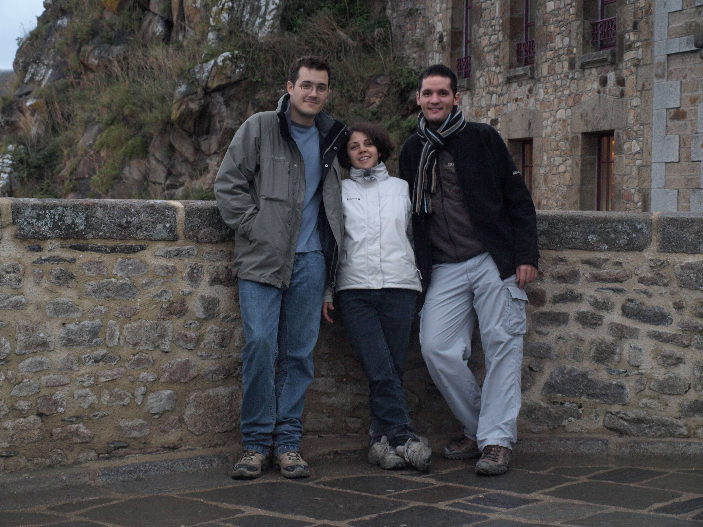
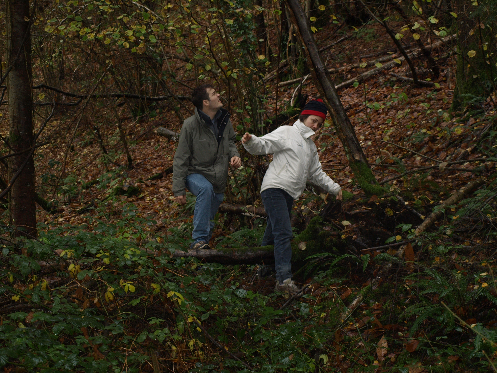

Un petit trip à la limite entre la Normandie et la Bretagne avec
Vincent, pour découvrir la belle abbaye du Mont St Michel, et
décompresser après le mariage de la semaine précédente...

### Jour 1 : 14 novembre : Visite du Mont St Michel
On arrive sur le Mont St Michel, vers 12h, après avoir roulé la matinée
depuis Versailles ; on arrive pile pour l'heure du pique-nique, version
améliorée on va dire : foie gras ramené par Vincent, fait maison et
bourriche d'huîtres cancalaises trouvées juste avant d'arriver sur le
Mont...

Ensuite petite visite sympathique du mont, de son abbaye et de ses
jardins, avec une étape géocaching vers la fontaine d'Aubert...

Le soir, on mange à Avranches, ou on galère pour trouver un resto
potable... On passe ensuite la nuit sous la tente aux environs de la
Lucerne-d'Outremer, à proximité d'un bois sur un lit de feuille plutôt
confortable... Idée pour plus tard : monter un site qui référence les
lieux possibles de bivouac (on a cherché une bonne demi-heure en voiture
de nuit un coin pour poser la tente...)

### Jour 2 : 15 novembre : L'abbaye de la Lucerne
Le matin, départ assez tardif (on est pas aux pièces!) pour un petite
marche d'une dizaine de kilomètres, à partir de la Haye-Pesnel jusqu'à
l'abbaye de la Lucerne, à travers les bois de la Lucerne... Terrain
plutôt humide, détrempé comme dirait Vincent ! Retour le soir en
direction de Paris après ce court mais agréable week-end...

