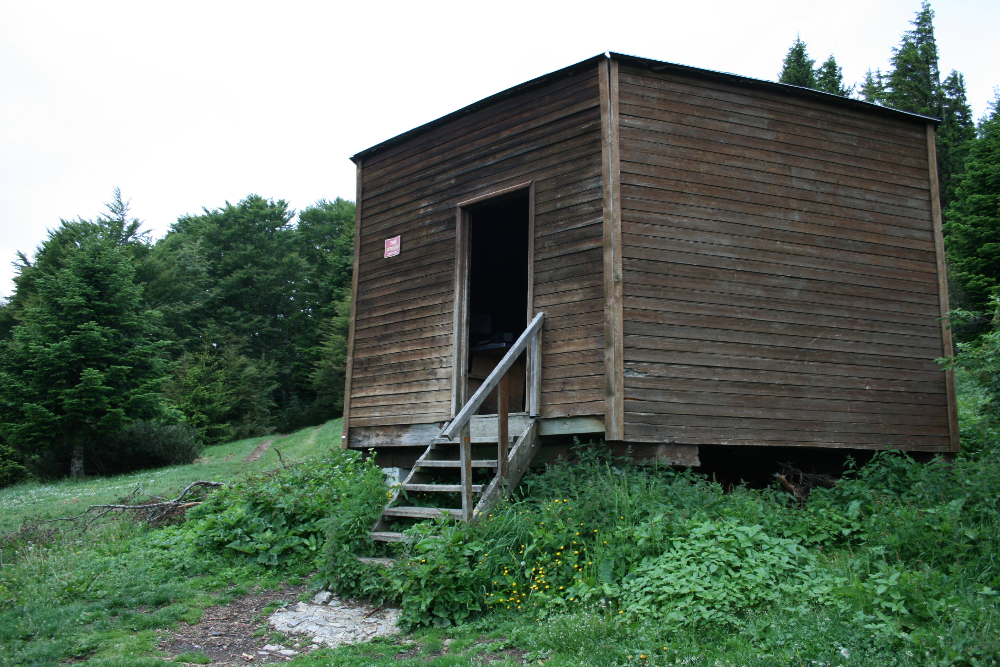
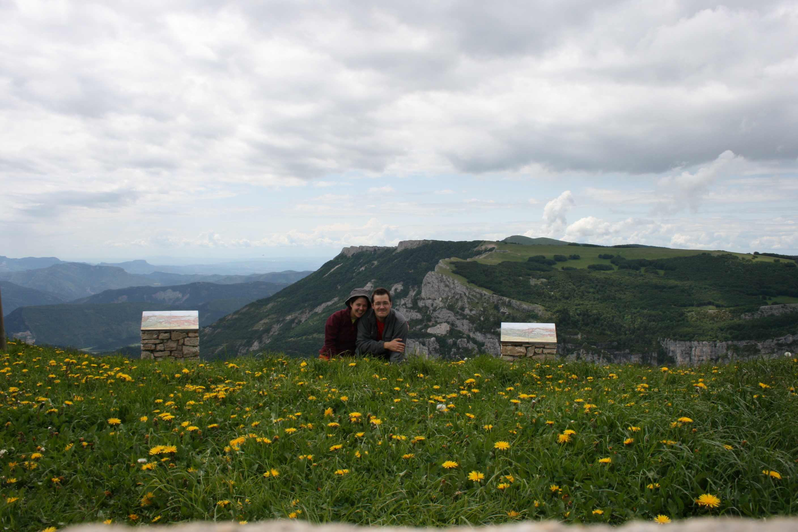
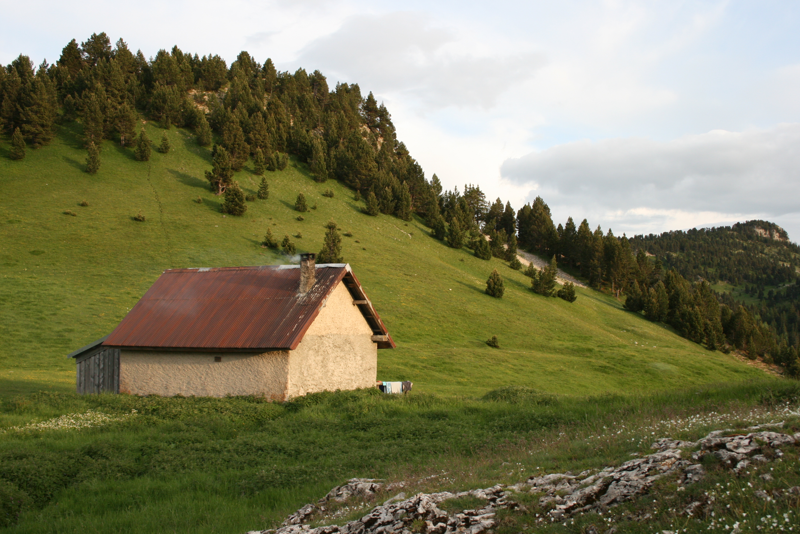
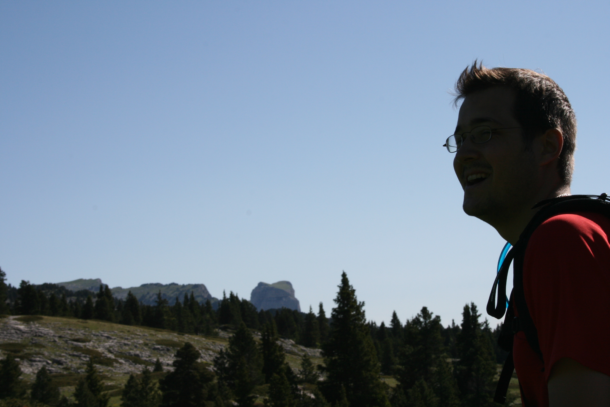
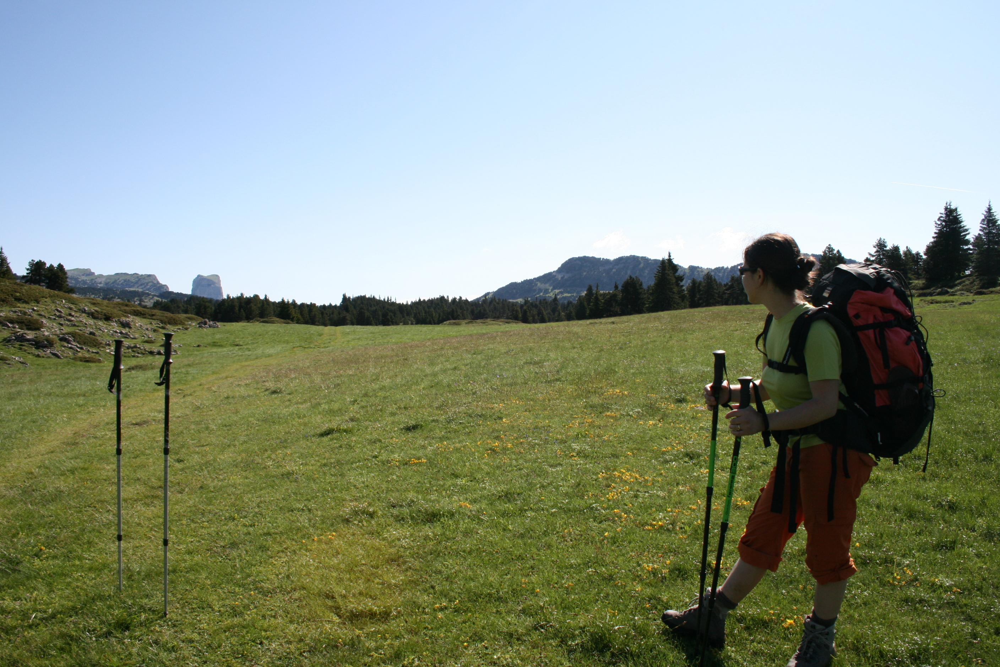

Quelques jours de vacances, un programme rando chargé de prévu : le vercors pis
ptetre le Verdon après. Finalement ça sera que le Vercors. Mais c'est chouette
les hauts-plateaux. Gros bonheur la-haut...

### J0 / Arrivée à Die
Arrivé au camping municipal de Die vers 19h après être parti de Paris à
12h, ça fait bizarre... On se fait un petit resto dans Die (p'tain c'est
tout petit en fait !). On se charge en liquide et on file au camping
pour dormir avant notre première journée. Le camping est rempli
d'étranger pour changer ;) On laisse la voiture devant le camping
pendant le séjour, à prioris pas de problème avec le gérant du
camping...

### J1 / Die - Col de Vassieux
- 1360 mD+ / 400 mD-

Une bonne grosse étape pour commencer ! Tout d'abord une longue approche
avant la montée du col. Ca monte, ca descend, c'est pas forcément idéal
pour une première journée et pour se mettre en forme. On se pose vers
12h au col de la Borne, déjà bien crevés...

L'ascension du col (environ 800m D+) est assez longue mais plutôt sympa.
On a un peu de pluie sur les 100 derniers mètres. On est bien vidé en
arrivant au refuge du col de Vassieux : il est en forme octogonale, très
propre et plutôt agréable. Il est construit sur les mêmes plans que le
refuge de Chamailloux (vers le pas de l'aiguille). Assez grand, il a une
capacité d'environ 20 personnes. Ce soir, on va se coucher tôt ! C'est
la première fois que l'on dort dans un refuge non gardé. C'est bien :
pas de tente, de l'isolation (il pleut dehors...), un poële, des chaises
et une table. La fontaine n'est pas trop loin, à 10 minutes environ.
Avant la nuit, on fait une petite flambée pour se réchauffer. Finalement
on sera que tous les 2 cette nuit dans le refuge. Une belle nuit en
amoureux dans les hauteurs de Vassieux, c'est chouette !

### J2 - Col de Vassieux - Col du Rousset - But Sapiau - Pas des Econdus - Refuge de Pré Peyret
- 1090 mD+ / -846 mD-

Une grosse étape pour aujourd'hui, mais avec un dénivelé acceptable :)
Départ vers 8h45 du refuge, après une nuit orageuse et pluvieuse. On se
dit qu'on a fait le bon choix en restant au refuge (par rapport au
bivouac prévu vers Espeline). Le matin, on se ballade dans le plateau de
Vassieux, avant d'arriver au col de Chironne. Ensuite direction le col
du Rousset (avec un beau chemin en encorbellement). On décide de faire
le détour jusqu'à la station du col du Rousset (à 10min du col) pour
manger chaud ce midi. Steak-frites salade... Bon, les frites étaient pas
super bonnes mais ça changeait du sauc' !

L'aprem, on reprend notre chemin qui nous mène tout d'abord au But
Sapiau, puis au pas de Econdus. On avait prévu de bivouaquer dans le
coin, on décide finalement de pousser jusqu'à la bergerie de Pré Peyret
pour profiter d'un abri solide comme la nuit dernière :) Il a fait plein
soleil toute la journée, ce fut très agréable... On retrouve à la
bergerie un groupe d'accompagnateurs de moyenne montagne qui préparent
leur exams. Ca change de notre solitude de la veille ! On passe une
bonne nuit dans ce refuge, emporté par les rêves du haut plateau du
Vercors.

### J3 - Refuge de Pré Peyret - Haut-Plateau - Archiane - Nonnières
- 734 mD+ / 1452 mD-

Gros D- aujourd'hui ! Réveil vers 6h avec les guides, qui se lèvent tôt
:) Petit déj et décollage tranquille à 8h. Belle matinée dans les
hauts-plateaux avec de super points de vue dans les combes et les cols.
De superbes images qui resteront gravés longtemps dans nos têtes...

Ensuite la descente sur Archiane, assez pénible avec un bon dénivelé
négatif. Arrivé vers 12h30 sur Archiane, on galère à trouver un coin ou
manger, et on squatte sur un snack qui n'a plus de pain ! Bon le fromage
était très bon. Mauvaise nouvelle : le gîte d'étape de Bénevise est
fermé pour cause perso... Donc on décide de filer jusqu'à Nonnières en
espérant que l'hotel sera ouvert (il ne répond pas au téléphone). On
passe par Bénevise, on refait le plein d'eau. On file sur Nonnières (il
fait chaud !), on trouve l'hotel après avoir discuté un moment avec un
habitant le long du GR... Chance, il reste une chambre dans l'hotel, il
ne reste plus qu'à attendre 18h pour que la réception ouvre à nouveau...

Bonne douche, bonne bouffe et bonne nuit dans l'hotel : c'était l'étape
royale de notre trip !

### J4 - Nonnières - Crête de Jiboui - Luz la Croix Haute
- 1254 mD+ / 1100 mD-

Petit déj à l'hotel : trop bien ! café, croissant, pain, beurre et
confiote ! Décollage à 9h pour la crête de Jiboui. Arrivé vers 12h
autour du col (belle montée, la ferme du désert est effondrée ?) le
paysage sur la crête m'a fait vraiement peur. J'aime pas les crêtes.
Avec le vent et le vide de chaque côté, ca me rend dingue ! Le poids du
sac doit surement jouer également.

Ensuite col de Seysse, descente sur la Pouyat, passage au col de Grimone
(j'aime pas marcher sur la route!) et arrivée pas si tardive sur Luz la
Croix Haute. La gare SNCF est fermée ce soir, on ne pourra pas prendre
nos billets pour demain. Le camping, en bas de la ville est très bien.
Une douche bien méritée après cette belle journée. Ce soir, on mange au
restaurant du camping, pas exceptionnel mais plus cool que les lyos :)
Et il faut bien fêter cette dernière journée de rando.

### J5 - Retour en train à Die

Hum, ca vaut le détour cette dernière journée : après une visite de Luz
le matin, décolle de Luz vers 11h40 en direction de Veynes S/ Devoluy.
Problème : pas de train vers Die avant 17h ! On en profite pour se poser
manger au café du coin, et pour trainer dans la petite ville. On est de
retour sur Die vers 18h pour reprendre notre voiture.
