Cet été 2009, nous avions décidé de partir refaire le tour du Queyras à
pied, comme l'année dernière, mais en invitant tous nos z'amis... Après
les infos techniques du parcours prévu, je retranscris le journal de
bord tenu pendant le trek. Bonne lecture !

## Etapes prévues

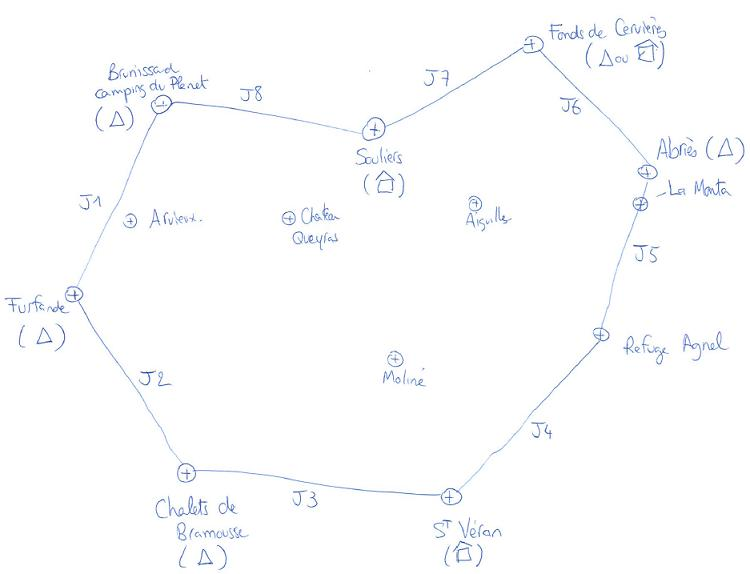

| Journée          | Description                                       | Dénivellé   | Alimentation                   | Alimentation                                                                                             | Ravitaillement |
|:---------------- |:------------------------------------------------- | ----------- | ------------------------------ | -------------------------------------------------------------------------------------------------------- | -------------- |
| J0 (samedi 11)   | Arrivée en voiture à Brunissard                   |             | Soir : resto ?                 | Camping au Planet à 1 km de Brunissard (04.92.46.79.15)                                                  |                |
| J1 (dimanche 12) | Brunissard - Refuge de Furfande                   | +800, -203  | Midi : PN Soir : bivouac       | Bivouac derrière le refuge                                                                               |                |
| J2 (lundi 13)    | Refuge de Furfande - Chalets de Bramousse         | +700, -1100 | Midi : resto Soir : bivouac    | Bivouac                                                                                                  |                |
| J3 (mardi 14)    | Chalets de Bramousse - St Véran (via Col Fromage) | +1000, -900 | Midi : PN Soir : resto         | Nuité en gîte ? (Le Chant de l'Alpe - 04 92 45 86 59, réservé pour 9, reste à envoyer 60 euros d'ahrres) | St Véran       |
| J4 (mercredi 15) | St Véran - Refuge Agnel                           | +834, -304  | Midi : PN Soir : refuge ou biv | Refuge ou bivouac ?                                                                                      |                |
| J5 (jeudi 16)    | Refuge Agnel - La Monta                           | +226, -1245 | Midi : PN Soir : resto         | Camping d'Abriès                                                                                         | Abriès         |
| J6 (vendredi 17) | Abriès - Les Fonds de Cervières                   | +1323, -883 | Midi : PN Soir : refuge ou biv | Refuge des Fonds ? Bivouac ?                                                                             |                |
| J7 (samedi 18)   | Fonds de Cervières - Souliers                     | +589 , -785 | Midi : PN Soir : refuge        | Refuge de Souliers - 04.92.46.76.90 (déjà réservé pour 6, il reste à envoyer 60 euros d'ahrres)          |                |
| J8 (dimanche 19) | Souliers - Brunissard, en passant par le lac      | +753 , -697 | Midi : PN au lac               | -                                                                                                        |                |

## Budget / Ravitaillement

- Environ 2 nuités en refuge soit 40*2 euros
- Environ 1 nuit en refuge : 20 euros
- Environ 1 nuit en camping : 10 euros

Le reste des nuits en bivouac.

## Trajets partiels

-   Guillaume et Audrey restent jusqu'au 14 juillet au soir, cad St
    Véran : il peuvent donc poser une voiture à St Véran pour repartir
    directement.
-   Amélie reste jusqu'au 16 juillet au soir, cad la Monta / Abriès,
    elle peut donc poser sa voiture vers Abriès pour repartir
    directement.
-   Les parents veulent faire un bout d'étape mercredi soir / jeudi :
    ils peuvent réserver un gite à St Véran pour la nuit du mercredi au
    jeudi, et marcher le jeudi de St Véran à la chapelle de Clausis.

## Récit du trek

### J0 / Arrivée à Brunissard

| Etape           |                    |
|:--------------- |:------------------ |
| Date            | 11/07/2009         |
| Départ          |                    |
| Arrivée         | Brunissard - 1850m |
| Denivelé mesuré |                    |

On arrive au camping du Planet vers 19h. On part à 9 pour ces premières
étapes : cams, loub, amélie, gégé, vincent, guillaume, audrey, marion et
moi. RoadTrip avec les voitures pour les poser aux endroits stratégiques : la voiture de guillaume et audrey à St Véran ; et les voitures de cams
et loub + celle d'amélie à Abriès. Ça nous prend un bon bout de temps
faire ce premier tour, on se dit que le tour sera long... Repas vers
22h30 : lentilles et soupe de fruits, le repas le plus 'lourd' qu'on
s'est permis, arrosé en plus avec quelques bouteilles de chez vincent.On
se couche tard pour le premier jour, on changera ces habitudes
rapidement !

### J1 / Brunissard - Furfande

| Etape           |                            |
|:--------------- |:-------------------------- |
| Date            | 12/07/2009                 |
| Départ          | Brunissard - 1850m         |
| Arrivée         | Refuge de Furfande - 2300m |
| Denivelé mesuré | + 1157m /  - 707m          |

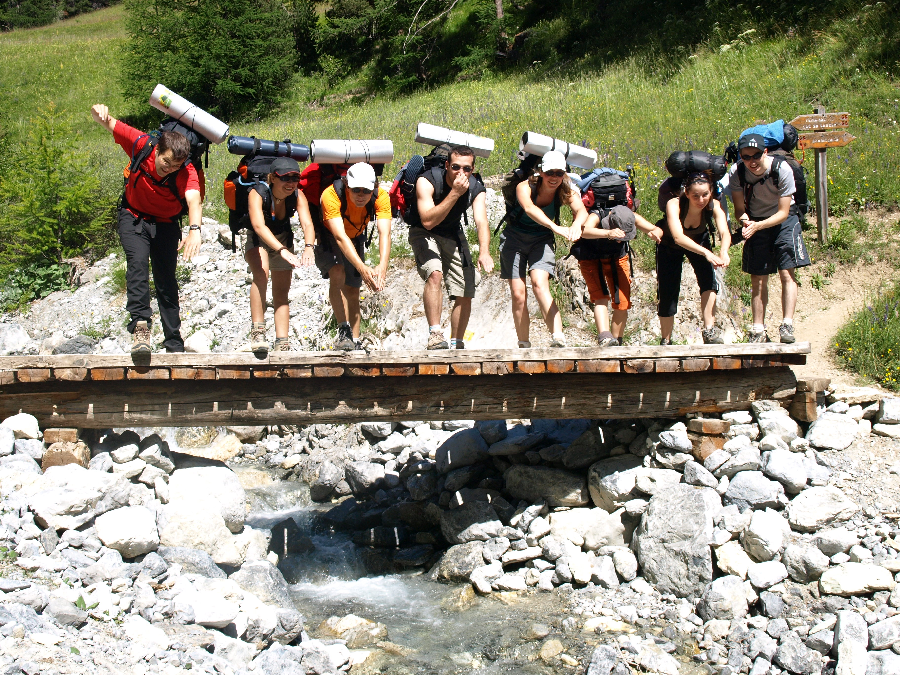

Départ vers 10h du camping après le partage des vivres dans les sacs à
dos. Ce camping nous aura charmé par ses grands espaces boisés... On se
pose entre les arbres ! Montée vers le col de Furfande (2500m), pause
midi à la cabane du Pré Vallon (juste avant en fait, parce qu'il y a
déjà du monde). Plein de mouche mais le mix saucisson/pain de vincent
/paté/pompote était apréciable. Un peu juste en pain.

Décollage pour le col en début d'aprem, en plein cagnard. La montée
commence à être dur pour certains. On arrive au col vers 16h, pause
géocaching ! Le refuge est 20 minutes plus bas, premières tourmente
attablés devant le refuge, le bonheur est présent ! Cette première étape
est réussie pour tout le monde, pas encore de casse. On pose les tente
derrière le refuge, on prend une douche et on continue l'apéro avant le
premier repas bivouac : le duo pates & soupes : apprécié par tout le
monde je crois... On se couche assez vite après une petite coinche.

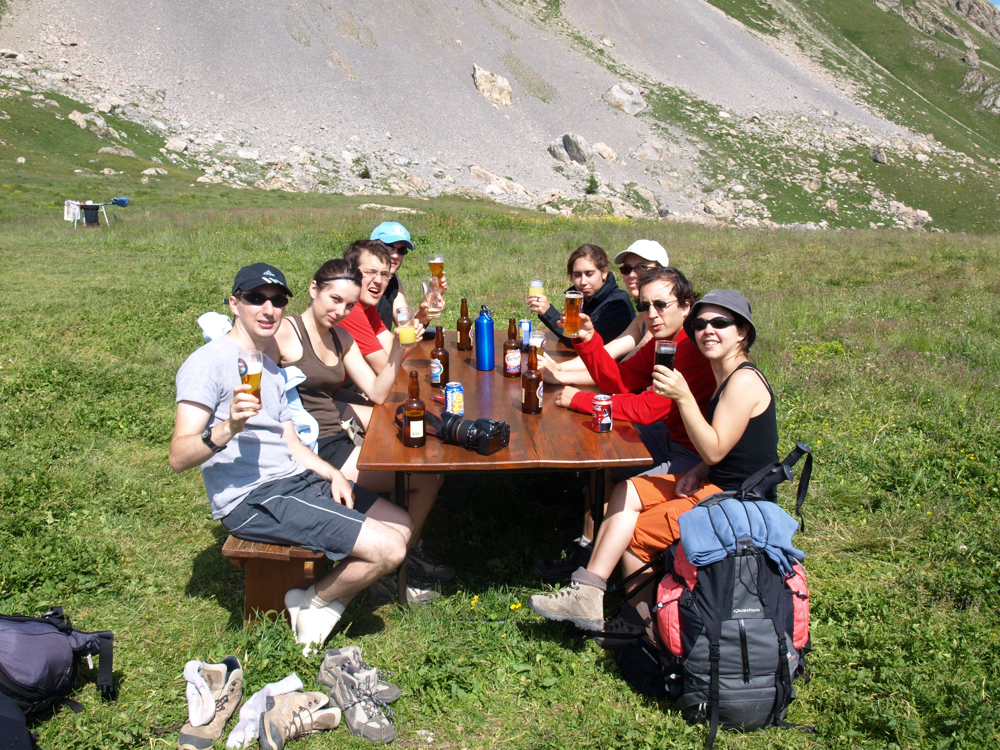

### J2 / Furfande - Bramousse

| Etape           |                              |
|:--------------- |:---------------------------- |
| Date            | 13/07/2009                   |
| Départ          | Refuge de Furfande - 2300m   |
| Arrivée         | Chalets de Bramousse - 1874m |
| Denivelé mesuré | + 993m /  - 1326m            |

Départ à 9h après un petit-petit déj (40g de céréales par personne,
c'est trop léger ! la prochaine fois on prévoiera un peu plus large...)
On passe par les chalets de Furfande au lieu de redescendre tout de
suite sur le GR. La gérante du refuge nous l'a conseillé. Bilan : une
bonne heure en plus de marche, mais chouette quand même... Camille en
profite pour trouver plein de belles images de fleurs alpines. On passe
juste en dessous du col de la Lauze, et on se paye le luxe de faire un
petit tour en rab' dans la foret au lieu de descendre directement (les
hommes de tête n'ont pas vu l'embranchement...) ; et on finit par
descendre lentement aux Escoyères. Ca commence à être un peu dur avec
toutes ces rallonges...

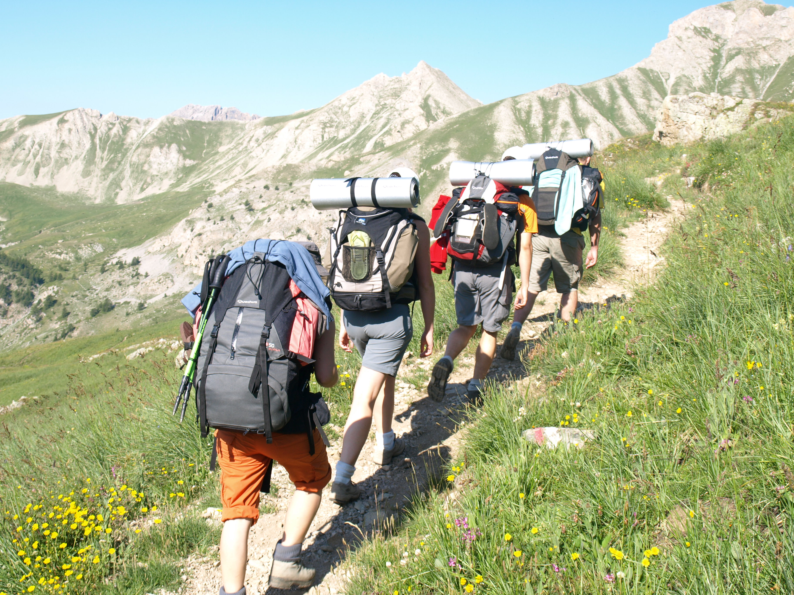

On mange vers 13h aux Escoyères, devant la fontaine. On descend ensuite
jusqu'au Guil (c'est bas!) sur une petite route goudronnée en lacets. On
longe 300m la gran' route et on traverse le Guil pour monter en
direction de Bramousse.Au gîte de Bramousse, pause bière/frites : elles
sont toujours aussi mauvaises ces frites, on dirait que l'huile n'a pas
été changé depuis longtemps ! Enfin, dernière montée de la journée pour
rallier les chalets de Bramousse, 300m de dénivelé plus haut. On arrive
bien lessivés à 18h20... Encore une belle journée ! On croise au passage
un berger très sympatique, on discute 5 minutes de la fréquentation du
GR, de notre bivouac aux chalets... On se pose justement sur ses
conseils devant le chalet de 'Jean-Pierre', au dessus du hameau. Bouffe
et douche (dans la fontaine du proprio !). Les pates passent carrément
bien (sauce aux cèpes à refaire !). Guillaume sort l'eau de vie
allemande (encore oublié le nom) ; encore quelques coinches avant de
mater les étoiles allongés sur un karimat : on est bien... Une belle
nuit dans les montagnes pour tout le monde...

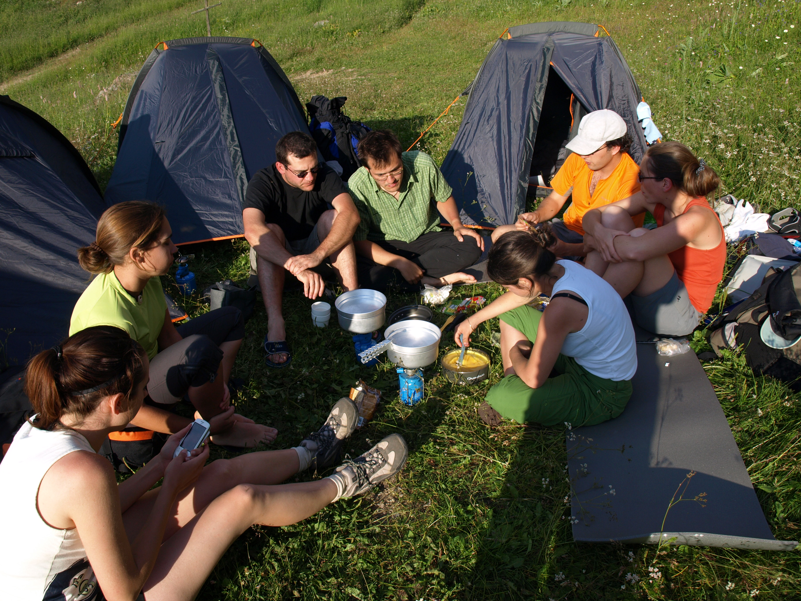

### J3 / Bramousse - St Véran

| Etape           |                              |
|:--------------- |:---------------------------- |
| Date            | 14/07/2009                   |
| Départ          | Chalets de Bramousse - 1874m |
| Arrivée         | St Véran - 2040m             |
| Denivelé mesuré | + 1300m /  - 1134m           |

Départ matinal à .. 8h45 ! On part en 2 groupes : un premier monte
jusqu'au col de Bramousse pour aller sur les crètes jusqu'au col
Fromage, alors que le second va directement au Col Fromage avec un
dénivelé réduit. Je pars avec le deuxième groupe, sans la carte, parce
que je me souviens bien du chemin : ça serait bête de se perdre sans la
carte resté dans les mains du premier groupe !

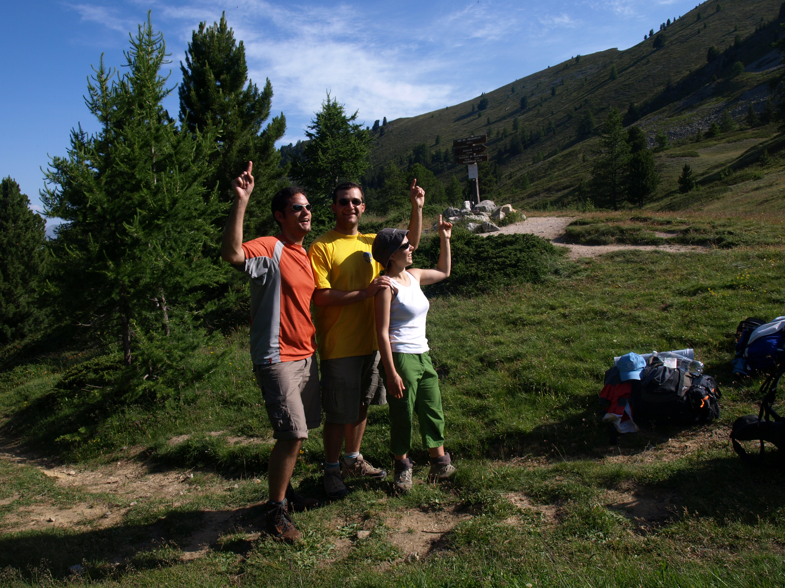

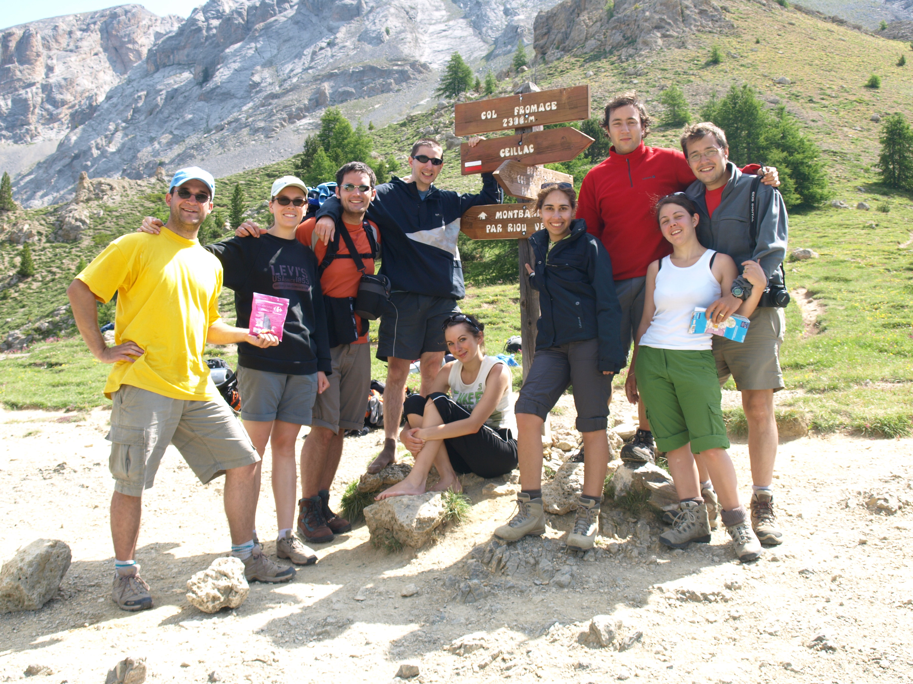

On monte tranquillement jusqu'au col Fromage. Ensuite on file jusqu'au
col des Estronques (2651m) : venteux comme d'hab ! Amélie montre elle
aussi quelques signes de fatigue dans la montée... Puse juste derrière
le col pour midi avec le package habituel : saucisson, paté, pain,
fruits secs... On redescend ensuite rapidement vers St Véran. Arrivée
vers 15h à la cascade : pur moment de bonheur, une bonne baignade sous
une eau assez froide ! Derniers mètres jusqu'à St Véran, arrivé au gîte
(le Chant de l'Alpe). Comme d'hab, on se cherche un bar pour boire notre
bière quotidienne... Guillaume et Audrey nous abandonne ce soir pour
aller bosser le lendemain. Cams et Loub décident également de ne pas
continuer l'aventure et préférent arrêter sur un bon souvenir :) Mes
parents arrivent vers 19h pour les remplacer ;) On finit au resto avec
une énorme raclette ! Soirée arrosée et un peu trop chargée en
fromage... On le regrettera le lendemain pendant la montée !!

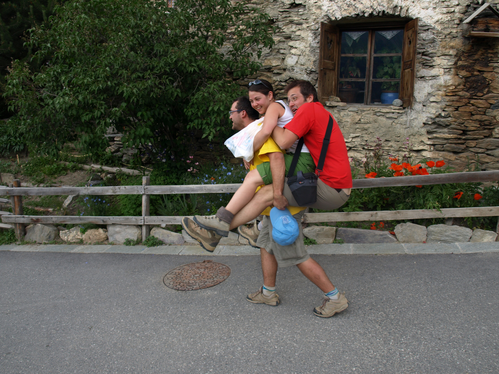

### J4 / St Véran - Lac Foréant

| Etape           |                     |
|:--------------- |:------------------- |
| Date            | 15/07/2009          |
| Départ          | St Véran - 2040m    |
| Arrivée         | Lac Foréant - 2625m |
| Denivelé mesuré | + 1300m /  - 715m   |

Départ sous la pluie à 7 de St Véran, montée assez pépère jusqu'à la
chapelle de Clausis, le beau temps revient avec nous assez rapidement.
Pause bouffe à Clausis, avec les parents. Mes parents mangent avec nous
avant de rebrousser chemin pour flâner dans St Véran...

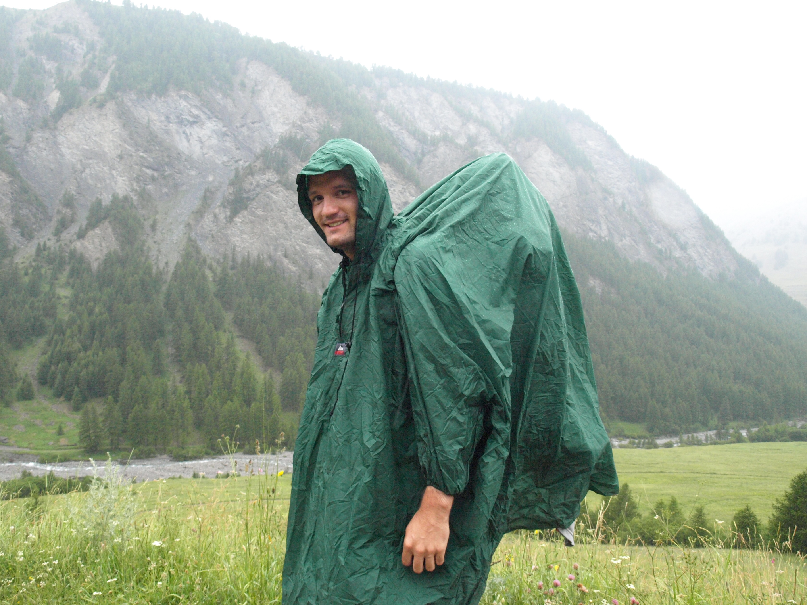

On finit donc la journée à 5, alors qu'on était encore 9 la veille... Ca
change le groupe ! Montée assez difficile au col de Chamoussière
(2882m). Il faut dire que j'avais les vieux démons de l'année dernière
qui me tournaient autour ! J'ai pris mon temps ;) On descend ensuite
rapido au refuge Agnel. Pause bière au refuge : pas de Tourmente ici,
toujours aussi 'usine' ce refuge ! Pas mécontent de pas dormir ici... On
redécolle vers 17h pour atteindre le Lac Foréant, et se rapprocher un
peu d'un rêve un peu fou : gravir le Pain de Sucre de nuit pour voir se
soleil se lever d'en haut... Marion dort à moitié sur le chemin, elle
n'a plus de carburant. Au lac, on se pose à côté d'autres bivouaqueurs
(encore une T2 UP...) Soupes et Pates pour changer, rapido pour Marion
qui dort déjà. Flemme de se laver ce soir, on se couche super tôt vers
20h...

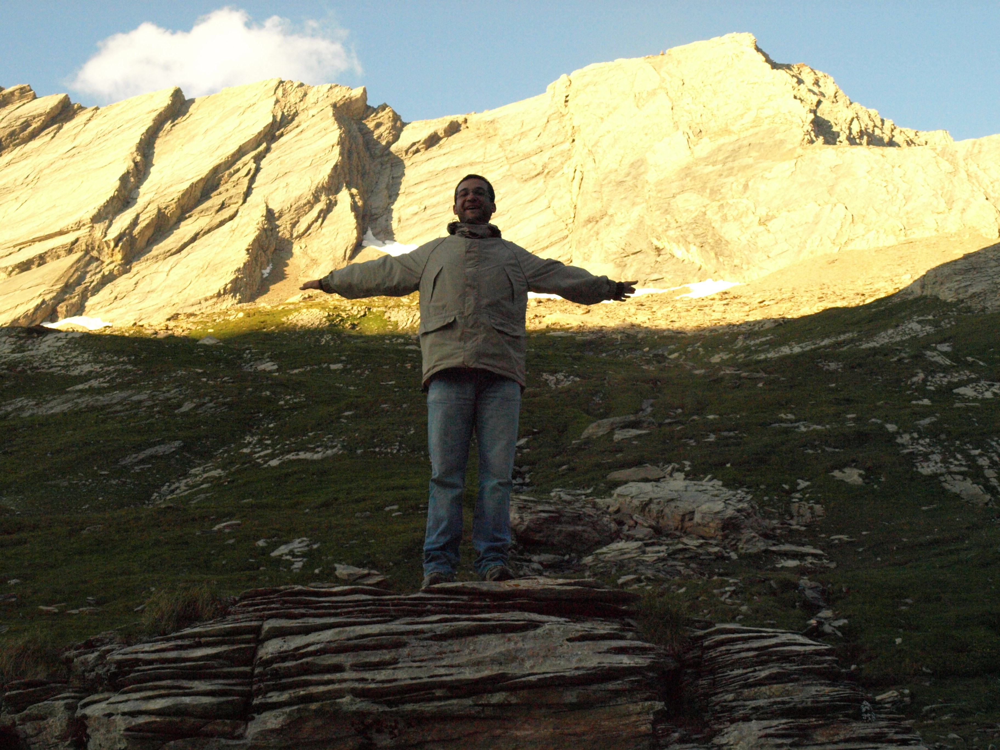

### J5 / Lac Foréant - La Monta

| Etape           |                     |
|:--------------- |:------------------- |
| Date            | 16/07/2009          |
| Départ          | Lac Foréant - 2625m |
| Arrivée         | La Monta - 1711m    |
| Denivelé mesuré | + 786m /  - 1672m   |

Départ vers 4h30 du bivouac, réveil difficile alimenté par des fruits
secs et quelques barres. On chausse les frontales, et on part en mode
léger (sans gros sac...) en direction du Pain de Sucre (3208m). La
montée (+600m) est raide, on met un peu les mains, mais on la fait assez
rapidement (1h30). Amélie un peu en retrait avec son ashme... On arrive
juste avant le moment fatidique, juste avant un autre groupe de
grimpeurs. On assiste groggy par le froid et l'altitude au premier rayon
de soleil d'une belle journée qui s'annonce... Vision magique tout
autour de nous, sur un ensemble de massif tous plus beau les uns que les
autres...

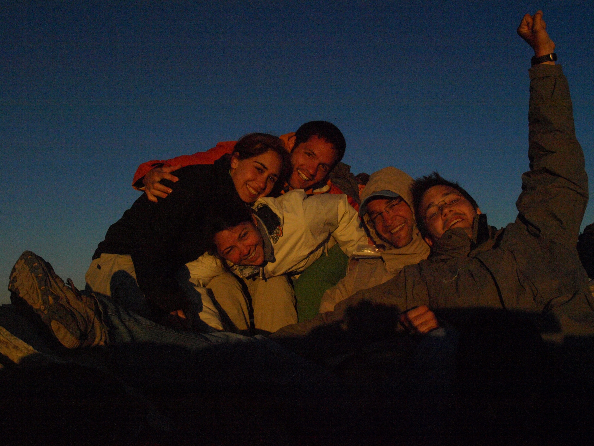

On redescend après une demi-heure de spectacle passé en haut, pour un
petit déj bien merité ! Les 2 bouteilles de gaz se vident
quasi-simultanement, vivement le ravitaillement à Abriès !

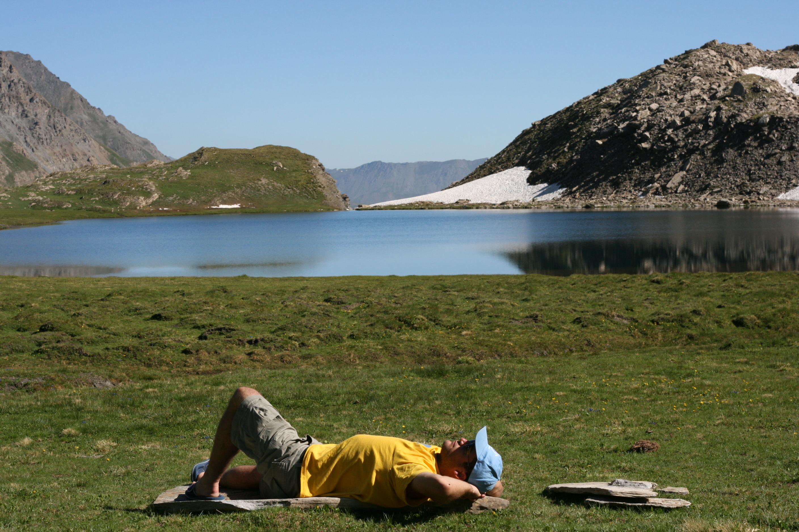

Descente ensuite à partir de 10h30 (on a droit à une pose méritée quand
même !) vers La Monta. Pause au point de vue du Viso. Gégé se tord le
pied :( Bad day ! On arrive tranquillouà La Monta vers 14h30. La
Tourmente à cette heure ça passe bien ausii ! Le bus pour Abriès passe
vers 17h10. Ravitaillement à Abriès, la voiture d'Amélie qui repart le
lendemain... On trouve les bouteilles de gaz, ouf ! Resto à la crèperie
le soir et dodo au camping après. Journée globalement cool à part notre
folie au Pain de Sucre...

### J6 / Abriès - Fonts de Cervières

| Etape           |                            |
|:--------------- |:-------------------------- |
| Date            | 17/07/2009                 |
| Départ          | Abriès - 1541m             |
| Arrivée         | Fonts de Cervières - 2041m |
| Denivelé mesuré | + 1636m /  - 1136m         |

Amélie nous abandonne au matin, on est plus que 4 : gégé, vincent,
marion et moi... On attaque vers 9h30 la (longue) montée vers les lacs
Malrif. Longue, un peu escapé par endroit mais globalement tout le monde
aime bien cette montée. 1000m plus haut, on arrive enfin aux lacs. 3h
pour la montée, c'est pas si mal ! Le rythme est plus élevé que les
jours passés. On est bien entrainé, mais les genoux commencent également
à faire souffrir dans les descentes...

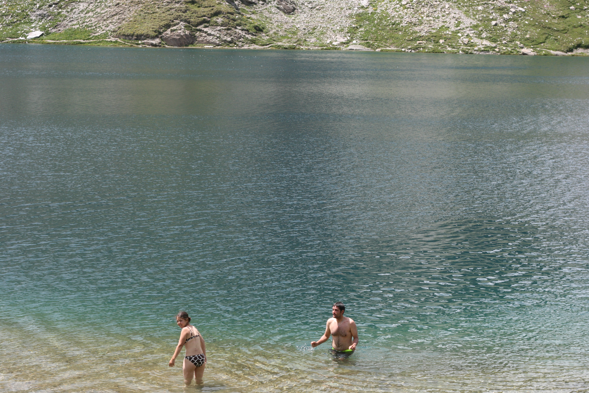

Pique-nique au lac. Baignade pour Vincent et Marion, les courageux !
Ravitaillement en eau dans 1 torrent du lac. Gégé redoute la descente
avec son genou en sale état... On finit la grimpette en début d'aprem
jusqu'au col Malrif (300m en plus, soit 2830m en haut). Des tornades se
forment à la crête. Assez impressionnant ! Le temps semble tourner à
l'orage. On commence la descente au pas de course. Gégé souffre...

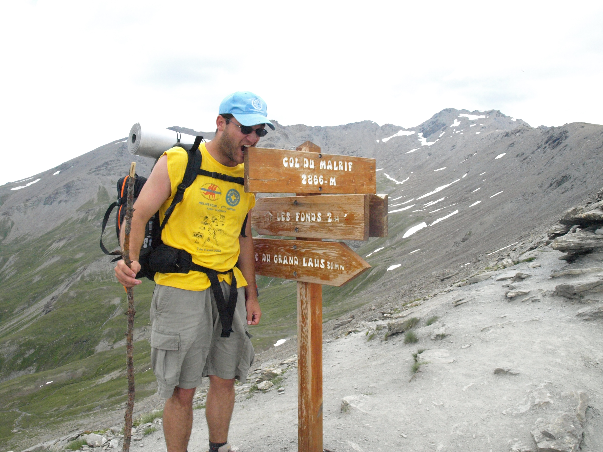

Quelques gouttes tombent mais ce n'est pas le déluge. La descente vers
les Fonts est longue (-750m) et très raide vers la fin. On a
l'impression de marcher sur un cours d'eau ! Pas super agréable... A
l'arrivée la pluie s'intensifie. On pose les tente en face du refuge
après avoir demandé à la tenancière. Petit chocolat chaud avant de
prendre une bonne douche.... (2,50€ la douche, bon rapport
qualité/prélassement). On choisit d'éviter le repas
bivouac-sous-la-pluie et on se joint aux autres randonneurs pour souper
au refuge (le cuistot est OK!). Un festin pour nous : une soupe de
légume maison, du sauté de porc au curry avec du riz, du fromage sec et
une crème caramel...

On se rentre dans la tente après le repas, pour un petit thé accompagné
d'une coinche et dodo pas très tard ensuite...

### J7 / Fonts de Cervières - Souliers

| Etape           |                            |
|:--------------- |:-------------------------- |
| Date            | 18/07/2009                 |
| Départ          | Fonts de Cervières - 2041m |
| Arrivée         | Souliers - 1816m           |
| Denivelé mesuré | + 1000m /  - 1224m         |

Nuit arrosée aux Fonts, mais pas trop froide sous les bons duvets (Gégé
a commencé avec un 13°C confort, et Guillaume lui a prêté son 0°C quand
il est parti : il est heureux depuis...). 5°C le matin sous la tente, le
plus froid du séjour. En sortant, quand la pluie s'arrête enfin, vers
9h, on découvre une légère couche de neige sur les sommets aux
alentours... On range la tente, petit déj dans le froid et on décolle
vers 10h. La montée vers le col de Péas (2629m) est glaciale : le vente
souffle de plus en plus fort. On est frigorifié au fur et à mesure qu'on
monte. Je reste en polaire pour ne pas trop transpirer mais j'hésite à
passer le coupe-vent en plus.En haut du col, un vent à décorner les
boeufs, on se réfugie 100m plus loin pour attendre Marion. Elle arrive
hilare, le vent l'emporte dit-elle ! La montée a été rude pour tout le
monde. La redescente s'effectue en mode cosmonaute : coupe-vent et
capuche ! Gégé est encore en mode dégradé pendant la descente.

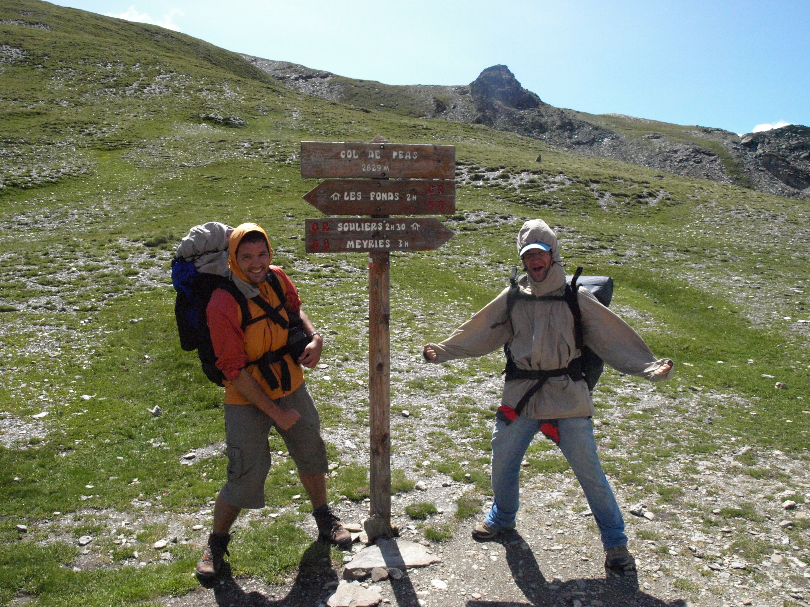

Pause midi au dessus de la bergerie de Péas. Le vente souffle encore pas
mal, mais on est dans un creux. Le temps est de mieux en mieux par
contre : dégagé. On repart après une bon moment de repos : la matinée a
été éprouvante. On arrive au gîte de Souliers cet aprem. La descente est
un peu raide, mais elle se passe bien. C'est sûr, on est dans la journée
la plus foride du tour... La faute au vent du nord entendra-on. On
arrive assez tôt vers 15h ; je suis le rythme tranquille de gégé pour la
descente, je commence moi aussi à ressentir des douleurs au genou droit.
Comme d'hab, petite Tourmente, séchage de tente, coinche... La gérante
du gîte à l'air un peu ailleurs ce soir, ça ne ressemble pas trop à
l'acceuil qu'on avait eu l'année dernière ! Le repas est succulent mais
elle carbure sur le service et on a du mal à faire des 2èmes tours...
Soupe au fumet de poisson, saucisses avec des haricots rouges, fromage
du coin (pas de 3/4 cette fois-ci!) et des fruits en dessert. On est que
6 dans le gîte ce soir, on cohabite avec un couple qui fait le tour
également. On discute un peu avec eux pour échanger nos expériences...
Comme d'hab, le petit film sur le village de Souliers il y a 30 ans, et
un petit verre de Genepi avant d'aller se coucher !

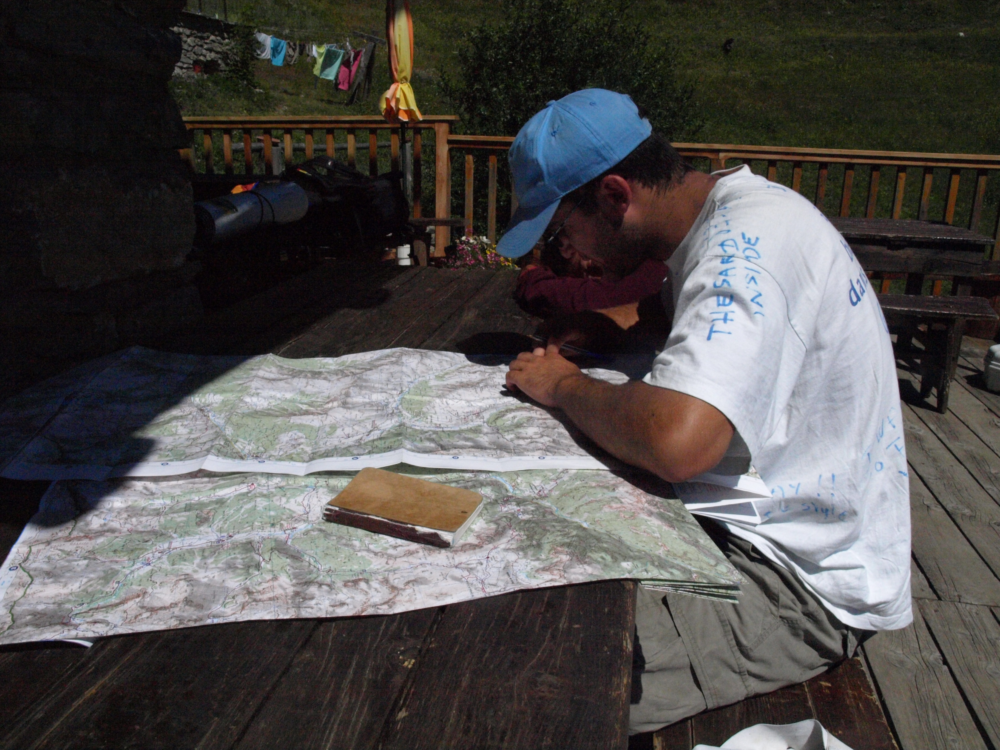

### J8 / Souliers - Brunissard

| Etape           |                    |
|:--------------- |:------------------ |
| Date            | 19/07/2009         |
| Départ          | Souliers - 1816m   |
| Arrivée         | Brunissard - 1850m |
| Denivelé mesuré | + 700m /  - 700m   |

La dernière étape ... snif !

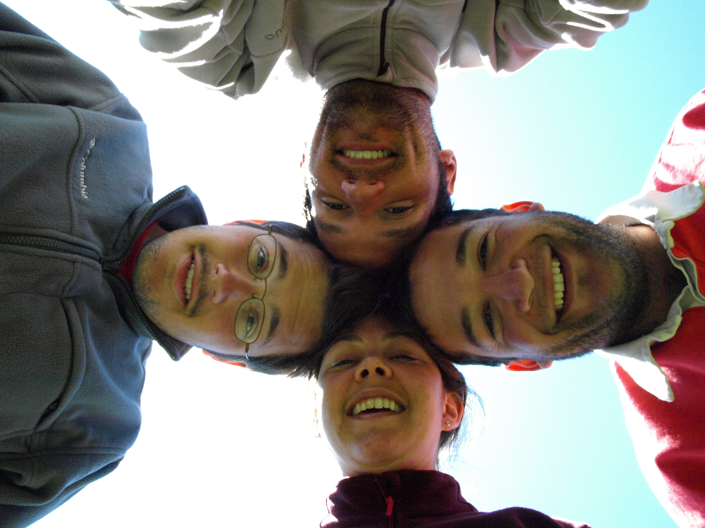

On a fait fuir le couple de notre dortoir... Merci gégé ;) Le petit déj
est pas, malgré la confiote Dia... Le miel est par contre génial (de
Molines) ! On charge les sacs et on décolle vers 9h. La montée vers le
lac de Souliers est très agréable au début, un peu plus sèche à la fin.
On arrive 1h30 après au lac, 700M plus haut. On commence à performer !
Longue pause à côté du lac, on se prélasse en profitant de nos derniers
instants de randonnée... Baignade pour Vincent et Marion, coinche,
bouffe avec de la soupe (il fallait la finir...) et écriture en lettres
de pierre de quelques textes comme c'est la coutume ici. On écrit un
'QUEYRAS 2009' avec autour nos noms : vincent, marion, bob et ...
angélique pour gégé : je n'en dit pas plus sur le choix du prénom. On
repart vers 14h30 (sacré pause!) pour la dernière descente. Les genoux
font mals, sauf chez Marion (chanceuse !). On arrive à Brunissard vers
16h, en queue-leu-leu... Le tour du Queyras 2009 est fini pour nous, et
ce fut encore une fois une réussite !

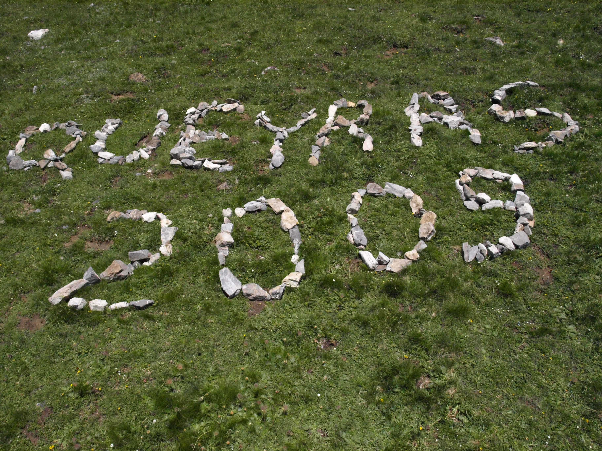

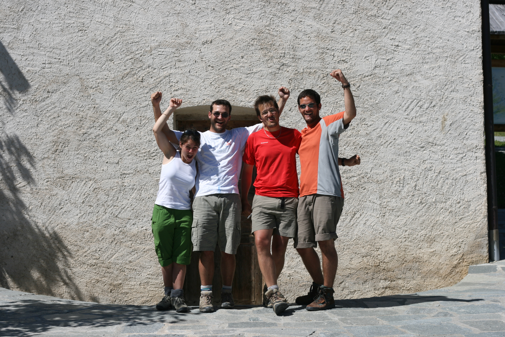

Pour finir, on décide de rester une journée de plus. Par pure tradition,
on va au bois des Amoureux (entre Molines et St Véran) pour se manger
une glace. On se pose ensuite pour la nuit au camping de Molines à
Pierre Grosse (en voiture maintenant !). On se fait un festin le soir
avec nos restes : purée // fromage // pain ... Puis le lendemain,
direction l'accrobranche au même bois pour changer un peu d'activité et
se détendre... On décolle en début d'aprem en direction de Lyon après
avoir (mal) mangé dans un resto de St Véran...

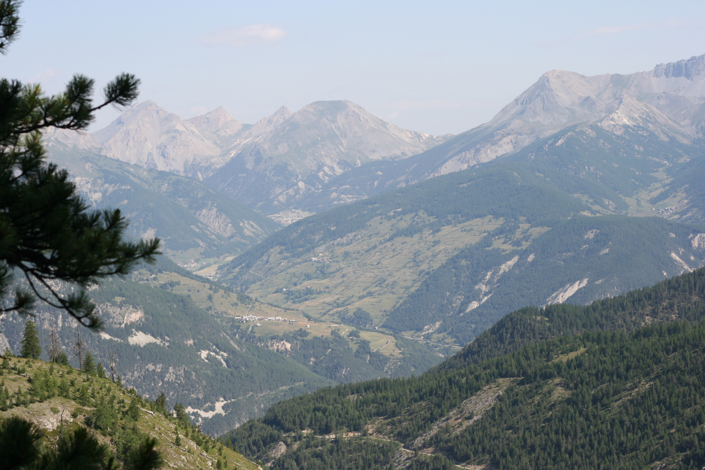
