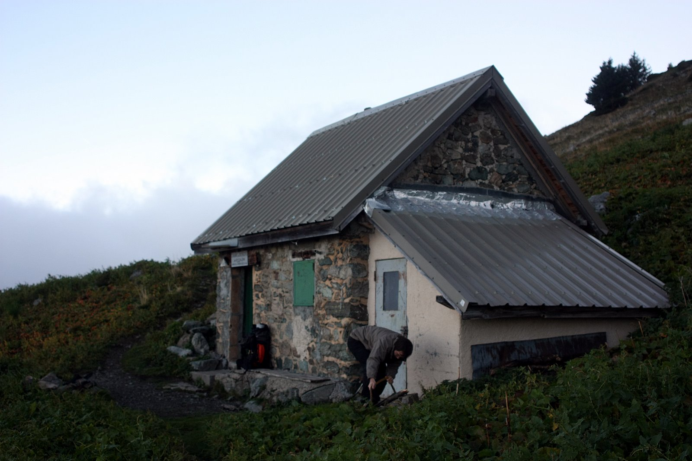
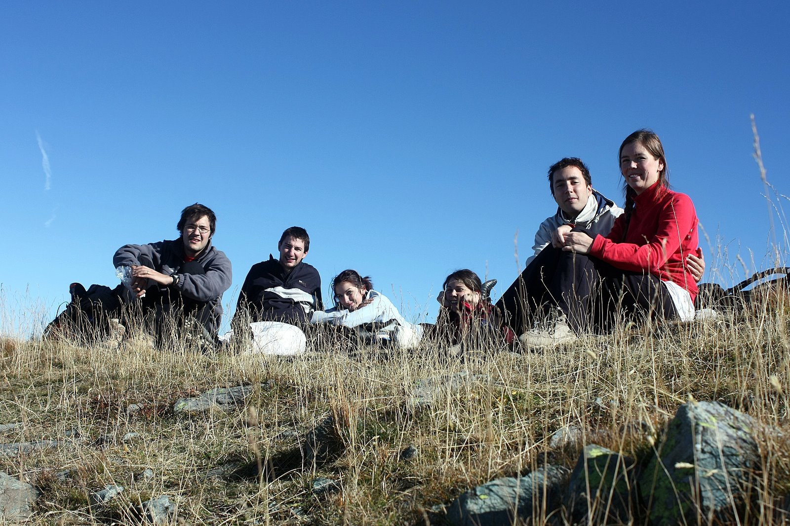

Après une première tentative en mai 2009 (trop de neige, et il
pleuvait!) on retente de gravir ensemble le sommet du Grand Colon, dans
le massif de Belledonne, à quelques kilomètres de Grenoble. Malgré les
oublis et le temps pas génial du samedi, on a passé un WE génial en
compagnie de Loubiana, Audrey, Camille et Guillaume (les grenoblois ;) )
Merci à vous pour ces instants de bonheur en pleine nature avec vous,
comme on les aime !!!

### J1 / Bois de l'épine - Baraque du Colon

| Etape           |                                          |
|:--------------- |:---------------------------------------- |
| Date            | 10/10/2009                               |
| Départ          | Parking du Bois de l'épine - 1460m - 19h |
| Arrivée         | Baraque du Colon - 1748m - 20h           |
| Denivelé mesuré | + 300m                                   |

Départ tardif ce samedi :) Comme on voulait partir faire cette grimpette
avec Guillaume et Audrey, on a attendu que Guillaume sorte de son taf
(c'était la première fois qu'il bossait un samedi :) ). C'est donc vers
18h qu'on décolle de GRE, pour arriver sur les lieux du départ vers
19h15. Départ d'ailleurs un peu trop rapide : Cams et Loub partent sans
leurs chaussures de rando, ni leur popotte... Notre 'cible' pour cette
première journée était assez simple : la [baraque du
Colon](http://www.refuges.info/point/4/abri-non-garde/belledonne/baraque-du-colon/),
300m plus haut. Par contre, on avait pas prévu une composante : la nuit
tombe assez tôt en octobre ! Bilan : une petite heure de grimpette assez
sèche et une arrivée presque complètement nocturne à la baraque vers
20h... Une première pour nous de marcher si tard, mais pas si
désagréable quand on retrouve un hébergement tout à fait charmant pour
notre nuit en altitude... On a quand même sorti la frontale pour pas
perdre le petit chemin !

Arrivée à la baraque, on constate qu_il n'y a encore personne (ouf !
pas envie de redescendre bredouille à la voiture, on n'avait pas pris
les tentes). Et là, on se retourne : wouah ! Un spectacle magnifique,
toute la vallée de Grenoble illuminé, ca ressemble à une immense
constellation à terre... Le froid exterieur nous force à rentrer assez
rapidement, et à faire une petite flambée dans le petit poele. Au menu
ce soir : des soupes, une bonne dose de purée, une ch'tite bouteille de
Croze Hermitage, des rires, du chocolat... A la lumière des bougies, la
soirée se passe bien et est agréable, le poele réchauffe bien la pièce
unique... Une petite partie de 'trou du cul' avant d'aller se coucher à
l'étage supérieur (tous les 6 en rangs d'oignons ! ca tient juste, et on
a calé une planche sur le 'trou' de l'escalier pour éviter de perdre
guillaume pendant la nuit !!)

### J2 / Baraque du Colon - Bois de l'épine

| Etape           |                                          |
|:--------------- |:---------------------------------------- |
| Date            | 11/10/2009                               |
| Départ          | Baraque du Colon - 1748m - 9h30          |
| Arrivée         | Parking du Bois de l'épine - 1460m - 17h |
| Denivelé mesuré | + 1100m / - 1400m                        |

Nuit fraiche (6° au réveil dans la baraque) mais agréable dans les
duvets 0°, un peu moins pour cams et loub... Petit déj bien riche pour
commencer la journée à base céréales (un peu plus de 20g par personne !)
de café, et de pains au lait / chocolat. Rangement de la baraque,
nettoyage du poele, coupage de bois pour les prochains locataires de ce
petit cocon. On réussit à partir vers 9h30 en direction du Grand Colon.
On a déjà 300m d'avance sur les autres randonneurs, mais certains nous
sont déjà passés devant. On arrive au sommet (2394m) vers 11h30, sur un
bon rythme, avec un point de vue assez magique : une 'mer de nuages'
commence à recouvrir la vallée en bas, on distingue les plus hauts
sommets des massifs environnants : le mont Aiguille et le grand Veymont
dans le Vercors, Chamechaude dans la Chartreuse. Ensuite descente assez
raide et caillouteuse pour arriver au lac Merlat vers 12h30. On se fait
une première étape géocaching, et notre pause de midi.

Les brumes menacent de nous recouvrir pendant qu'on mange, et on repart
dans un brouillard assez dense après une courte pause. Le chemin devient
difficile à retrouver, mais on connait la direction à prendre... On
passe par le refuge de la Pra (oh! le ciel se découvre et on quitte le
brouillard !), on monte au col de la Pra (2156m), et on descend en
direction du lac du Crozet (oh! de nouveau du brouillard !). On cherche
dans le brouillard la deuxième étape géocaching (encore bravo loub!) ;
et le brouillard se lève de nouveau... On finit la boucle assez
tranquillement (c'est long mais c'est de la descente...) sauf les
dernières 30 minutes pour remonter au parking, hein guillaume).

Au final, une superbe sortie automnale, avec un parcours ambitieux mais
tout à fait réalisable, et une nuit bien sympa dans un chouette refuge
:) Merci les copains, on reviendra sur grenoble !
