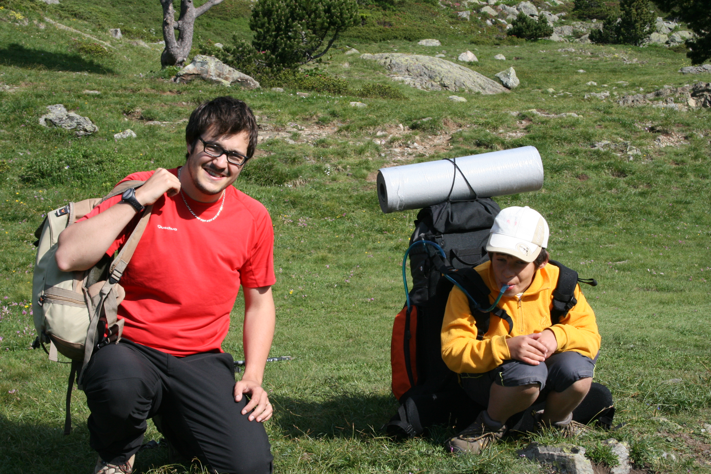
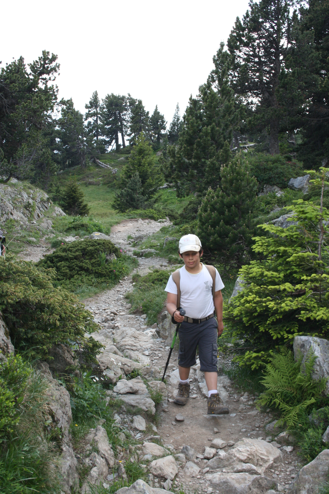
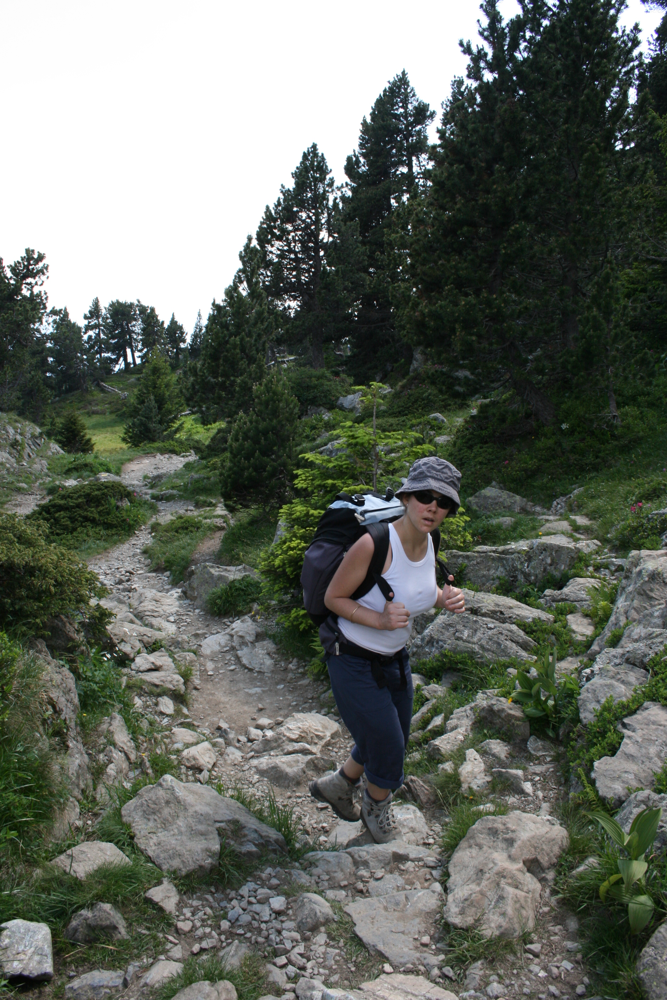
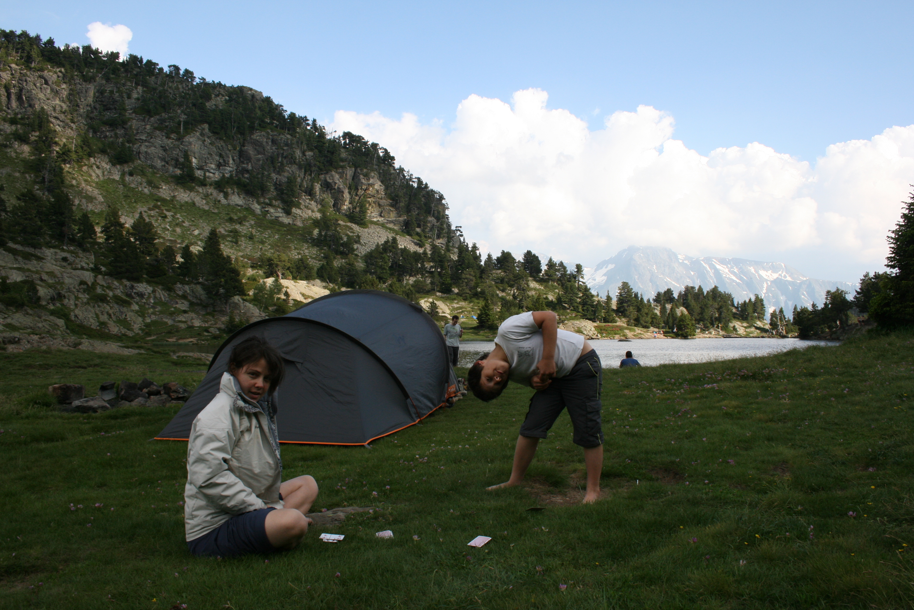

Ce début juillet, c'est l'occasion idéale pour monter en altitude et
profiter de l'air frais de la montagne de Belledone... Pour cette
sortie, on part avec Quentin, mon filleul. Objectif : une petite
ascension samedi aprem, puis un bivouac à coté du lac Achard, avant de
redescendre le dimanche matin.

On part tranquillou le samedi aprèm depuis le télésiège de
Bachat-Boulou de Chamrousse, j'avais peur qu'on voit plus de télésiège
que de 'nature' mais le chemin vers le lac est bien préservé. Quentin
marche bien, malgré les grosses chaleurs de l'aprem... Marion a chaud !

Quelques passages rocheux, mais globalement une montée simple (une
grosse heure) et un dénivelé quasi-ridicule (160m ?). Mais bon c'était
marrant quand même !

Arrivé à deux pas du lac, le décor s'aplanit, et les montées rocheuses
se transforment en tourbières. Beaucoup de monde autour du lac, c'est
une classique familliale...

On fait un petit tour pour se poser du bon côté pour le soleil du
lendemain. Posage de tente, dorage au soleil de fin d'aprem, on est
bien... Par contre petit bilan eau : le lac Achard est alimenté par les
fontes de neige, pas de ruisseau à l'horizon... On était parti avec 3
litres pour 3, il en reste 2 : 1 pour ce soir et 1 pour demain matin,
y'en aura pas de reste... Donc on décide d'abandonner l'extra qu'on
voulait faire le lendemain.

Au fil de la soirée, de plus en plus de tente s'installent autour du lac
: on compte au moins 15 ou 16 tentes ! Tous les spots sont occupés... On
se crois presque au camping !

Petit repas frugal : pates & soupes dans le même récipient pour
économiser l'eau ; et la nuit qui approche à grand pas... On a encore
essayé de regarder les étoiles mais comme d'hab on prend froid / sommeil
juste avant le noir complet...

Le lendemain, petit déj classique avec chocolat chaud pour Quentin (lait
en poudre et nesquik : pas lourd !). Le meilleur repas de la journée !

La descente se fait par le même chemin en moins d'une heure... Une
ballade sympa en tout cas !

