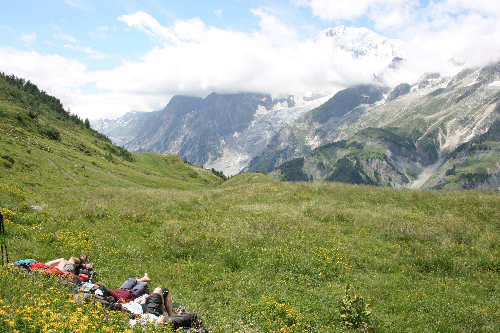

Un grand tour qui nous tenait à coeur de faire depuis quelques temps, et une
bonne occasion de marcher avec Guillaume et Audrey pendant cet été ! Le
programme prévu était relativement peu chargé : 10 étapes, en zappant la vallée
de Chamonix. On s'en est tenu à ce programme initial, en mixant les campings,
les bivouacs et les refuges. Au final, un très bon parcours, assez ensoleillé et
avec pleins de souvenirs dans la tête pour les prochains mois...

Tout d'abord, un petit résumé des étapes effectuées :

| Journée             | Description                      | Temps topo | Deniv      | Alim       | Nuit    | Ravito |
|:------------------- |:-------------------------------- |:---------- |:---------- |:---------- |:------- |:------ |
| dimanche 18 juillet | Arrivée aux Houches              | -          | -          | resto      | camping | oui    |
| lundi 19 juillet    | les Houches - Les Contamines     | 5h35       | +600/-600  | pn/bivouac | caming  | oui    |
| mardi 20 juillet    | Les Contamines - La Balme        | 2h25       | +600       | pn/bivouac | bivouac | non    |
| mercredi 21 juillet | la Balme - Les Chapieux          | 5h20       | +800/-1000 | pn/bivouac | camping | oui    |
| jeudi 22 juillet    | Les Chapieux - Refuge Elisabetta | 5h10       | +900/-300  | pn/refuge  | refuge  | non    |
| vendredi 23 juillet | Refuge Elisabetta - Courmayeur   | 4h         | +500/-1500 | pn/resto   | hotel   | oui    |
| samedi 24 juillet   | Courmayeur - Refuge Bonatti      | 4h30       | +1000/-300 | pn/refuge  | refuge  | non    |
| dimanche 25 juillet | Refuge Bonatti - La Fouly        | 6h35       | +900/-1000 | pn/bivouac | camping | oui    |
| lundi 26 juillet    | La Fouly - Champex Lac           | 4h20       | +400/-500  | pn/bivouac | camping | oui    |
| mardi 27 juillet    | Champex Lac - Col de la Forclaz  | 5h10       | +800/-800  | pn/resto   | camping | oui    |
| mercredi 28 juillet | Col de la Forclaz - Montroc      | 6h10       | +900/-1050 | pn/-       | -       | oui    |

Soit au total :

-   **D+7400m**
-   **D-7050m**
-   Environ **135 km** parcourus

Et ensuite je vous propose un petit résumé des étapes, illustrés avec
quelques images...

### J0 - Arrivée aux Houches

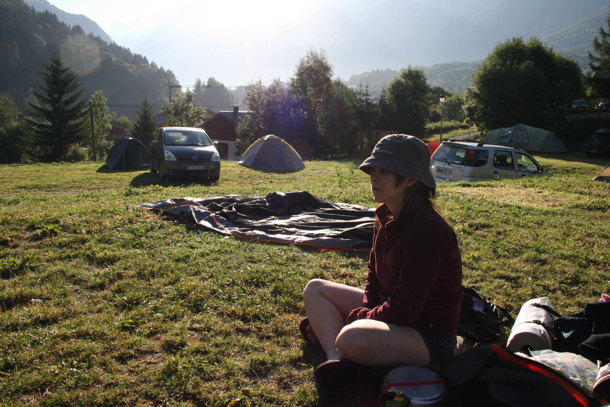

Après une étape à Grenoble pour finir les sacs chez Guillaume et Audrey, on est
fin prêt pour aller aux Houches en voiture. On y arrive vers 19h, le temps de
trouver le camping et de prendre une douche. Resto pour fêter ce début de TMB...
Les sacs sont particulièrement lourd en ce début de rando : 16kg pour Guillaume
et moi, 12kg pour Audrey et 7kg pour Marion (et oui !). La cause à la quantité
de nourriture que l'on emmène. On est parti pour avoir 4 jours d'autonomie
complète ; au final on a eu peu de ravitaillement à effectuer (Courmayeur +
bricoles en Suisse). Je pense qu'on a pris trop de nourriture sur un tour comme
le TMB, ou les possibilités de ravitaillement sont assez importante. Le camping
(Bellevue) est assez chouette, mais la nuit est ponctuée par les camions qui
roule en direction du tunnel du Mont-Blanc.

### J1 - Les Houches - Col de la Voza - Les Contamines - Camping du Planet

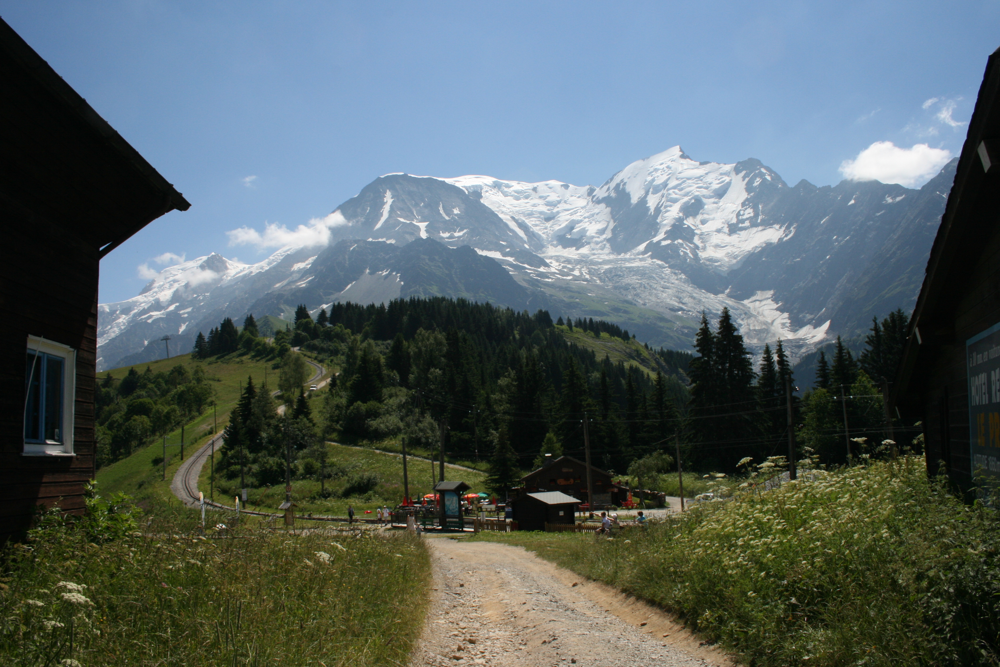

Première journée, et belle grosse journée pour se mettre en jambe ! On part
tard, vers 10h, après avoir retiré de l'argent pour se ravitailler et les
refuges ; et on repasse aux voitures laissées sur le parking du téléphérique de
Bellevue pour prendre les affaires qui nous manquent. Première montée de 2h30
jusqu'au col. Dans la montée de nombreux 4x4 nous doublent, c'est pas très
agréable. Beaucoup de beau chalets avec des parigots devant :). Le col est
blindé de monde, on fuit et on mange en contrebas.Après-midi très chaude dans la
vallée, mais beaucoup d'eau ! On passe par de nombreux villages (Bionnassay, la
Gruvaz, Contamines...).Toujours autant de voitures... Sur la fin on se rend
compte que le camping prévu est 1/2 h après les Contamines ! Petit coup au moral :)
Au final, 6h05 annoncé sur le topo, mais 7h en réel. Tous le monde est naze au
camping à l'arrivée. Sympa, on peut faire notre popotte sous un auvent.
Rencontre avec Victor, polonais qui fait le TMB pour la première fois, il va
bien plus vite que nous !

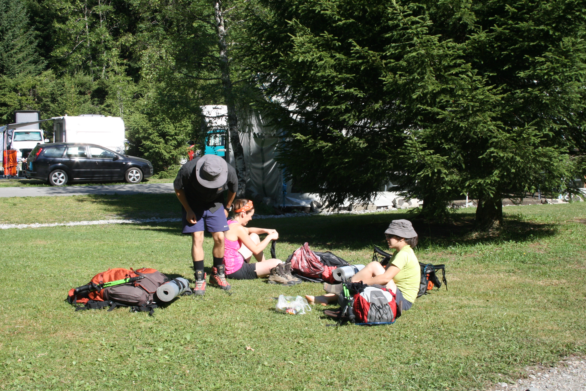

### J2 - Camping du Planet - La Balme

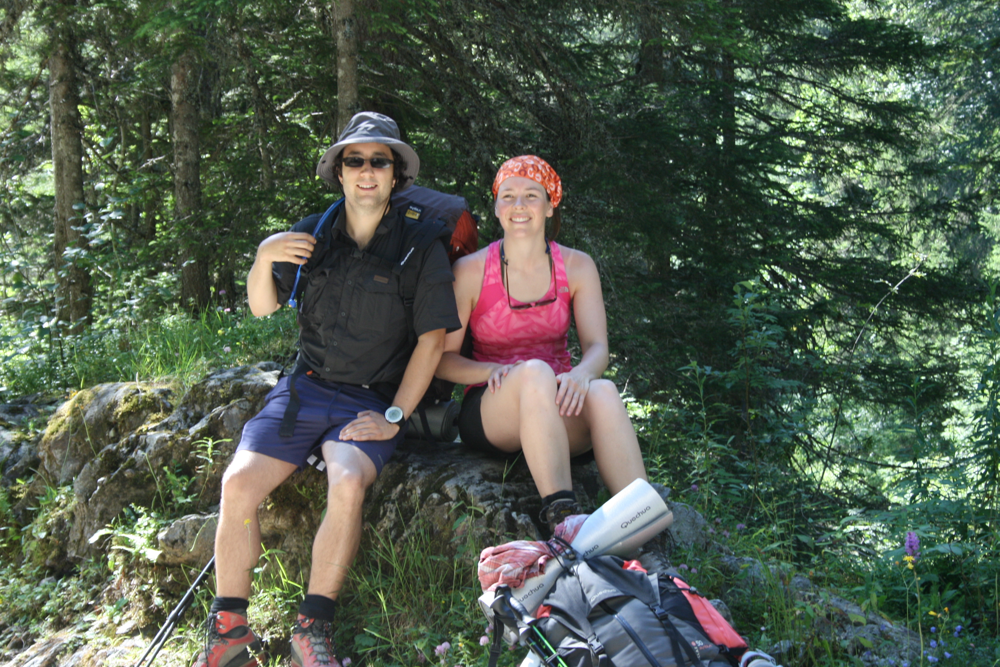

Toute petite étape sur le papier, parfait pour se remettre en jambe doucement.
La journée de la veille a été rude, comme chaque première journée de rando. On
prévoit donc un départ pas très matinal, autour de 10h. La montée est assez
chouette en direction du refuge de la Balme. On a un peu chaud sur la fin, on
arrive en haut pour manger vers 13h. Après un pique-nique sous le poncho de
Guillaume (on cherche l'ombre ! mais il ne fait pas tarp :( ), on se pose au
refuge pour boire un coup et jouer au 'Gang of four', le jeu de la rando ! Une
aire de bivouac est prévue juste sur le vallon en face du refuge. Assez plat,
des toilettes à proximité, des poubelles pour jeter ses déchets, ça ressemble
presque à un camping ! Un autre groupe de 15 ou 16 jeunes nous accompagnerons
pour la nuit sur le site. On rencontre également un prof de Besançon qui fait le
GR5 sur un mois :) Il bivouaque à côté de nous. Il a aussi un P3RS !! On a eu le
temps de prendre un thé ensemble, ainsi qu'une rasade de génépi avant d'aller se
coucher. Petite insolation pour Marion qui ne mange pas ce soir.

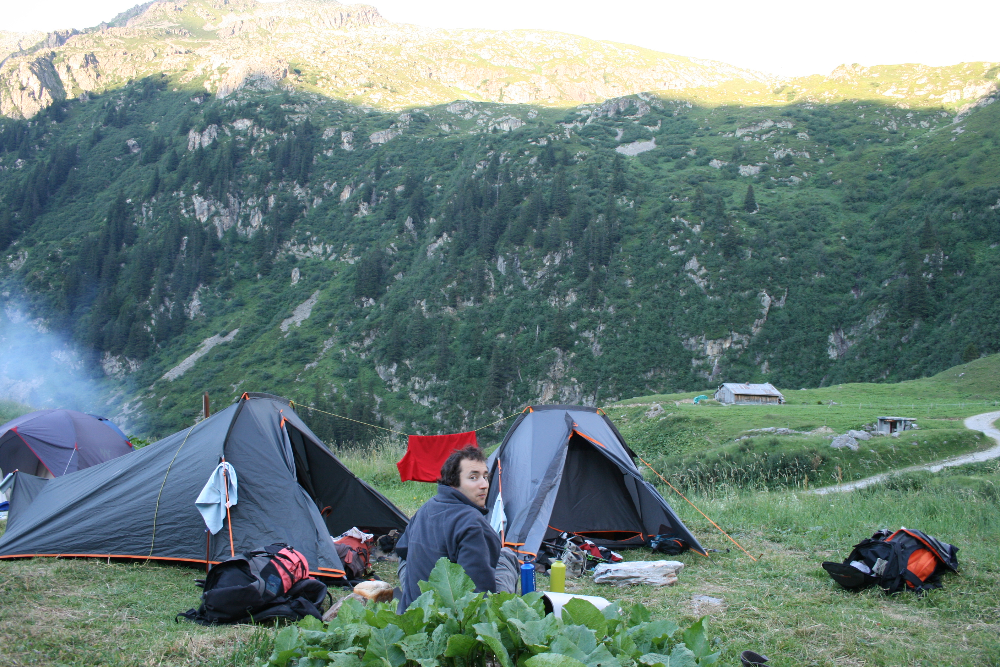

### J3 - La Balme - Col de la Croix du Bonhomme - Les Chapieux

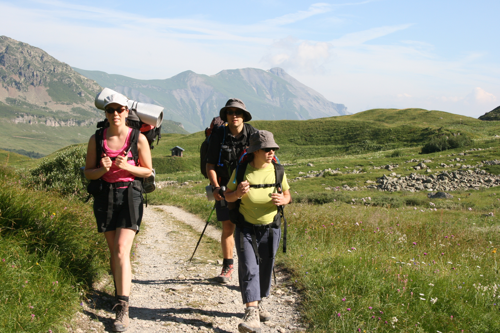

Allez, aujourd'hui on repart pour une étape normale ! Levé vers 7h, pas de rosée
sur la tente, c'est agréable ! On décolle vers 8h après les classiques céréales +
café ou thé. On a 800m de dénivelé + à faire ce matin, jusqu'au col de la Croix
du Bonhomme. C'est long mais c'est bon !

On se pose vers 12h devant le refuge du col de la croix du Bonhomme. Il nous
reste juste une descente de 1000m, ça casse un peu les jambes ! Premières
douleurs dans les genoux, gloups. On croise un âne sur le sentier, et un chat :).
Ca descend plutôt bien, on voit la vallée de Chapieux en bas. On arrive vers 16h
en bas, il pleut 5 min après notre arrivée (juste le temps de poser les tentes
sur l'aire de camping gratuit). On se pose à l'auberge pour boire un coup à
l'abri. On trouve quelques extra dans l'épicerie : des oeufs, des fruits, du
fromage ! Nuit agréable et sans pluie, mais avec quelques odeurs pestinancielles
de la fosse camping-car à coté de nos tentes... On regrette presque de ne pas
avoir pris la T3 UP (on est parti avec la T2 UP de gégé) : c'est plus lourd d'un
kilo mais cela permet de rentrer à 4 assis au cas ou on devrait manger sous la
flotte !

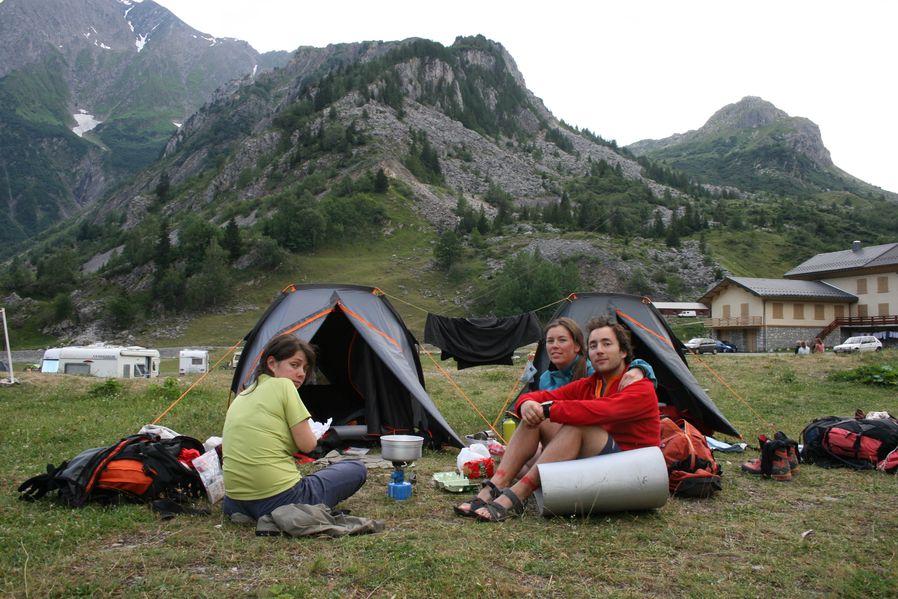

Truc marrant : on s'est posé à coté de 2 bikers étrangers qui doivent
faire le tour du Mont Blanc en moto. Choc des modes de transports :) Pas
eu l'occasion d'en discuter avec eux, on tombe vite de sommeil.

### J4 - Les Chapieux - Col de la Seigne - Refuge Elisabetha

Réveil matinal vers 6h30 pour une grosse étape aujourd'hui ; les odeurs
ne nous ont pas trop importunés cette nuit. On déjeune, on plie les
tentes et on décolle vers 8h. On n'arrive pas à joindre Camille pour se
rejoindre à Courmayeur : les portables ne passent pas et le téléphone de
l'auberge est tout le temps utilisé ! 960m de D+ à faire ce matin pour
rejoindre le col de la Seigne, frontière entre l'Italie et la France. On
n'utilise pas la navette qui peut nous avancer jusqu'à Ville des
Glaciers : c'est triché ! On arrive au col vers 13h, pas mal ! Il fait
froid. Pas de photo, le temps est très nuageux, mais pas de pluie. On ne
voit pas le Mont Blanc, mais l'aiguille des glaciers nous a nargué toute
la matinée. Pause déjeuner dans la descente, mais la pluie commence à
nous déloger. On continue donc la descente après cette courte pause. On
arrive au refuge Elisabetha vers 14h30 (toujours plus tôt, on prend
l'entrainement !). La douche est super apréciable après 2 nuits de
bivouac : c'est uniquement 18 litres d'eau chaude et c'est en supplément
:) Le refuge est alimenté par une turbine qui produit toute
l'électricité nécessaire. Ensuite le confort habituel des refuges : un
repas chaud et convival, une nuit en rang d'oignons ! Mais ça change de
la tente !

### J5 - Refuge Elisabetha - Col Chécrouit - Courmayeur

Un bon petit déj au refuge : du pain, du beurre, de la confiture (le pain
italien est très blanc, tout comme le beurre). C'est le grand luxe le refuge...
On décolle vers 8h. Par contre, le temps se dégrade très rapidement. La montée
(500m D+) s'effectue presque entièrement sous la pluie, ma veste, pas toute
jeune, se trempe intégralement. Je n'ai pas de poncho, j'en vois ici l'intêret !
Mon sac abrité par le sur-sac commence à se tremper au niveau des bretelles. La
protection n'est pas magique ! Les vêtements en protection du duvet était
mouillé après cette matinée. Border line je vous dit ! Descente enseuite sur le
col Chécrouit, on se pose pour manger alors que le soleil revient. On hésite
pour prendre les télésièges qui redescendent à Courmayeur : 15€ par tête c'est
pas donné ! Et en plus c'est triché ! On prend finalement le GR pour descendre,
le long du téléphérique, dans un sentier particulièrement abrupte. Mais sous le
soleil ! Arrivée dans la grande ville italienne, on hésite sur l'hébergement de
la nuit : camping, hotel ? De plus, Camille et Lioubiana doivent nous rejoindre
ce soir pour nous accompagner la journée du lendemain. On choisit finalement un
hotel, le Cristallo, par commoditié : les campings sont assez éloignés du centre
ville. Et on en profitera pour bien se reposer cette nuit.

Cams et Loub nous rejoinent le soir à l'hotel. Il sont passés en voiture par le
tunnel du Mont Blanc. Courmayeur ressemble à une ville très 'bling-bling'. On en
profite pour recharger en vivres : céréales, pain, fruits secs ; et également en
matériel... On attendait tous cette étape avec impatience : Marion n'avait pas
de poncho ; les lacets des chaussures d'Audrey étaient en train de lacher ;
Guillaume a oublié son coupe-vent à Grenoble et moi j'ai déchiré mon short il y
a deux jours ! Les nombreux magasins de la ville nous aident à combler nos
problématiques d'équipements :) Le soir on se retrouve tous autour d'une bonne
table pour déguster une excellente pizza italienne : très bon moyen pour se
charger en énergie ! Et on file au dodo un peu tard comparé au précédentes nuits !

### J6 - Courmayeur - Bertone - Refuge Bonatti

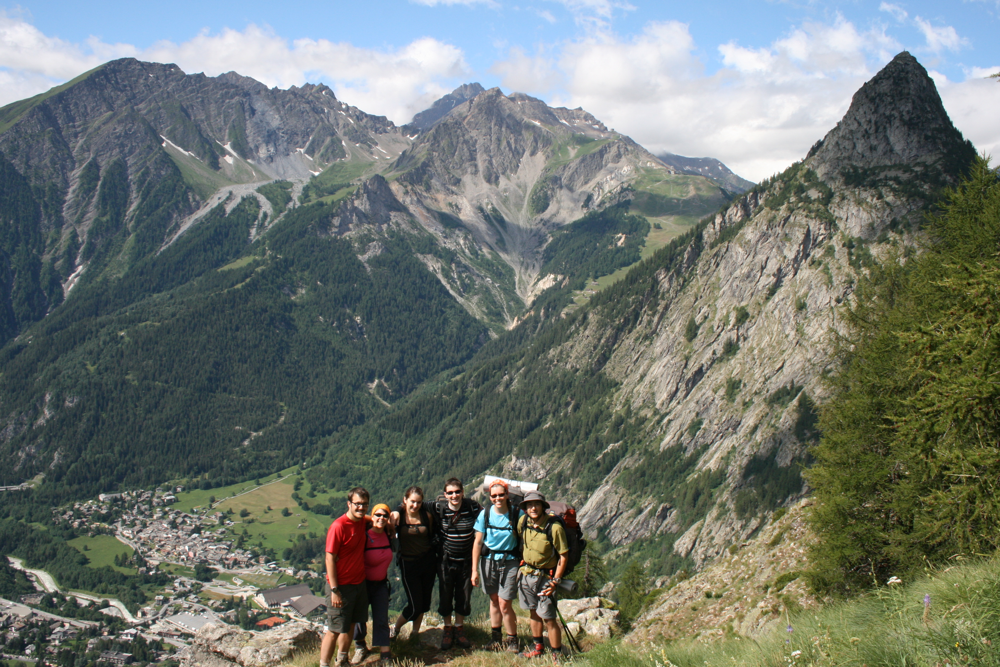
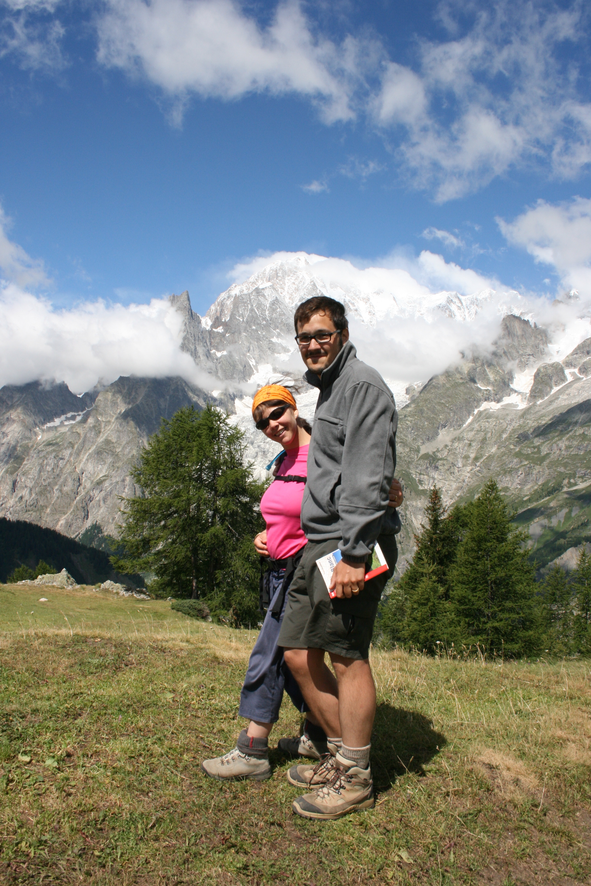

Réveil tardif vers 7h30 :) C'est l'heure d'ouverture du petit déj à l'hotel ! On
en profite bien, on mange bien ! On part vers 8h30, une équipe à pied (Audrey,
Guillaume et moi) et l'autre équipe dans la voiture (Lioub, Marion et Cams) pour
sortir la voiture de la ville. A 9h on attaque la montée vers le refuge Bertone.
Celle-ci est très agréable, sous les arbres, et avec un temps assez ensoleillé.
Le rythme est bon ! Arrivé en haut, on reste ba-ba devant la vue du Mont Blanc,
avant de repartir sur un chemin en balcon en direction du refuge Bonatti. Grosse
pause midi : melon, abricots, jambon cru : c'est le luxe ! On en profite pour
lézarder devant le Mont Blanc et les Grandes Jorasses. Une bonne sieste ! On
arrive au refuge Bonatti vers 16h30, mes genoux sont bien en compote depuis
hier. Il sont très gonflés et très chaud malgré le peu de descente que l'on a
fait aujourd'hui. J'ai peur pour la grosse étape du lendemain.

Le refuge est assez 'usine', mais plutôt agréable.Le repas est copieux le soir,
en compagnie d'autres français et un couple étranger avec qui on échange nos
impressions sur les prochaines étapes. Dodo assez vite vers 21h30, je suis crevé
et mes genoux me font mal...

### J7 - Refuge Bonatti - Grand col Ferret - La Fouly

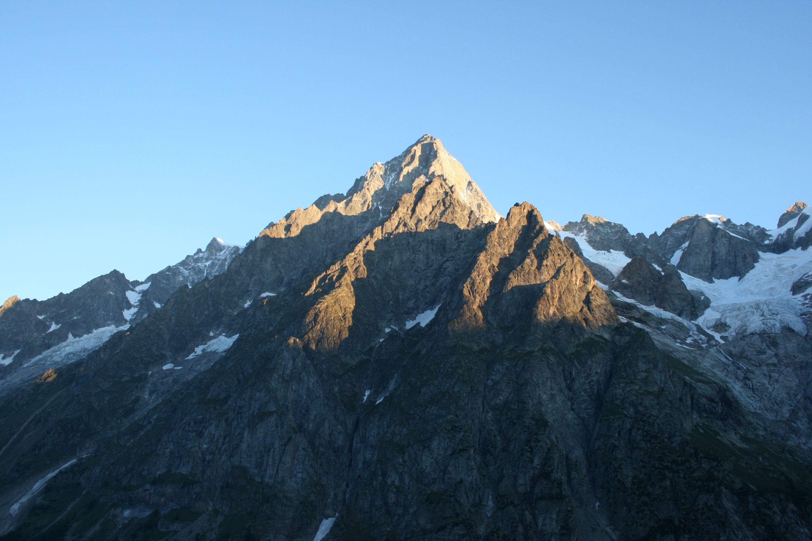
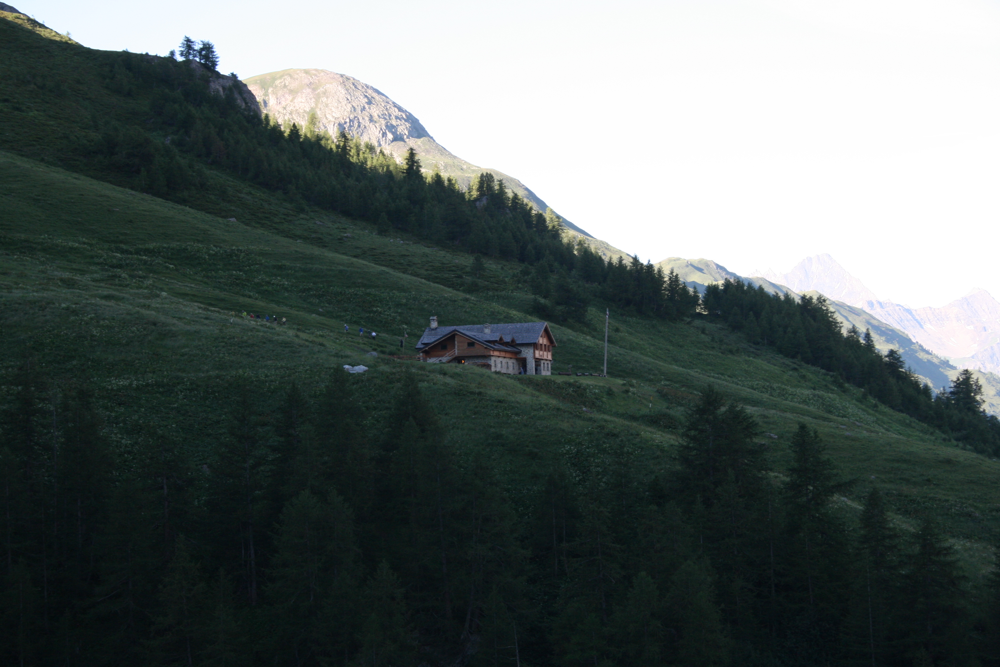

Petit déj à 6h30, on dit au revoir à Cams et Loub qui reviennent sur leurs pas
pour récuperer la voiture à Courmayeur. C'était agréable d'être 6 pendant une
grosse journée, ça nous a fait bien plaisir ! La grosse étape du topo pour
aujourd'hui. On part à 7h45. On finit de parcourir le val Ferret avant d'arriver
au pied du col. La montée commence dans un vent assez fort. Je monte avec les
trois couches : polaire, coupe-vent, gant. J'ai jamais eu aussi froid dans une
montée ! On arrive au sommet vers 12h30. C'est dur pour Marion mais c'est passé :)
La descente est plutôt tranquille dans les montagnes suisses... Pause déj
rapide, car il fait encore assez froid. On fait une bonne pause quand on arrive
au torrent de la Drance, de la vallée que l'on va suivre demain en Suisse. La
fin de l'étape pour rejoindre la Fouly est assez dur pour tout le monde. Les
derniers kilomètres sont exténuants, bien que quasi-plats. Arrivée à la Fouly,
notre première étape suisse. Les commerçants acceptent tous les € : ouf ! Il est
17h, l'étape a durée plus de 8h... Pot bien mérité à l'auberge du village (la
bière blanche est extra). Quelques ravitaillements pour le repas du soir
(chocolat suisse !). Le camping est très propre et chouette, mais
particulièrement cher : 46€ pour 4. Ah les tarifs suisses :) Au menu ce soir :
lyophilisés et soupes pour finir nos réserves. Chocolat suisse et gateaux/fruits
en dessert... La nuit arrive très vite pour nous, bercé par la belle grosse
journée et le torrent qui coule a quelques mètres de la tente...

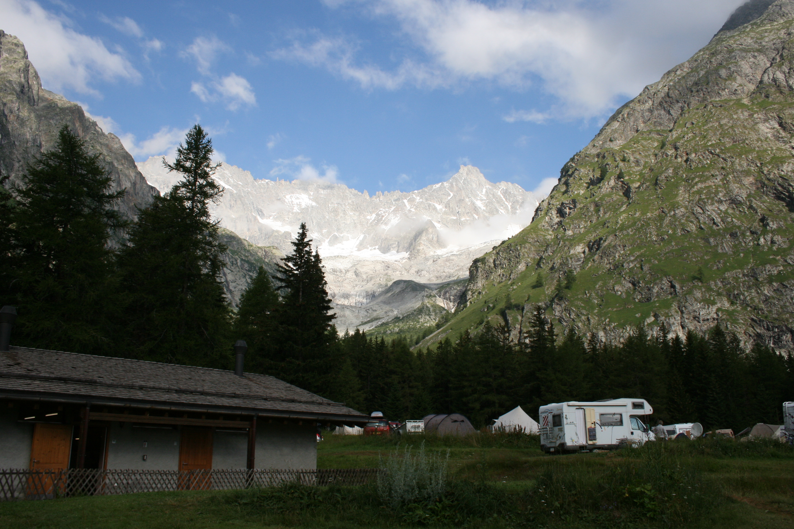

### J8 - La Fouly - Champex-Lac

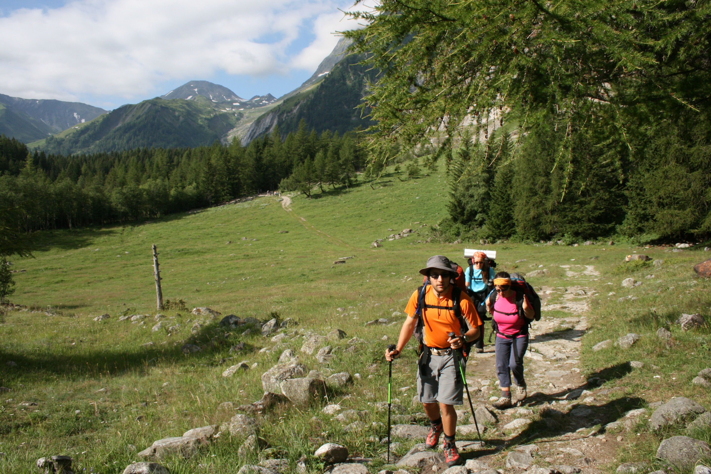
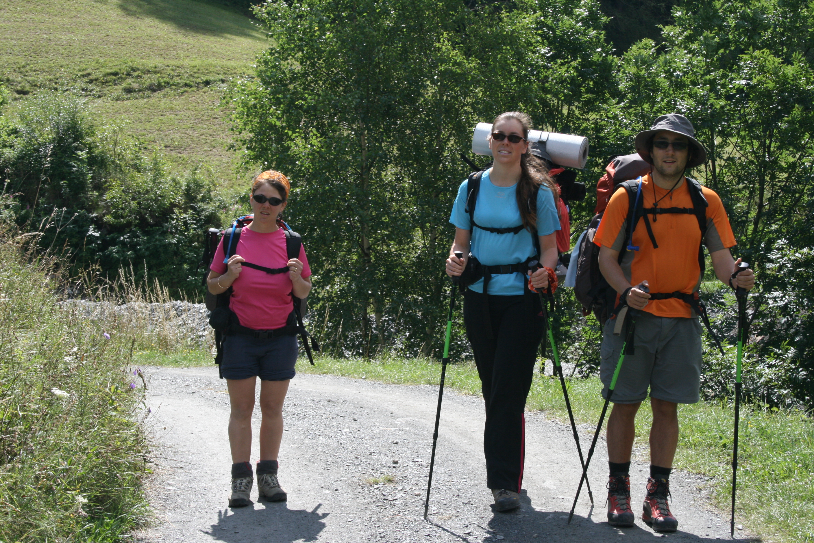

Réveil pas très tôt pour cette étape plutôt courte (7h30 ?). Petit déj classique
puis départ du coeur du camping pour cette nouvelle journée. Les montagnes
suisses sont agréables et ensoleillées pour cette journée qui ressemble plus à
une ballade. On croise nos 2 amis français qui sont partis des Contamines. Ils
font les mêmes étapes que nous, en camping également. A Praz de fort une
curiosité : une vente de produits à profit humanitaire en libre-service ! Du
jamis vu ! Ca ne pourrait pas marcher en France... Pause midi dans les champs,
café au P3RS :) Le test est concluant pour ce petit réchaud !! La grimpette se
fait sur la fin de la journée (dur l'aprem !), la bière est classique au bar, le
temps commence à tourner et il se met à pleuvoir (juste quand on est au bar, ça
tombe bien !). Le camping, au fond du village, après le beau lac de Champex (pas
de photo, désolé !), est assez petit et mignon, mais également excessivement
cher : 48 € pour nous 4 ! La pluie rafrachit la soirée qui s'annonce fraîche. Un
auvent est accessible pour manger, mais il n'est pas fermé et abrité comme la
veille.

Lyo et soupe au menu ce soir, comme la veille (bilan : j'en ai marre des lyos !).
On se retrouve ce soir avec un grand groupe de scouts italiens qui font un bruit
du tonnerre ! On tombe également sur 3 'fous' qui s'entrainent pour l'UTMB qui a
lieu en août : ils sont partis de Courmayeur ce matin ; et ils seront à Chamonix
le lendemain soir ! On se couche pas très tard, le temps est globalement froid
et on est mieux dans les duvets chauds :)

### J9 - Champex-Lac - Bovine - Col de la Forclaz

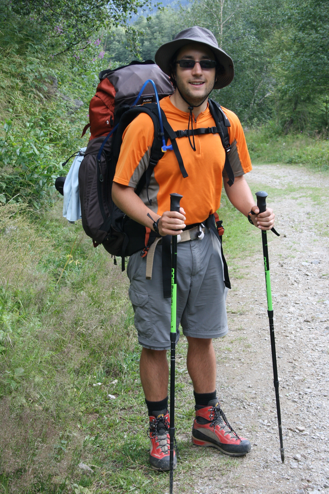
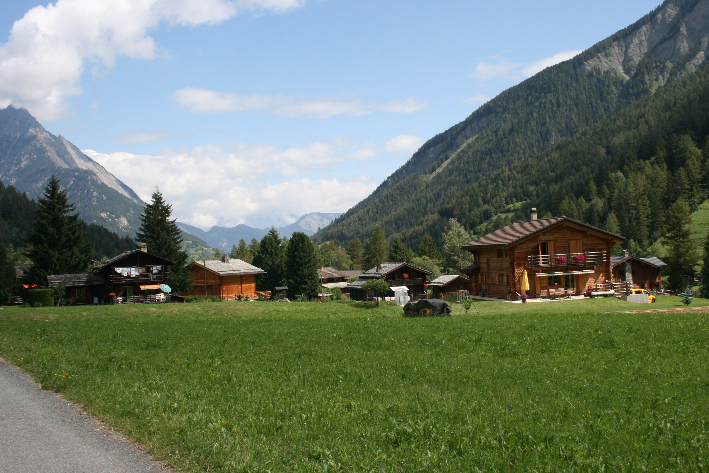

Petite pluie ce matin avant de se lever pour bien mouiller la tente... On
décolle vers 8h45 ce matin pour une étape moyenne en D+ et temps. On passe dans
les petits hameaux de Champex, tout aussi mignons les uns que les autres. La vie à
l'air agréable en Suisse ! La montée de la Bovine qui suit est vraiement
casse-jambe. De gros cailloux empèchent une progression régulière. Marion
commence à s'épuiser bien avant le col. J'essaie de porter son sac pendant 5min,
mais j'ai cru verser donc c'est pas la bonne solution ! Arrivés aux alpages, la
vue est belle et dégagée, c'est plutôt agréable après ce raidillon ! On se poser
manger à la Bovine, avec une bonne bière en prime, et une omelette pour Marion
(bien apréciée à priori !). La descente sur le col de la Forclaz (référence à
Décathlon :) ) se fait en 2h. Rien de spécial à signaler ! Arrivés à l'hotel du
col, pot puis posage de tente à côté de nos 2 compères français, qui nous
avaient doublé dans la montée de Bovine. Beaucoup de voitures au col. Ca fait
pas très nature... Des motards aussi. On assiste aussi au ravitaillement d'un
refuge d'altitude : l'hélico fait ses rotations vivres/déchets juste à côté du
camping de l'hotel.

Au programme ce soir : resto à l'hotel et bonne nuit ! On commence avec Marion à
réfléchir à arrêter le tour ici demain matin. Je veux pas forcer Marion à faire
un étape de plus juste pour finir, on verra bien demain l'état des organismes :)

### J10 - Col de la Forclaz - Col de Balme - Le Tour - Montroc

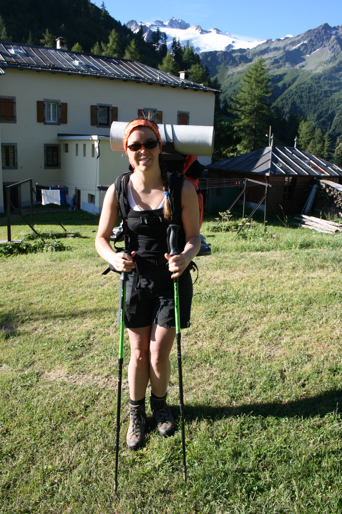
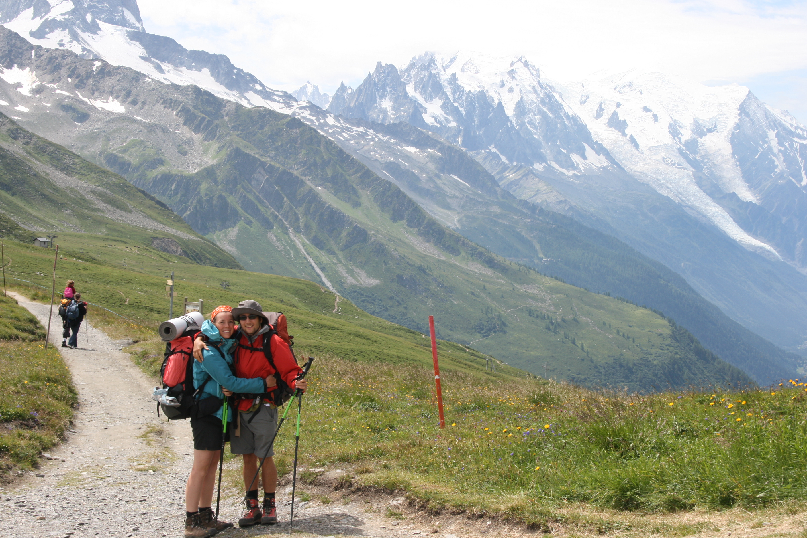

Finalement la bonne nuit a aidé (le bon repas aussi je pense !) et on part tous
les 4 pour la dernière étape de notre tour. On attaque par 200m de D- avant
d'attaquer la montée (900m  D+) du col de Balme, frontière entre la Suisse et la
France. Super montée, sous un temps très clément. On arrive au sommet juste 3h30
après notre départ du camping ! Tout le monde est content d'avoir fait la
dernière grimpette de ce tour ! Pause au refuge du col pour une omelette +
frites, puis redescente sur la variante du Tour (flemme de faire l'autre
itinéraire, et puis le vente souffle !). On refait une pause dans la descente
pour finir nos vivres, et faire un petit café au P3RS ! On arrive à la gare de
Montroc 5 min avant le prochain train qui nous ramenera aux Houches : le timing
est parfait !

Une petite heure après, on retrouve nos 2 voitures qui nous attendent sur le
parking du téléphérique de Bellevue aux Houches ! Et on prend pour finir la
glace de la victoire dans le café du coin, pour finir en beauté ce beau tour.

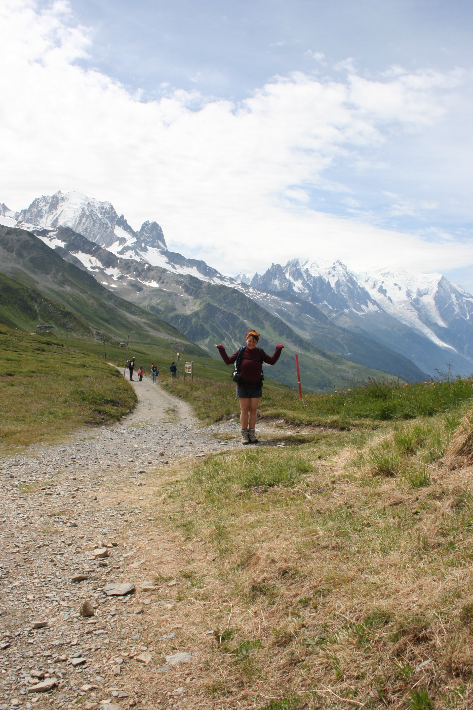
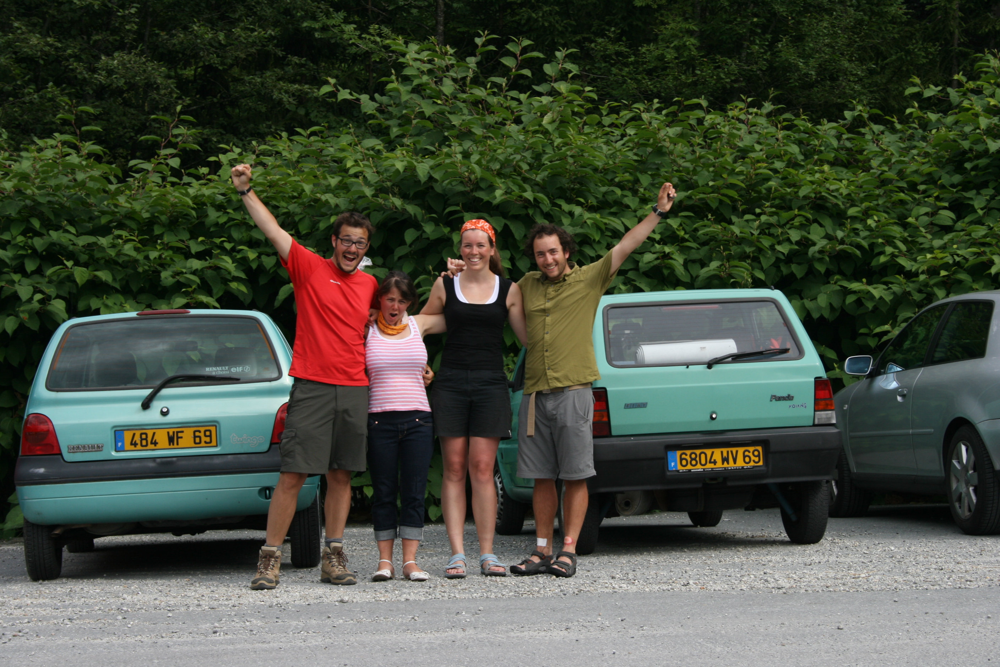

 Ce fut encore une expérience fabuleuse, à 4 sur le gros du parcours, dont une
 femme enceinte (on peut dire 4,5 ? :) ). 10 jours c'était bien, limite trop
 long par rapport au Queyras, mais on n'a pas encore le niveau pour faire le
 tour complet en 8j... Et on cherche pas la compet'. J'ai beaucoup aimé les
 paysages variés de ce tour, les différents modes d'hébergements que l'on a
 choisis. J'ai beaucoup apprécié d'avoir fait ce tour avec Guillaume et Audrey,
 on a pas souvent l'occasion de passer 10 jours ensemble et c'était très sympa !
 J'ai un peu moins aimé l'aspect touristique de ce tour, le monde aux
 différentes étapes, mais c'était un gage de sécurité dans le cadre d'un
 problème si on voulait arrêter en cours de route.

Au niveau du matos, la tente T2 UltraLight Pro de Décath est pas très lourde
(2kg) mais elle est assez exigu : on peut pas être 2 assis dedans pour manger,
dans le cas ou le temps aurait été pourri en bivouac par exemple. Notre tente,
la T3 UP permet de manger à 4 dedans assis, ou jouer aux cartes. Mais pour le
prix d'1 kg supplémentaire. Les sacs étaient lourds en début de rando du fait
des vivres que l'on avait. Mais finalement ces vivres nous ont 'tenus' quasiment
tous le tour, alors que l'on pensait les consommer en 4 jours. Nos
ravitaillements ont été assez partiels. Et on a finit avec des sacs donc
relativements légers !

To be continued....

