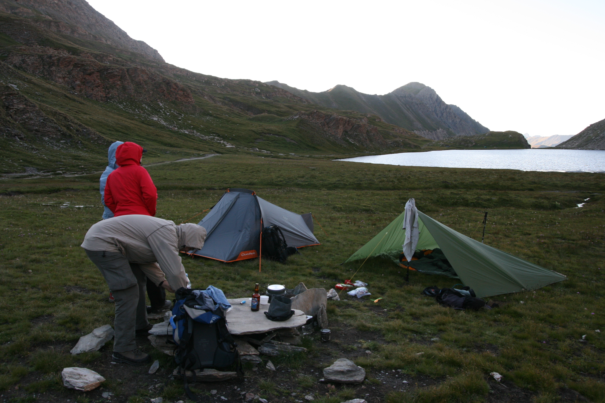
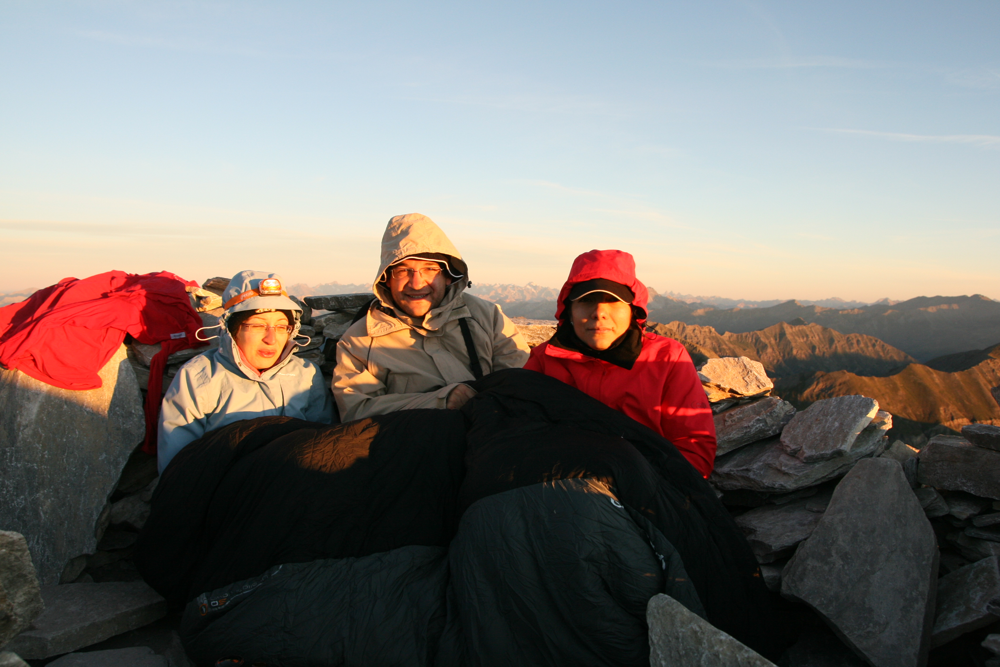
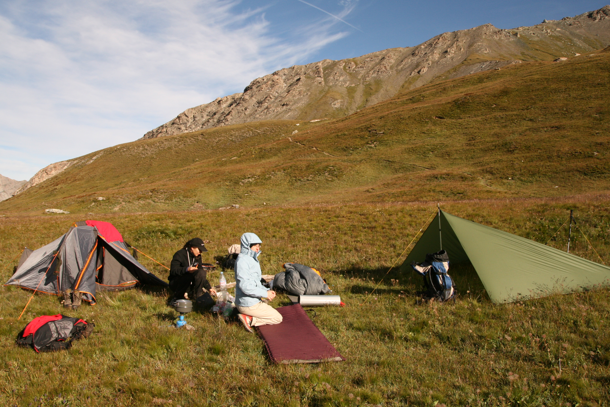

Après l'arrivée d'Eliott, les randonnées itinérantes se sont un peu
limitées :) Mais on essaie de garder le cap ! Cet été, en vacances dans
le Queyras avec quelques amis, on a décidé de se lancer un petit défi :
bivouac au lac Foréant (2600m) pour aller voir le soleil se lever au
sommet du Pain de Sucre, un _classique_ queyrassien à plus de 3000m.

Bon, la préparation n'était pas aussi sérieuse que les années
précédentes, mais la petite équipe de 4 (gégé, laura, anne-claire et
moi) est partie la veille au soir pour atteindre le bivouac prévu. Le
lac Foréant s’atteint sans encombre, après une grosse heure de marche
(passage par le col Vieux à 2806m). Déballage des tentes/tarps se fait
dans le froid, ça va cailler cette nuit ! Gégé est persuadé que j'ai une
_vraie_ tente dans mon sac. Non, non, on va vraiment dormir sous le
tarp :) Petit repas tranquille avant de se coucher assez tôt. La nuit
sous tarp s'est pas trop mal passée, malgré une température frisquette
(-2°C au plus froid sur la montre). Le givre s'est beaucoup déposé sur
la toile, ce qui a causé un affaissement. Anne-Claire, au fond de la
tarp avait quelques difficultés pour résister avec la toile qui lui
tombait dessus... En terme de sensation, c'est assez étrange,
l'atmosphère ne se 'réchauffe' pas comme dans une tente. L'air respiré
est toujours très frais. Je n'avais jamais eu cette sensation dans une
tente classique. En terme de chaleur, le duvet 0° confort était juste :)
On a dormi 4h je crois, de 22H à 2h du mat'. Après, impossible de se
rendormir jusqu'au lever vers 4h...

Le réveil est froid au petit matin, ça claque des dents... Le tarp voit
son poids doublé avec la couche de givre !! L'eau préparé la veille pour
le thé s'est transformé en glaçon dans la casserole... On repart vers
4h45 en direction du sommet, 600m plus haut. Montée sans grosse
difficulté, on peut suivre la progression des autres groupes grâce aux
frontales... Le Pain de Sucre est très prisé en ce petit matin ! Arrivé
en haut quelques minutes après le lever du soleil (mauvais timing, trop
de temps pour ranger le bivouac...) Mais c'est un succès pour la petite
équipe ! Bon ça caille hein, les 3 loustics se camouflent derrière mon
duvet pour gagner quelques degrés, mais c'est pas gagné... Après un gros
1/4 d'heure c'est le temps de la descente tranquille pour faire sécher
le matos au soleil en attendant le reste des équipes qui partaient de
l'appartement au matin.

En tout cas une chouette sortie sans grande prétention, mais avec un
test de tarp en condition sympathique, et un sac minimaliste !

