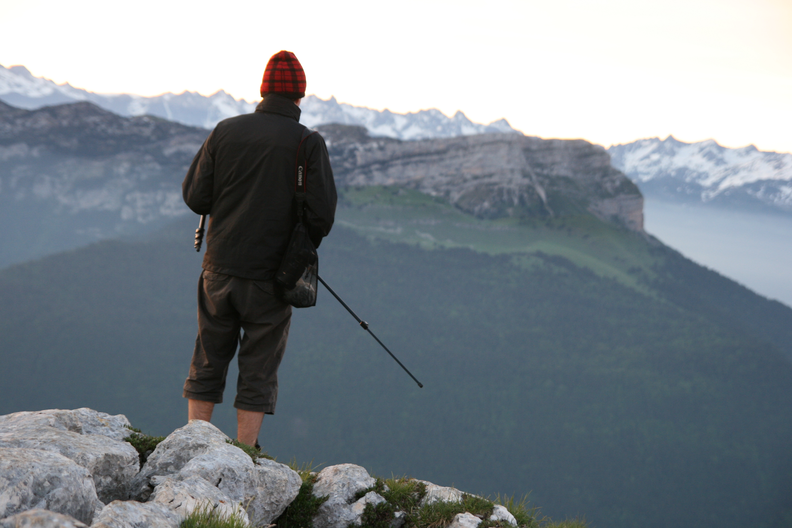
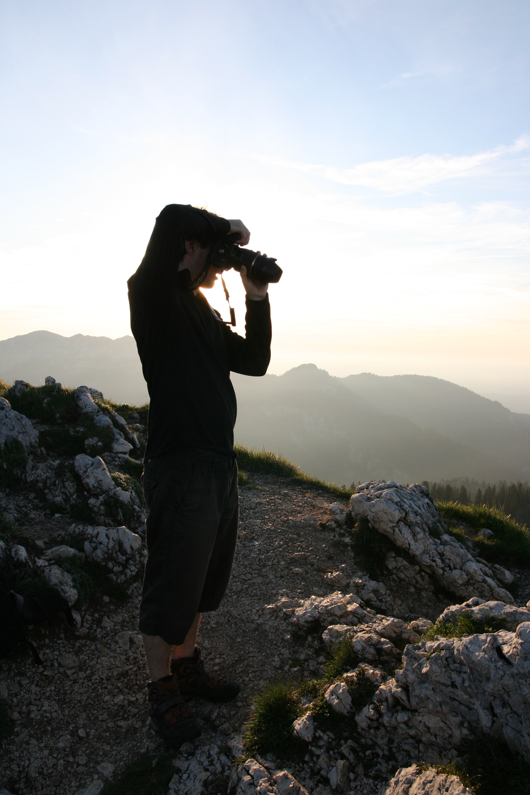
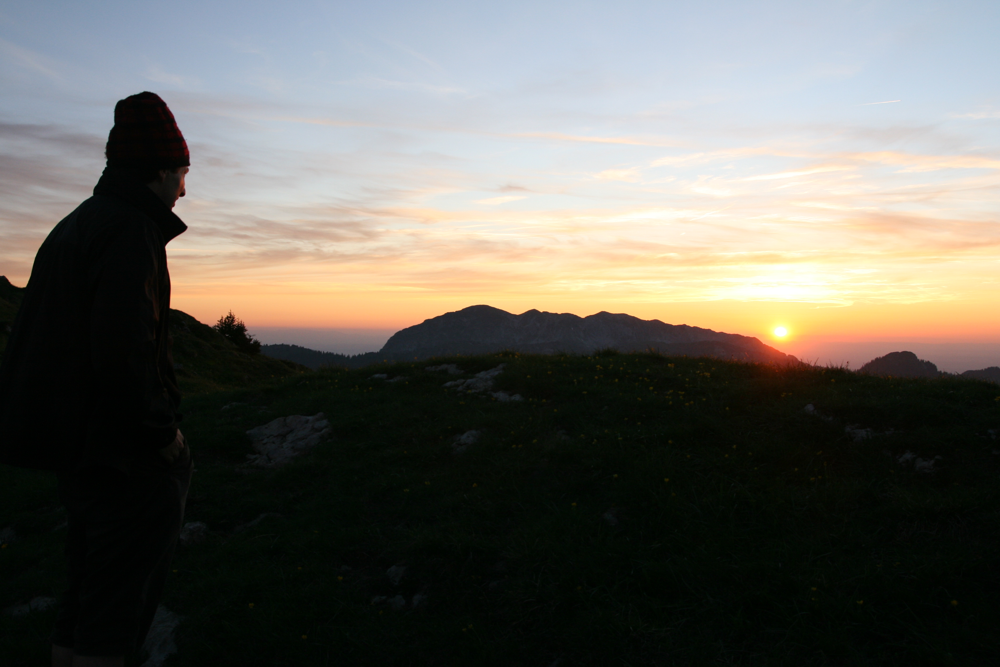
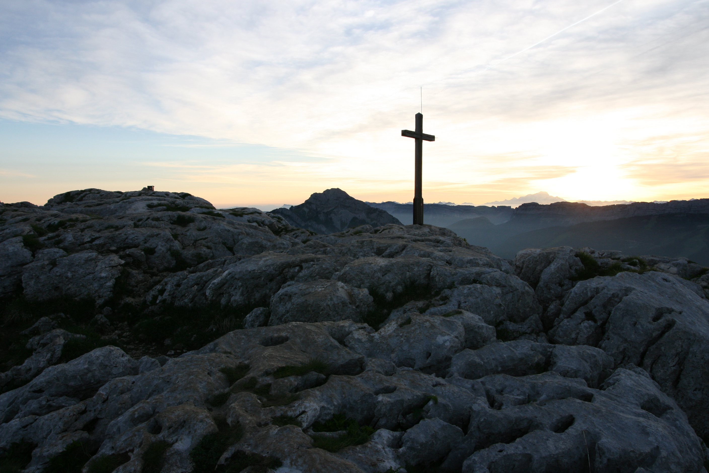

Avec Camille on avait décidé de longue date de prévoir un petit bivouac
sans prétention pour tester la tarp et autre matos léger... Après
plusieurs faux départs en mai pour cause de temps pourri, ce vendredi
soir paraissait idéal pour ce petit test : températures caniculaires
dans la cuvette grenobloise, et beau temps prévu jusqu'au lendemain.

L'objectif fixé est de dormir sur le [Charmant
Som](http://fr.wikipedia.org/wiki/Charmant_Som), un sommet très
accessible de la Chartreuse, avec un beau point de vue sur le relief
environnant : Chamechaude, Grand Som, Dent de Crolles, Grande Sure,
Pinéa, Mont Blanc au loin...

Après une petite demi-heure de montée, on arrive déjà au sommet,
accompagné par un chamois. Le temps est magnifique et le soleil commence
déjà à tomber... C'est l'occasion de sortir les appareils pour tenter de
prendre des photos intéressantes ;). On décide de se poser entre les 2
'ressauts' du Charmant Som, à 5 minutes du point haut dans un grand
espace herbeux. Les derniers randonneurs s'éclipsent quand on pose la
tarp en préparant notre sommaire repas...

La nuit sous tarp est clémente, sans vent, à environ 8°C. Par contre
assez humide le matin, on se reçoit pas mal de rosée déposée sur la
toile intérieure... Réveil à 5h30 aux premières lueurs du jour, on file
vers le sommet pour immortaliser les sommets environnants au réveil du
soleil... Le cadre est somptueux, avec un soleil qui pointe le bout de
son nez juste derrière le massif du Mont Blanc.

A la redescente sur le camp, un chamois est venu brouter sur le plateau
herbeux. En le suivant, on tombe sur un groupe de 5 ou 6 chamois sur les
pentes du Charmant Som... Le petit déj expédié, on rentre par un sentier
différent, descendant au nord du Charmant Som et qui retombe sur notre
point de départ, les chalets et l'auberge.

Ce fut une sortie sympatique, suivi au 'pas de course' par une rando en
famille jusqu'à la dent de Moirans, sous un soleil de plomb attenué par
le sentier très idéalement ombragé !

