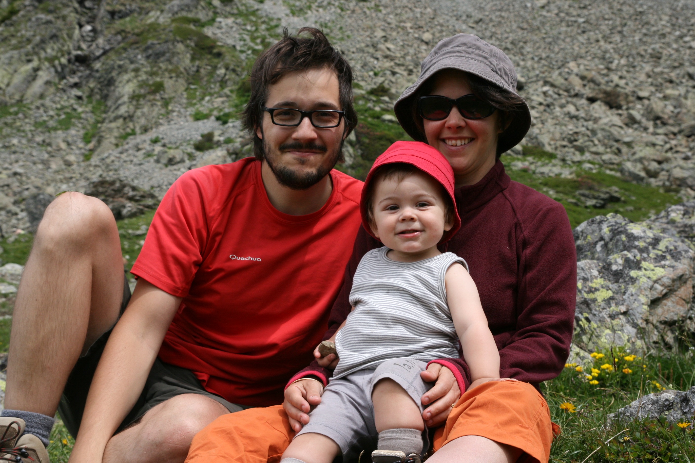
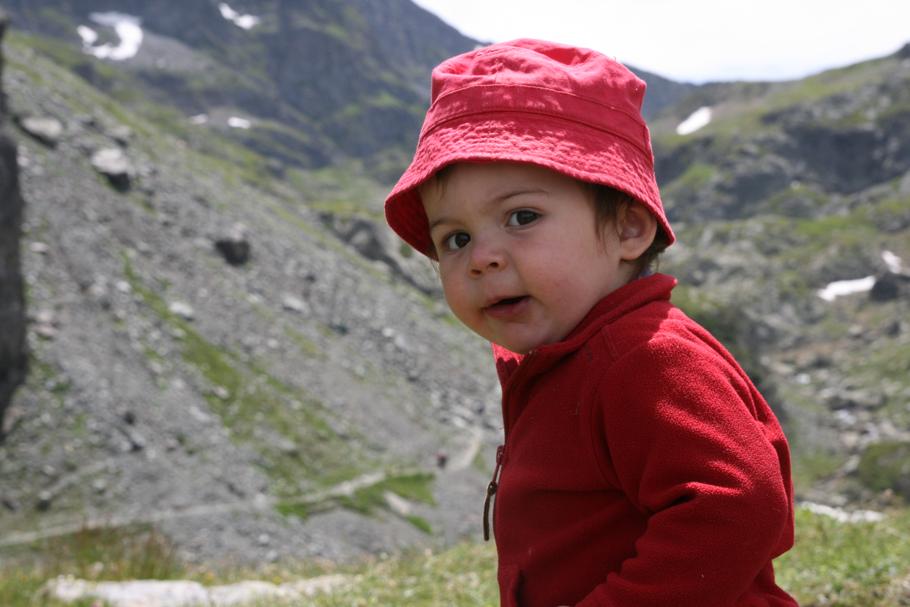
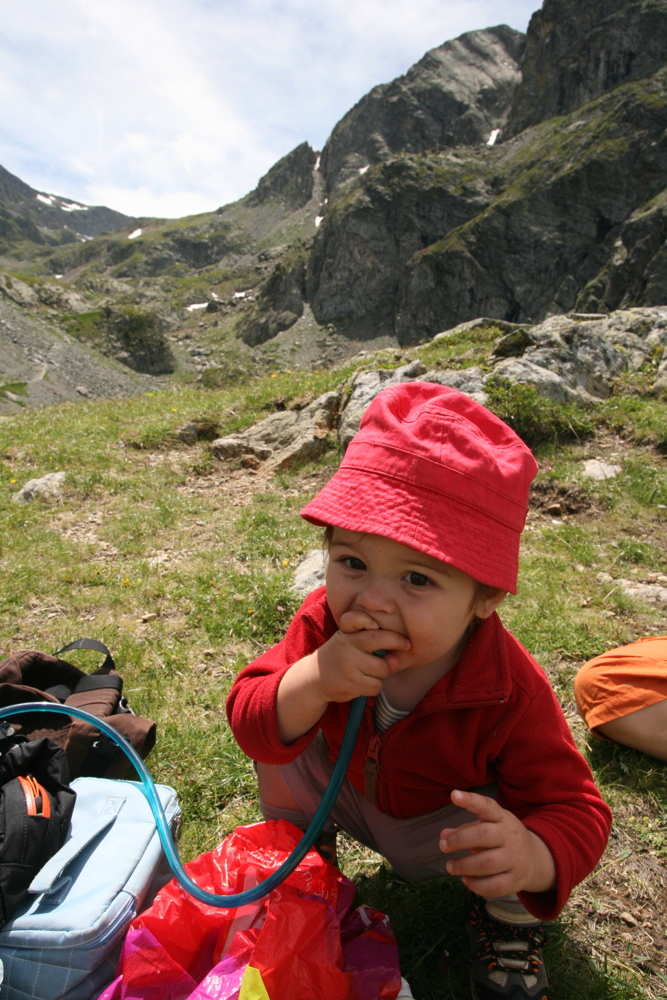
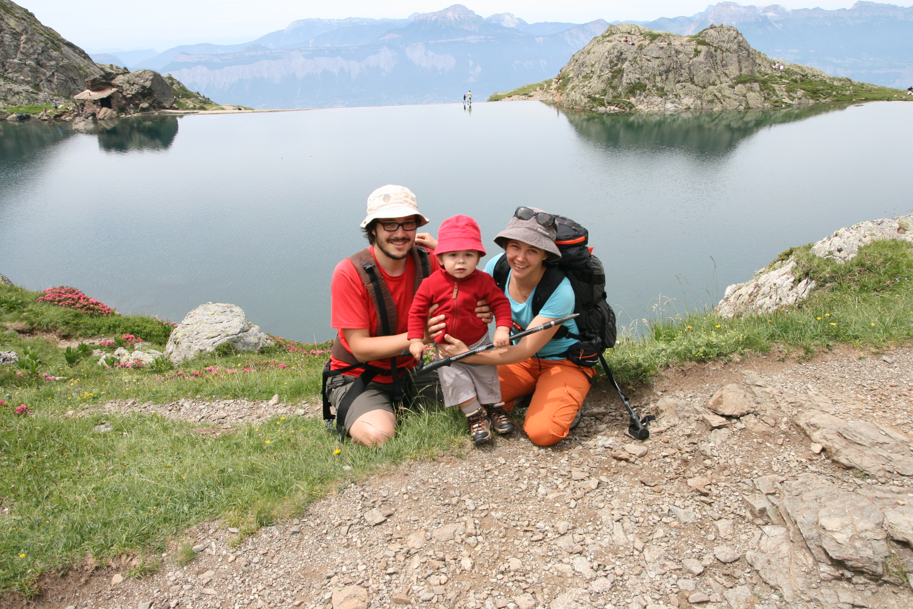

Petite rando improvisée autour du lac du Crozet, pour profiter de la
fraîcheur de l'altitude et du panorama. Eliott a pu testé ses nouvelles
chaussures de marche, il est super à l'aise dedans. Il a pu vadrouillé
un peu avec. Nous on est revenu au basiques : le porte-bébé Beco (note
de traduction: le _porte-eliott_) nous semble plus confortable pour
les randos à la journée que le porte bébé traditionnel de montagne à
armature. Eliott apprécie aussi, il a dormi à l'aller et au retour !

