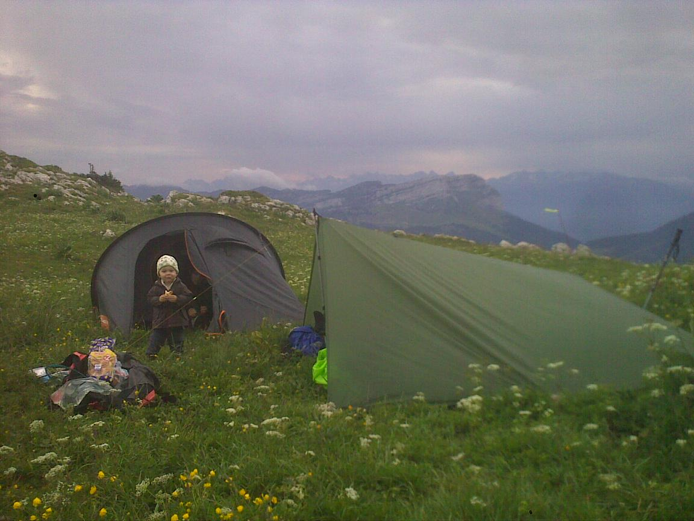

5 juillet 2012, jour historique : Eliott fait son premier bivouac !

Après une montée que l'on commence à bien connaître vers l'auberge du Charmant Som, sans
vomito (trop bien !), la fine équipe commence à monter : Anne-Claire, Cams,
Marion, Eliott et Julien. Anne-Claire est un peu dans le flou, elle a eu le
temps de roupiller dans la voiture. Au moins une qui est pas dérangée par les
virages...

La montée est rapide, mais le temps n'est pas au beau fixe comme la
dernière session bivouac en juin. Le montage de tente & tarp et le repas se font
rapidement, Eliott file au dodo. Nous on fait pas les vaillants avec le temps
qui se dégrade et des fines gouttes de pluies qui commencent à tomber !

La nuit
est bruyante : orage, tonnerre, pluie et un peu de vent. Eliott dort entre nous 2.
Au milieu de la nuit, on échange quelques mots avec Marion sur l'orage :
Eliott dans son sommeil nous dit : _DODO !_. Bon on a compris le message, on se
rendort !

Au petit matin, le temps est toujours aussi bouché. En plus le réchaud
au gaz de cams est vide : pas de café chaud ce matin... On plie rapidement dans
le vent et le froid et on prend vite le chemin de la descente. Boarf le Charmant
Som c'est quand même mieux quand il fait beau, mais Eliott a bien dormi sous la
tente. Il était juste un peu grognon le matin dans le froid :)

> Merci les potos
pour ce court épisode !
