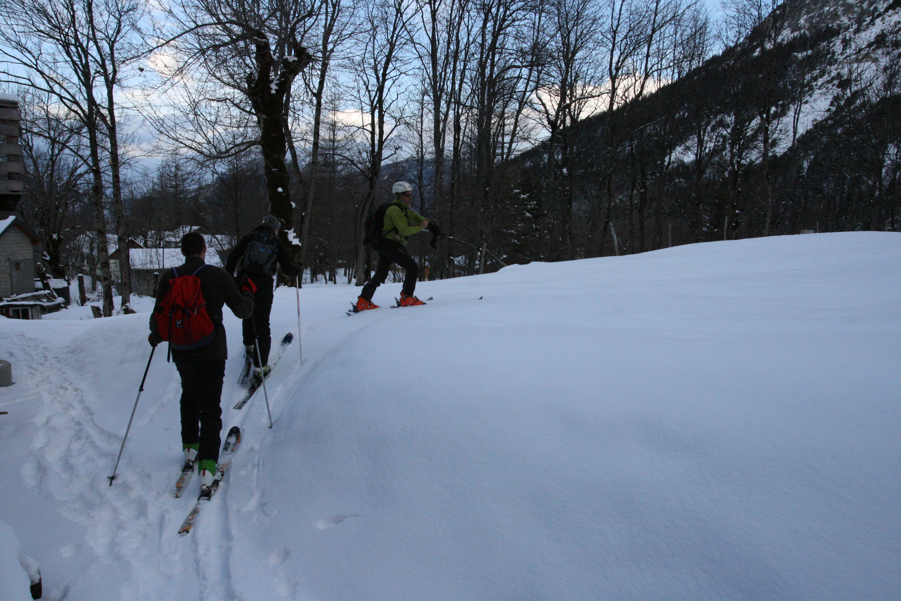

Une bien belle introduction au ski de randonnée ce jour avec quelques copains,
pour aller au sommet du Peronnet, au dessus de Saint Martin de la Porte
(Maurienne).

On a profité d'un créneau favorable (jour de congé oportuniste, matériel
dispo...), d'une météo plutôt clémente, et d'un soutien logistique sympa et
efficace (l'auberge des randonneurs vers la Planchette pour se prévoir cette
petite sortie.

Arrivés la veille au soir, on a pu rejoindre le gite/auberge en ski de rando
(300m de dénivelé de nuit avec les frontales, accompagné par notre guide  /
hébergeur :) ). Super acceuil et super repas ; le lendemain est plus sport :
rejoindre le Peronnet (900m de dénivelé plus haut à 2400m) ! La sortie se
termine à l'auberge avec encore un bon plat savoyard pour récupérer de cette
belle aventure. Bilan ski de rando adopté, c'est un bon moyen de mixer
découverte de la nature et rejet des stations de skis classique.
