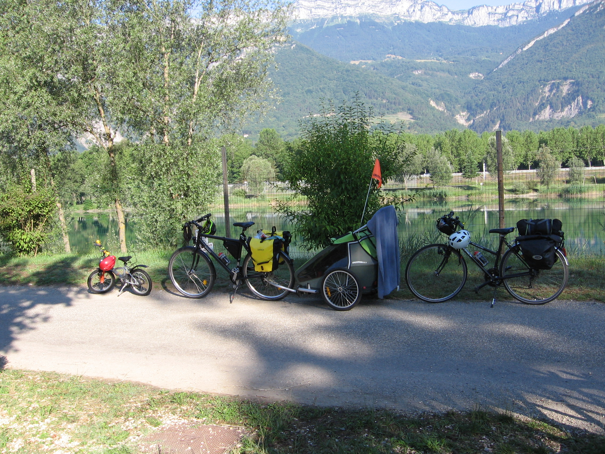
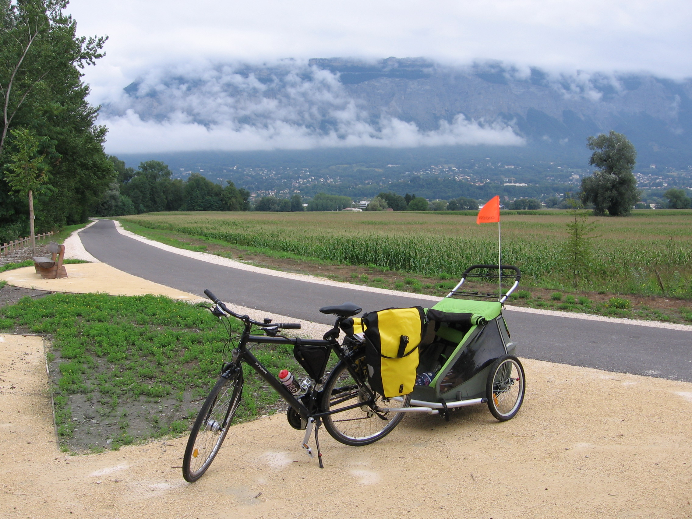
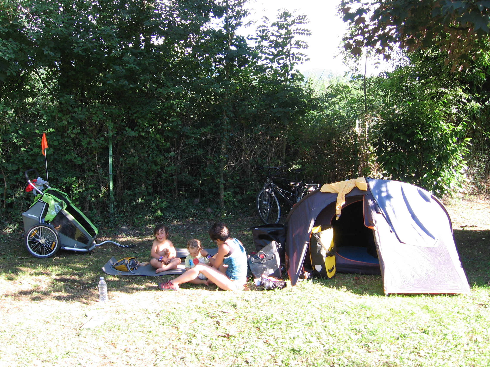
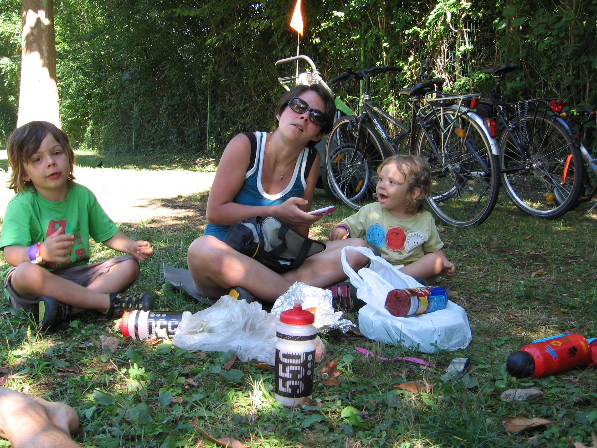
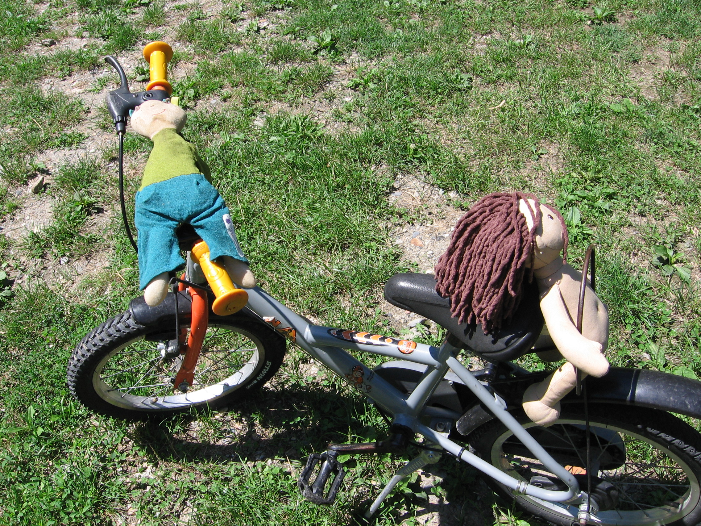
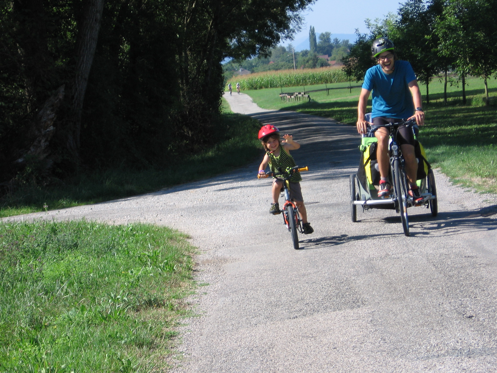
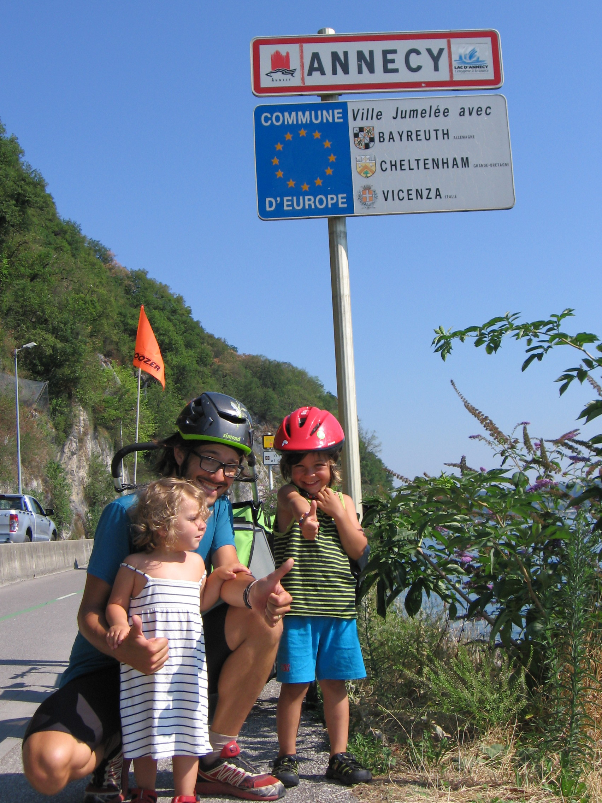

A Grenoble le vélo est roi ! Quoi de plus naturel que d'envisager partir
rouler avec les enfants pour les vacances ? On se fixe un objectif
réaliste, rejoindre Annecy en 6 jours avec 3 vélo + 1 carriole  depuis
Grenoble !

## Les dates
Du dimanche 2 aout au vendredi 7 aout 2015

## Les acteurs
-   Eliott, 4 ans et 1/2 avec son vélo
-   Sidonie, 2 ans, dans sa carriole
-   Julien et Marion chacun avec un vélo + 2 sacoches

## Le trajet
6 jours de trajet prévu, on a bien tenu le planning. Certains jours
était plus chaud que d'autres à gérer mais dans l'ensemble on a prévu de
faire des distances assez courtes pour ne rouler que le matin
principalement, et favoriser pour les étapes des campings avec point
d'eau (piscine ou lac). Et bien sûr en vélo on cherche à optimiser les
routes : chercher au maximum les véloroutes / voies vertes, ou alors des
petites routes peu fréquentés. Et aussi avec pas trop de dénivelé :
tracter la carriole en montée ça ressemble à un chemin de croix (en
comparaison un faux plat montant en carriole ressemble à une montée de
col sans carriole...).

| #   | Départ                 | Arrivée                | Km  | mD+ |
|:--- |:---------------------- |:---------------------- |:--- |:--- |
| 1   | Grenoble               | La Terrasse            | 28  | 67  |
| 2   | La Terrasse            | Saint Hélène du Lac    | 22  | 0   |
| 3   | Saint Hélène du Lac    | Saint Pierre d'Albigny | 15  | 211 |
| 4   | Saint Pierre d'Albigny | Albertville            | 25  | 89  |
| 5   | Albertville            | Doussard               | 28  | 203 |
| 6   | Doussard               | Annecy                 | 18  | 0   |

J'ai pas mal suivi le trajet d'Albert pour cela (voir
[ici](http://www.vieavelo.com/2014/04/v62-vallee-de-l-isere-annecy-grenoble.html)),
qui l'a fait dans l'autre sens en 2014. Bon OK en 2 jours :)

## Le matos
Globalement on a pas pris du matériel exceptionnel pour ce voyage, on a
pas mal repompé dans notre matériel de bivouac a pied. On a juste en
plus pris des sacoches étanches pour vélo (1 paire pour chaque vélo
adulte) et aussi un super carriole :

-   Couchage
    -   Tente 3place quechua (on tiens à 4), posé sur le porte bagage
        arrière de Marion
    -   4 duvets + 4 tapis de sol, dans le coffre de la carriole
-   Alimentation
    -   Rechaud, Popotte, Gaz, repas pour petits dej / midi et soir,
        dans les 2 sacoches de Marion
-   Habillement
    -   Tenue chaude (polaire) + Veste imperméable pour chacun, habits
        de rechanges pour chacun, dans les 2 sacoches de Julien

L'ensemble du matos était super confortable car en vélo on ne 'porte'
pas le matériel mais on le tracte... Bref on ne le sent que quand la
montée est là !

## Récit

### Grenoble La Terrasse

Cette permière journée nous emmène jusqu'au camping de la Terrasse, au
bord du petit lac de plaisance dans lequel on peut se baigner. On sort
de Grenoble par le campus, l'ile de l'amour ; on prend un bout de route
avant de trouver la véloroute le lond de l'isère. Elle passe à coté de
bois français et puis on bascule de l'autre coté de l'autoroute pour
sinuer entre les petites routes. On tombe ensuite sur le chemin de
l'empereur, idéal en vélo ! On a même passé un passage à gué vers
Lumbin. Eliott a fait 1km en carriole juste après le repas de midi pris
à St Nazaire les Eymes. J'en profite pour parler de mon système de
maintien avec le vélo d'Eliott : quand il roule tout va bien. Mais s'il
veut dormir et/ou se reposer, je peux attacher son vélo 16 pouces sur la
cariolle (Croozer for 2) avec 2 tendeurs. C'est rapide à mettre en
place. Par contre cela pèse assez lourd ! Eliott + Sidonie + Carriole +
vélo = au moins 50 kg à tracter. En montée c'est quasi impossible. Il y
a un bout de départementale passante pour rejoindre le camping de la
Terrasse, qui n'est pas si mal, avec une belle plage sur un lac. Bon un
peu bruyant à coté de l'autoroute ! Eliott retrouve même un copain
d'école au camping !

### La Terrasse St Hélène du Lac

Aujourd'hui au programme : chemin de l'empereur ! On en profite pour
voir décoller un autogire sur un champ à côté de la route. On veut
manger à Pontcharra à midi. L'accès en vélo à la ville est pas évident,
on prend un bout de route passante. On se pose dans un chouette parc
avec jeux pour enfants. L'aprem on prend un petit chemin un peu
chaotique pour rejoindre saint hélène du lac, le long de la voie ferrée.
On roule moins vite sur les cailloux, surtout avec Eliott dans la
carriole cet après-midi. On retrouve un chouette camping a taille
humaine a st hélène, avec belle piscine pour barbotter l'après-midi.

### St Hélène du Lac St Pierre d'Albigny

On décolle tôt, toujours vers 9h ou un poil avant. On est super efficace
pour ranger la tente je trouve ! Levé vers 7h, petit déj et hop
vaisselle / pliage de matos en un temps éclair. La route est pas géniale
aujourd'hui : on rejoind Montmélian par le pont piéton, mais ca demande
de prendre une départementale avant. Ensuite on s'engage sur un chemin
large, mais on décide le quitter assez vite pour revenir sur la D201. On
rejoint la D201 en traversant la ligne de chemin de fer via une porte
qui ne permet que le passage d'un vélo ou d'un homme, donc on doit
porter la carriole au dessus du grillage... Pas facile avec Sidonie
dedans ! Ensuite parcours assez valonné (ça monte, ça descend...)
jusqu'a St Pierre d'Albigny. On trouve le camping d'Arclusaz, petit
camping avec peu d'emplacement, il est très chouette et calme. Eliott se
fait une super copine, Inès ! Moi je profite de la sieste des enfants
pour faire un tour au col du Frène au dessus de St Pierre (c'est bon de
ne pas tracter une carriole et des sacoches !). On commence a profiter
de la gastronomie locale, pizza et melon au menu du soir !

### St Pierre d'Albigny Albertville

On suit la D201 jusqu'à Frontenex, puis on retrouve la vélo route qui va
bien de l'autre coté de l'isère. La D201 est pas facile avec encore pas
mal de parcours vallonée, et un peu de circulation. Eliott lâche vers
Grezy en Isère. Ensuite la descente sur Frontenex est agréable ! Et la
vélo route est un bonheur après le D201 ! Eliott reprend son vélo dès le
début de la véloroute. J'ai droit à une crevaison roue arrière (la seule
du voyage) due je pense au pincement de la chambre à air sur la bande de
roulement. La vélo route contourne Albertville jusqu'au camping, au
nord-est de la ville. Ce camping est pas exceptionnel (entouré de 2
routes un peu bruyante) mais bon pas si mal. L'aprem ça sera : piscine
de Gilly sur Isère, puis resto crèpes à Albertville ! Et gros dodo pour
l'étape de demain.

### Albertville Doussard

On continue la véloroute qui passe le long du camping (agréable le matin
de partir juste à coté du camping !), mais on retombe assez vite sur une
départementale, qui nous emène jusqu'a Ugine. Cette portion n'est pas
très agréable mais pas très longue (10km). Eliott fait un peu de
carriole avant Ugine. Ensuite à partir d'Ugine c'est véloroute jusqu'à
Annecy ! C'est agréable de finir le trajet une route comme celle-ci !
Par contre ca grimpe un peu (genre 300m D+ jusqu'au lac), avec la
carriole ça tire... On arrive vers midi a Doussard et on cherche un
camping: beaucoup sont complets ! On tombe sur un camping assez cher (47
euro la nuit pour 4 !), avec pleins d'animations. Bon il y a une piscine
mais on se croierai plus dans un club med qu'un camping. On a même droit
au feu d'artifice a 22h quand on est couché... Bref on recommande pas ce
camping c'était le mauvais choix du séjour !

### Doussard Annecy

L'étape cadeau du trajet, assez courte (18km) et le long du lac... Bref
juste pour profiter !! Eliott la fera entièrement sur son vélo. On va
pas trop vite (de toute façon la véloroute est très fréquentée), on
s'arrête sur les plages pour profiter un peu du lac... En poins de 2h on
rejoint Annecy, et on fait une pause plage/repas avant de reprendre le
train direction Grenoble. On met toutes nos affaires dans le TER (zone
porte vélo qui va bien !) et on rentre tranquillou a Grenoble !

## Conclusion
Les plus :

-   Le vélo permet VRAIEMENT de faire de l'itinérant avec des enfants.
    Bien plus qu'en randonnée à pied. C'est principalement le vélo qui
    porte. Il faut juste clairement éviter les montée, donc plutôt
    cibler les fonds de vallée, pas les cols !
-   Les fonds de vallée, ben c'est blindé de camping et de
    ravitaillement possible ! Quand on est habitué à marcher 2 jours
    sans voir de ravito possible, et bien le vélo en plaine c'est le
    pied !
-   On va moins vite qu'en voiture donc on découvre des paysages jamais
    vu. C'est top.
-   On roule pas toute la journée (générallement 3h le matin), donc ça
    laisse du temps pour d'autres activités avec les enfants
    l'après-midi : sieste, piscine, etc...
-   Eliott a bien roulé dans l'ensemble

Les moins :

-   Sidonie est pas très copine avec la carriole, le matin on avait
    souvent droit à 'moi pas carriole, moi à pied' !
-   On peut pas faire trop d'autres activités (escalade, etc...) car on
    emmène pas le matos qui va bien

<iframe src="http://www.visugpx.com/?i=RXteUbGs9v&amp;iframe=1" scrolling="no" marginheight="0" marginwidth="0" frameborder="0" width="800" height="520"></iframe>
