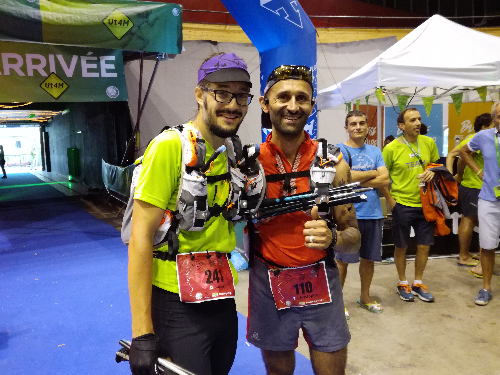

*Christophe et moi sur la ligne d'arrivée après près de 50h*

*Un petit tour dans les montagnes grenobloises...*

L'Ut4M est un évenement pour tout traileur de la région de Grenoble. C'est des
courses autour de la ville, de 40km à 168km, autour des 4 massifs à proximité.
Il y a 2 ans lors de l'édition 2015 on avait réalisé l'Ut4M Vercors, un 40km
avec 2500m D+ avec Kévin et Fabien. L'an passé ils avaient fait la version
master ; un 90km sur Belledonne et Chartreuse. Cette année 2017 il était écrit
qu'on devait tous les 3 s'aligner sur la version reine, le 168km qui parcours
les 4 massifs Vercors, Oisans, Belledonne et Chartreuse. Il y est prévu un
D+ de 11000m et un temps limite de 51h.

# La prépa

La préparation a été assez classique de mon coté ; pas de programme d’entraînement
très précis mais des séances variées depuis le début de l'hiver : un club de trail
à Montréal avec une séance tous les mardi, quelques sorties le midi sur le
Mont-Royal, pas mal de 'daily commute' pour aller au travail... Assez peu de longues
sorties, une en avril et 3 grosses sorties début août avec Kévin en Maurienne. Au
final environ 1600 km, et 30.000 m de D+. Je peux pas faire bien plus depuis la
belle province !

# Le matos

De ce coté assez peu de surprise, mais j'ai du prendre un sac à dos un peu plus
grand (Raidlight Olmo 12) et j'ai décidé de partir avec des bâtons. J'ai testé
des vieux batons Quechua en Maurienne et .... ben j'ai pris des bâtons de trail
BD parce que on va éviter les ampoules ;) J'ai aussi choisi de prendre des
flasques plutôt qu'une traditionnelle poche à eau : le remplissage au ravito est
super rapide (pas besoin d'enlever le sac, ça se remplit en 30 secondes, pas
besoin d'enlever le contenu du sac pour remettre la poche, de penser à vider
l'air pour éviter les flotch-flotch...). Je voyais Kévin qui galérais pas mal
avec sa poche, je suis assez content de mon choix ! Je suis parti avec 2 flasques
de 600mL de raidlight, plus une bouteille d'eau de 500mL pour les portions plus
longues entre 2 ravito ou très chaudes. J'avais donc une capacité totale de
1700mL et c'était suffisant pour moi.

# La course

**Jeudi 18h** : après check du matériel et retrait des dossards c'est l'heure de
partir pour notre petite aventure ! Fabien reste assez vite en retrait (on le perd
pendant les premières centaines de mètres). Sa stratégie c'est de mettre le super
frein à main pour pas se cramer. Bref il a du courir avec les serres-files ! Avec
Kévin on décide de rester ensemble. Avec la nuit qui arrive on se dit que c'est
mieux de courir à deux.

## Vercors
On enchaîne la première montée, le premier ravito, le premier
sommet (le Moucherotte)... On reste en tee-shirt manche courte sauf au pic Saint
Michel tellement la nuit est temperée. On arrive à la base de vie de Vif à 3:17 le
vendredi matin. Ce premier massif était connu donc on a bien dosé. Pas de
surchauffe, il en reste 3 derrière ! Le courir de nuit est assez particulier, j'ai
bien aimé les sensations différentes, le faire avec Kévin, la chaleur de la nuit...
Gros kif dans les descentes, les montées pas mal !

## Oisans
Je sors de la base vie a 4:17 ; grosse pause mais finalement je n'ai pas fait grand
chose. Le temps passe vite quand on s'arrête ! J'ai pas pris de douche juste pris le
temps
de manger et vérifier les pieds. Tout va bien pour le moment. Je décide de repartir
avant Kévin car il veut rester un peu plus pour soigner ses pieds.

Tout d'abord on a pas mal de chemin sur petites routes, chemin assez larges pour
attendre le col de la Chal avant de redescendre sur Laffrey, le premier ravito du
massif. Pause assez rapide car il fait frais ! (c'est 7h du matin) Je repars avec un
compagnon de route en direction de la Morte. On monte un chemin qui passe en dessous
du
sommet 'le Grand Serre' avant de repiquer sur la Morte. Session réalisée exclusivement
en marchant sur les conseils de mon compagnon d'étape !

A la Morte je fais une grosse pause (45min) je sais pas trop pourquoi. Je pense pour
attendre Kévin mais j'aurais du repartir au plus vite et perdre moins de temps je
pense. Je croise Kévin 5min avant de repartir, j'apprends que Fabien s'est fait arrêté
par les barrières horaires à Vif. Je repart encore seul en direction du col de la
Vache, le premier KM (kilomètre vertical) de la course. Une vrai 'vacherie' cette
montée ! Je monte avec une équipe de bretons (3 frères dont un en assistance et 2 en
course). Arrivé en haut on mange le paysage. C'est magnifique. On a une vue presque
360 sur le Vercors, Grenoble, la Chartreuse, les Ecrins... La montée a été rude, en
pleine heures chaude. Elle a été longue mais c'est passé ! Ensuite on trempe les
pieds dans le lac de Brouffier puis une longggggue descente pour aller jusqu'au lac
de Poursollet. Je pensais arriver avant mais cette section est bien longue (plus de
4h). J'ai perdu un peu de temps mais j'ai toujours 2h d'avance sur les barrières.
Tout va bien :)

Maintenant direction les chalets de la Barrière puis Rioupéroux ! C'est une belle
section sur un plateau plein de lac (dont le lac Fourchu) avant de tomber sur le pas
de l'Envious. La longue descente sur Rioupéroux se passe sous les arbres, et c'est
plutôt bien car on se prend la saucée. Je double Kévin que je pensais derrière, qui a
en fait beneficié d'un itinéraire de repli :) J'arrive a Rioupéroux, seconde base vie
vers 18h30, j'ai encore un bon 2h d'avance sur la BH.

## Belledonne

Rioupéroux est pas la meilleure base vie. C'est petit bruyant plein de monde pour
résumer ! Je prend ma première douche de la course, je m'occupe de mes échauffements
aux cuisses, je mange... Kévin arrive et abandonne dans la foulée sans que j'ai le
temps de lui parler ! Trop mal aux cannes. Je retrouve les amis (Fabien et Gé la
copine de Kévin). Ça fait du bien de voir du monde ! Le problème c'est que j'ai pas
une folle envie de repartir seul. L'Oisans je l'ai fait seul mais j'avais Kévin que
je croisais de temps en temps. Bref c'est le premier moment où je pense à
abandonner. Par flemme de s'engager seul sur les 80 kms restants. Flemme de partir
alors que la nuit va arriver, la seconde nuit. Flemme de partir alors que des orages
sont annoncés.

Mais à Rioupéroux Fabien retrouve le mari d'une copine du judo, qui s'apprête
justement à repartir. Mes potes veulent nous marier pour le reste de l'épreuve
pour le meilleur et pour le pire ! Banco 5min plus tard on décolle ensemble
affronter le terrible KV de l'Arselle. Bonjour Christophe, on se quittera plus !

Belle introduction au massif ! Après 1300m de D- pour arriver, on prend direct
1100m de D+ dans le KV de l'Ut4M. Montée en douceur, pas trop violent. 2h 15 pour
la montée, pas pire. Arrivé sur le plateau on a un ravito eau à l'Arcelle. En plus
Christophe a des amis qui vont le suivre sur le plateau jusqu'à Chamrousse. Une
chance pour nous car le brouillard est tombé et l'orientation est devenue difficile.
On est fatigué, on veut dormir. Pas facile au ravito d'Arcelle. On voit la salle
hors sac de ski de fond qui est ouverte : on rentre, on place les 2 tables en
longueur pour pouvoir dormir dessus, on s'allonge et on y reste 30min. Un repos
qui fait du bien mais qui me donne bien froid ! Je ressort de la salle avec toutes
les couches (dont le surpantalon , la goretex et le bonnet !) On est en plein mode
marche maintenant difficile de nous faire changer. Ravito au Recoin, puis 17km de
piste forestière pour rallier Freydière (repli à la place de la croix de Chamrousse +
grand colon).

Cette piste forestière, elle est interminable. On est parti sur 'on la marche'
mais 17km en marchant, de nuit, fatigué, c'est très long. Je commence à expérimenter
quelques hallucinations nocturnes. Christophe est pas plus lucide que moi. Bref on
est content d'être 2 ! Il m'arrive de me poser sur le bord du chemin pour une micro
sieste de 60 secondes. On commence a calculer notre temps d'arrivée a Freydière, et
c'est pas génial. L'envie de dormir est là, elle englobe tout. Je rêve d'une sieste a
Freydières. Je sais que si je dors 30 minutes je vais être hors barrières. Bref j'ai
décidé d'abandonner à Freydières. J'en parle avec Christophe qui est aussi dans une
mauvaise phase. Je le sens motivé également pour abandonner.

On arrive a Freydières 10 minutes avant la barrière horaire. Les bénévoles nous
félicitent. Moi je veux abandonner pour dormir. Je leur dit. Et là globalement on
se prends des torrents de félicitations. Dans les bénévoles, Jérémy Lavy vainqueur de
l'Ut4M 2016... Christophe appelle sa femme, elle l'engueule pour qu'il continue...
Christophe dédice de repartir. Il se fait remplir ses bidons par Jérémy. Je le vois
faire... Et du coup j'ai envie de l'accompagner de repartir avec lui. Est-ce pour
ne pas le laisser seul ? Ou pour ne pas rester seul à Freydières ? Je sais pas trop,
sans doute un mélange des 2... Mais malgré l'envie de dormir, la fatigue physique
on est reparti pour au moins une nouvelle étape jusqu'à la base vie de St Nazaire
les Eymes ! Et du coup le changement de mental est incroyable ! On est arrivé à
Freydières le moral dans les chaussettes, en marchant et on repart avec la banane et
la ferme intention de courir pour aller au point suivant !

On se lache un peu avec Christophe dans la descente, j'ai envie de courir pour gagner
du temps et avoir le temps de profiter de la base vie. Finalement lui aussi va
courir et on va arriver grosse maille dans les mêmes temps. A 8h35 je rentre a la
base vie. Juste 2h30 pour faire ce segment contre plus de 4h pour celui avant...
C'est officiel on est reparti ! En sortant de Freydières on a marché un peu avec
les serres-files, on étaient officiellement les derniers de l'Ut4M à ce moment
là !

## Chartreuse

L'arrêt à la base vie de St Nazaire est minuté. On a 1h30 avant la barrière horaire.
Je prend le temps de faire une douche, un mini dodo de 15min, et ensuite de bien
m'alimenter. Des pates, de la soupe, du pain. J'ai eu aucun problème d'alimentation
pendant toute la course ! On repart à 9h36 ensemble avec Christophe. Il nous reste
le dernier gros dénivelé de la course, le col de la Faïta qui nous emène vers le
habert de Chamchaude. 1200m de D+ à avaler avant la BH de 13h30 au habert. C'est
clairement le dernier bout difficile pour tenir les délais. La montée toute en sous
bois est agréable en cette dernière matinée. 2h pour atteindre le col ! On
carbure encore a 600m/h après 40h !! Petit chemin après vers l'Eimendra puis bon
coup de cul pour rallier le habert de Chamchaude (j'avais oublié ces 300m de D+ !)
On s'effondre au habert à 13h06, on a bien grimpé. Et on est ok avec la BH ! On
bénéficie encore d'un itinéraire un peu plus rapide pour descendre au Sappey, mon
genou est plutôt d'accord pour limiter la casse désormais. Il commence à moyen
apprécier cet enchainement de montée descente depuis jeudi soir !

Pause rapide au Sappey, et on repart avec 2 collègues de Christophe en plus qui vont
nous accompagner jusqu'à la ligne d'arrivée. Depuis le habert on sait que c'est
dans la poche. Les barrières sont larges jusqu'à Grenoble. On est passé par toutes
les émotions dans cette course ! Cette fin de course est surtout contemplative,
chargé de discussion avec les uns et les autres, et on suit gentiment le tracé
classique qui passe par le fort St Eynard, le col de Vence, le Rachais que je
connais bien... Pour le coup on le fait intégralement en marchant, sauf en dessous
de la Bastille, et quand on arrive sur la ligne. Pour le fun c'est tout !

Moi je retrouve Fabien et Kévin qui m'attende au col de Vence, ça fait plaisir de
les croiser...Je crois qu'ils vont s'inscrire sur la version 2018 dès que c'est
en ligne, ils ont la rage ! Puis la classique descente, on arrive au Palais des
Sports juste avant 20h. Bel accomplissement... Christophe semble également
satisfait du travail accompli, je suis pas complètement lucide pour se diriger
correctement dans le PDS ! Fabien Kévin et Caroline, une copine de mon frère sont là
pour m'accompagner... J'ai des étoiles pleins les yeux, et je suis sur mon nuage,
il me faudra quelques jours pour redescendre ! Maintenant j'ai envie
d'accompagner mes potes Kévin et Fabien pour leur revanche l'an prochain !

<iframe width="800" height="500" src="https://www.youtube.com/embed/7vc2APgRNVQ" frameborder="0" allow="accelerometer; autoplay; encrypted-media; gyroscope; picture-in-picture" allowfullscreen></iframe>
