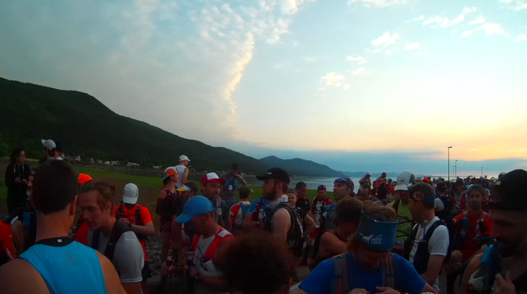

Le Québec Mega Trail est un évenement qui se tient au Mont-Saint-Anne à
proximité de la ville de Québec, dans un beau territoire plus vallonné que
Montréal :) On y retrouve des épreuves de 1k à 100k, avec du coup ces deux
nouvelles distances cette année 70k et 100k qui vont utiliser le sentier des
caps et le sentier Mestachibo...

<iframe width="800" height="500" src="https://www.youtube.com/embed/mvi3Cl2aLzw" frameborder="0" allow="accelerometer; autoplay; encrypted-media; gyroscope; picture-in-picture" allowfullscreen></iframe>
