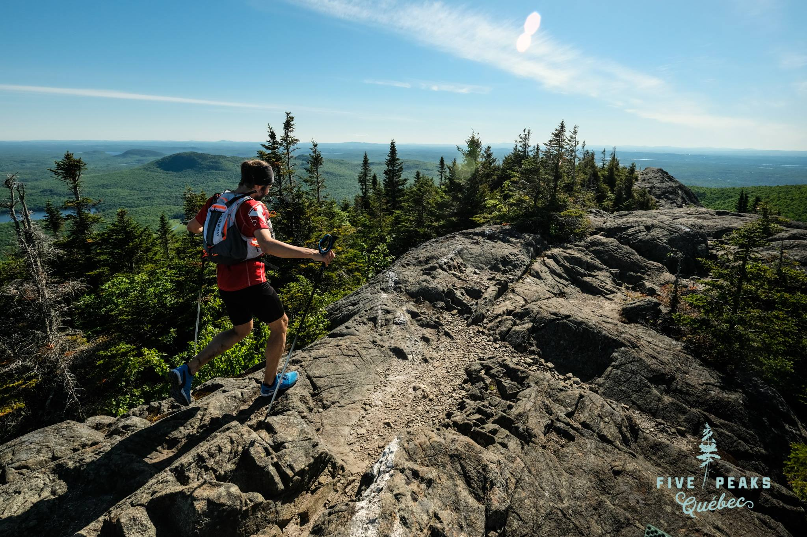

Projet de rando/trail en juin 2020 pour remplacer le [5 peaks](http://www.5peaksquebec.com)
qui aurait du avoir lieu début juin annulé pour cause de COVID-19.

# Option 1 (25k)

Fait en juin 2019, alors que les pistes du Mt Orford étaient fermés.

<iframe name="plotaroute_map_836534" src="https://www.plotaroute.com/embedmap/836534?units=km" style="position:absolute;top:0;left:0;bottom:0;right:0;width:100%; height:100%;" frameborder="0" scrolling="no" allowfullscreen webkitallowfullscreen mozallowfullscreen oallowfullscreen msallowfullscreen></iframe>

Route map for <a href="https://www.plotaroute.com/route/836534?units=km" target="_blank" title="View this route map on plotaroute.com">Sentier Des Cretes Mont Orford</a> by <a href="https://www.plotaroute.com/userprofile/239676" target="_blank" title="View this person's profile on plotaroute.com">Julien Bras</a> on <a href="https://www.plotaroute.com" target="_blank" title="plotaroute.com - free route planner for walking, running, cycling and more">plotaroute.com</a>

# Option 2 (40k)

Version plus ambitieuse !

<iframe name="plotaroute_map_1088282" src="https://www.plotaroute.com/embedmap/1088282?units=km" style="position:absolute;top:0;left:0;bottom:0;right:0;width:100%; height:100%;" frameborder="0" scrolling="no" allowfullscreen webkitallowfullscreen mozallowfullscreen oallowfullscreen msallowfullscreen></iframe>

Route map for <a href="https://www.plotaroute.com/route/1088282?units=km" target="_blank" title="View this route map on plotaroute.com">Mont Orford - Le Grand Tour</a> by <a href="https://www.plotaroute.com/userprofile/239676" target="_blank" title="View this person's profile on plotaroute.com">Julien Bras</a> on <a href="https://www.plotaroute.com" target="_blank" title="plotaroute.com - free route planner for walking, running, cycling and more">plotaroute.com</a>

